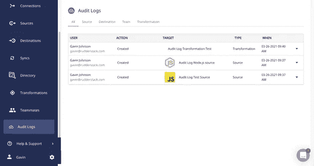
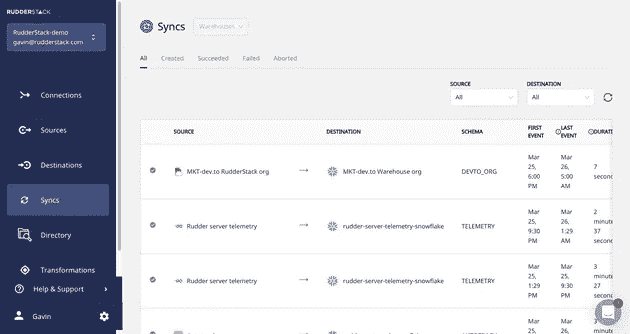

# 新特性综述:转换 API、仓库同步、审计日志等等

> 原文：<https://medium.com/geekculture/new-feature-roundup-transformations-api-warehouse-syncs-audit-logs-and-more-c29f0d398be0?source=collection_archive---------78----------------------->

我们的工程团队不断构建和发布新功能。我们告诉您，我们的用户，我们在发布博客中构建的各种功能。不过，并不是每个功能都足够大，可以单独发布。为了让您及时了解不适合发布的所有内容，我们将定期撰写产品综述，涵盖我们的工程师构建的功能、修复和集成。

# 新特性、增强功能和错误修复

# 转换 API

用户喜欢我们的转变。这是我们最受欢迎的功能之一。不过，它的 API 直到现在才可以使用。我们发布了对转换 API 的改进，并向用户公开，以编程方式与转换功能进行交互。

使用转换 API，您可以:

*   以编程方式向平台添加和移除转换。

> ***注意:*** *总是检查新的转换是否成功编译和执行。*

*   创建一个组织范围的沙箱，在将转换发布到真实环境之前，您的团队可以在其中存储转换。
*   定义库——可以在 RudderStack 中重用的转换集合。
*   版本控制您的转换——转换中的每一个变更都会创建一个新的版本，并且单个转换的整个谱系都是可用的。

这个版本还包含了一些有用和流行的转换库，在转换 UI 中以 RudderStack Libraries 的名称出现。

# 仓库同步

我们发布了一个名为**仓库同步**的新特性。它使您能够观察到将数据加载到仓库中的管道。

通过仓库同步，您可以:

*   在 RudderStack 中查看与所有数据仓库目的地同步的按时间顺序排列的列表。
*   查找重要的元数据，如同步所用的总时间、同步是否成功、来源等。
*   基于各种标准的搜索同步。
*   通过点击 UI 中的同步，获得关于每个同步的详细信息，例如，关于同步到的表格数据、错误报告等的详细信息。

# 审计日志

对于我们的用户来说，数据及其基础架构的安全性和合规性变得越来越重要。这就是我们发布第一版**审计日志**的原因。

审计日志是每个用户在 RudderStack 中进行的所有操作的日志。被跟踪的操作包括:

*   RudderStack 中每个对象的 CRUD 操作(例如，源、目的地和连接)。
*   邀请和用户管理事件。
*   登录和密码操作。

**仓库同步**

# 其他功能和错误修复

除了上述特性，我们还发布了以下次要特性、增强功能或错误修复。

*   提高了将数据加载到仓库的性能。
*   对数据治理 API 的改进。
*   改进了注册和登录流程，包括谷歌认证。
*   更新了许多用户旅程的 UX。
*   其他错误修复。

# 新集成

# 事件流源

*   [Appcues](https://rudderstack.com/integration/appcues/)
*   [用户列表](https://rudderstack.com/integration/userlist/)
*   [微软应用中心](https://rudderstack.com/integration/app-center/)
*   [ActiveCampaign](https://rudderstack.com/integration/activecampaign/)
*   [Klaviyo](https://rudderstack.com/integration/klaviyo/)
*   [Salesforce 营销云](https://rudderstack.com/integration/salesforce-marketing-cloud/)
*   [CleverTap](https://rudderstack.com/integration/clevertap/)
*   库斯托默

# 云提取源

*   [Zendesk](https://rudderstack.com/integration/zendesk-source/) →支持数据
*   Pardot →营销数据
*   条带→财务数据

# 免费注册并开始发送数据

测试我们的事件流、ELT 和反向 ETL 管道。使用我们的 HTTP 源在不到 5 分钟的时间内发送数据，或者在您的网站或应用程序中安装我们 12 个 SDK 中的一个。[入门](https://app.rudderlabs.com/signup?type=freetrial)。

本博客最初发表于:
[https://rudderstack.com/blog/new-feature-roundup-2021-03-3](https://rudderstack.com/blog/new-feature-roundup-2021-03-3)