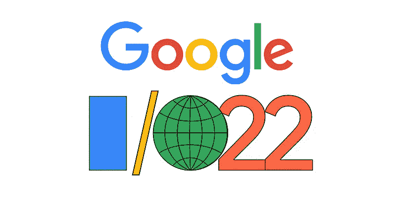
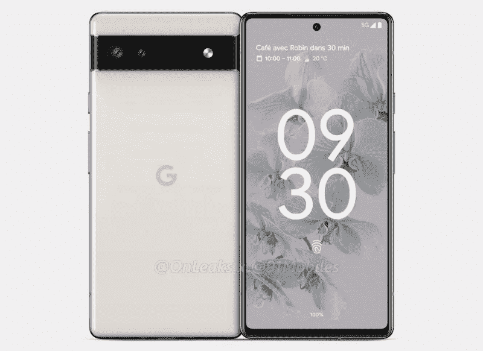
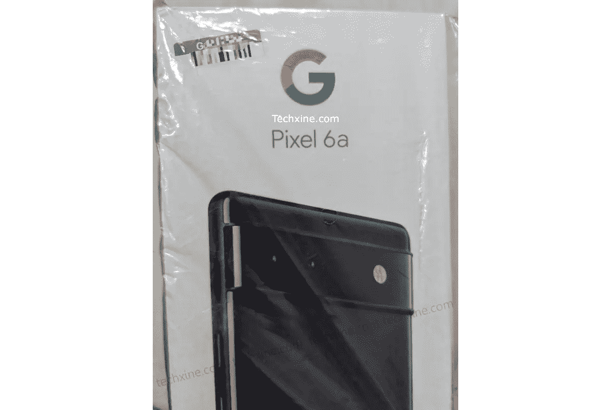
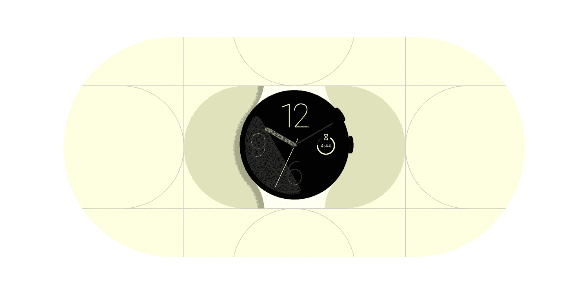

# 谷歌 I/O 2022 新硬件！

> 原文：<https://medium.com/geekculture/new-hardware-at-google-i-o-2022-8888f6e537b8?source=collection_archive---------18----------------------->

一些谷歌 Pixel treats 正在路上。

现在是 4 月，距离 5 月 11 日的谷歌 I/O 还有一个月，这是谷歌展示 Android、Chrome OS、Stadia 和许多其他服务最新更新的主要活动。

但有时谷歌甚至会发布一些硬件，据传今年他们将发布一款新的 Pixel 手机和手表。

所以我们来谈谈这个，Pixel 6a 和**可笑的**传闻已久的 Pixel 手表。

**像素 6a**

谷歌的下一个中端产品 6a 将采用与 Pixel 6 相同的设计，但有一些中端规格。6a 将采用与 Pixel 5a 相同的 12.2 兆主摄像头，而 12 兆超宽镜头来自 Pixel 6，显示屏应该采用 6.2 英寸 OLED 面板，但最有可能被限制在 60 赫兹的刷新率。

Google Pixel 6a render | from [**Onleaks**](https://www.91mobiles.com/hub/google-pixel-6a-renders-exclusive/)

需要注意的其他一些规格是，6a 将由谷歌张量芯片、屏幕指纹扫描仪、4800 毫安时电池、30W 快速充电、800 万像素前置摄像头提供动力，并配备 6GB RAM/128GB 存储配置。

就个人而言，我认为这听起来像是一个伟大的设备，如果它保持在 400 美元到 499 美元的价位。设计确实很独特，张量芯片非常适合为谷歌服务提供动力，如助手、照片和镜头，同时它也可以很好地处理游戏。

这将是任何想要测试来自 iPhone 的 Android 世界的人的完美设备，或者可能只是想要以良好的价格与 iPhone SE 竞争的出色相机的流畅体验。

**Leaked image of the Pixel 6a packaging.**

由于芯片短缺，谷歌去年仅在美国和日本发布了 Pixel 5a，但 6a 将在所有常规市场上市，如美国、英国、加拿大、法国、日本，希望这次能有更多市场。

**像素手表**

Pixel Watch 已经传闻了这么多年，我们知道 LG 正在与 Pixel Watch 合作，但在 2016 年被取消，但谷歌几年前收购 Fitbit 可能意味着我们最终可能会看到 Pixel Watch 的收购带来的好处。

Google Pixel Watch render | By [Jon Prosser](https://twitter.com/jon_prosser?ref_src=twsrc%5Egoogle%7Ctwcamp%5Eserp%7Ctwgr%5Eauthor)

如果他们做得对，这可能是设计最好的智能手表，看起来很棒，**如果**它有一个很好的扬声器，触觉，NFC 和良好的电池，那么它可能是 Android 用户完美的健身追踪器或智能手表。

WearOS 去年在 I/O 大会上获得了巨大的支持，它进行了用户界面改造，并与三星合作将 TizenOS 并入 WearOS。谷歌还最终为 WearOS 发布了 Gboard，并更新了 Youtube 音乐、Google Pay、地图等应用程序，以及一款用于健康跟踪和锻炼的新 Fitbit 应用程序。

Google Pixel Watch render | By [Jon Prosser](https://twitter.com/jon_prosser?ref_src=twsrc%5Egoogle%7Ctwcamp%5Eserp%7Ctwgr%5Eauthor)

现在谷歌拥有了 Fitbit，它有大量的健康功能，它们肯定会添加到 Pixel 手表中，预计将同时推出 20 种不同的表带，手表应该有银色，金色或黑色铝框，但不知道它们是否会有不同的尺寸。

这是谷歌今年最令人兴奋的产品，Android 用户多年来一直在等待一款出色的 WearOS 手表，尽管三星去年发布了一款不错的手表，但它的健身功能仍然有限，除非你拥有一款 Galaxy 设备。

我迫不及待地想拿到它并进行测试，看看它与 Pixel 或 Android 手机的匹配情况以及它可能配备的传感器会很有趣。还不知道它是否会使用三星芯片或谷歌张量芯片的一种形式，但无论如何，我预计助手和健身跟踪将是主要卖点。

谷歌生态系统很棒，因为它不仅限于谷歌 Pixel 手机，就像 Chromebooks 或 Pixel Buds 可以与所有 Android 设备兼容一样，手表也应该如此。

Pixel 6a 和 Pixel Watch 当然会在发布时运行最新版本的 Android 和 WearOS，在 I/O 上，我们将看到随着 Android 13 和 WearOS 4.0 在这些设备和旧像素上的到来，今年秋天会有什么新功能。

谷歌去年终于在硬件上采取了行动，推出了 Pixel 6 系列，看起来今年和 2023 年将继续推出 Tensor powered Pixel Books，Pixel 7 系列中的 Tensor 2，Pixel Buds Pro，可能还有一个带显示器的新 Nest Hub。

随着 5 月 11 日的临近，预计会有更多消息泄露，我非常有兴趣看到 Android 13 给 Pixel 系列带来了哪些新功能，并希望与 Chrome OS 进行更多集成。

让我们看看谷歌有什么锦囊妙计。