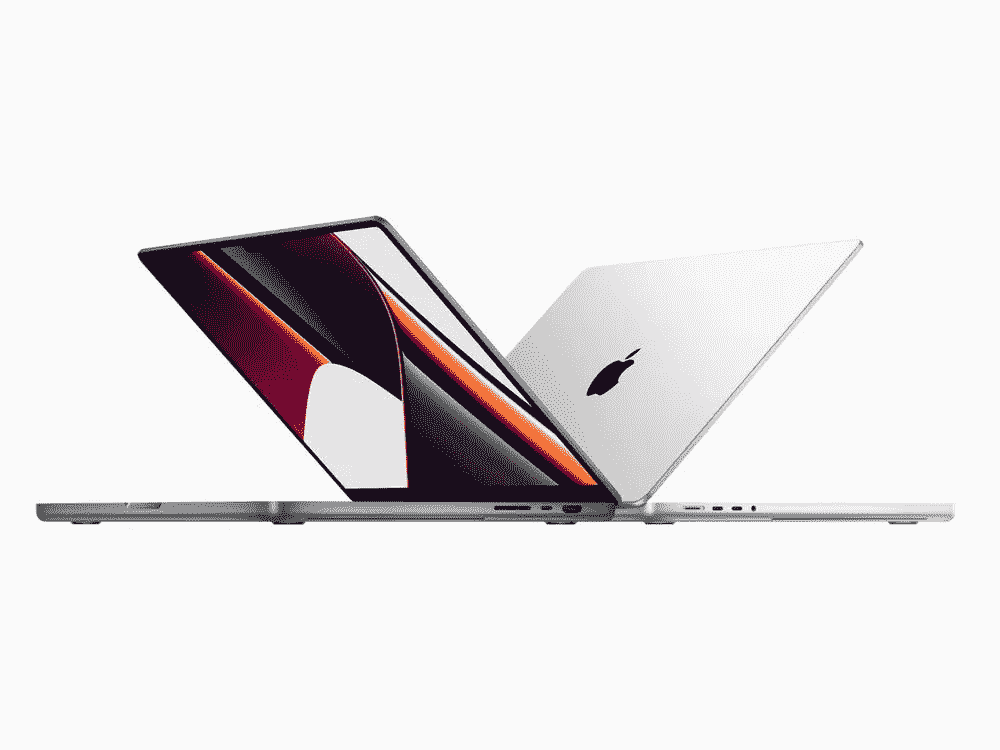
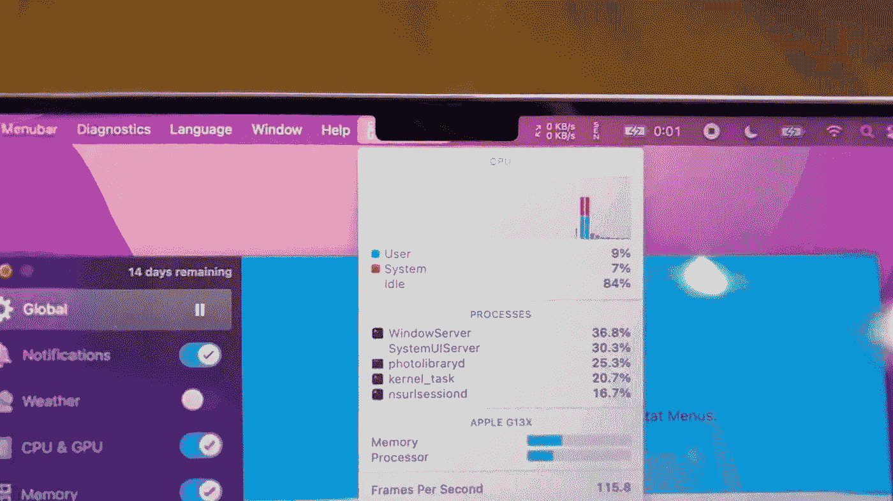
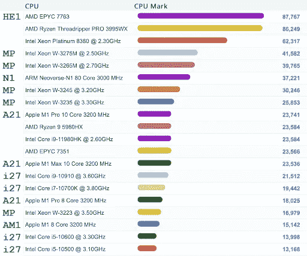

# 新 Macbook Pro 2021 回顾:推动全球笔记本电脑市场

> 原文：<https://medium.com/geekculture/new-macbook-pro-2021-review-driving-global-laptop-market-b5ccc3b74e77?source=collection_archive---------8----------------------->

Source: [https://www.apple.com/](https://www.apple.com/)

苹果于 2021 年 10 月 18 日发布了全新的 MacBook Pro 机型。新的设计，新的屏幕，新的外部端口，最重要的是，新的 CPU 和 GPU。如果在 9 月份的发布会上，终极英雄的角色一如既往地授予 iPhone 13，苹果没有展示任何特别的东西，但它确实用新的 MacBooks 给我们带来了惊喜。我们来详细看看透露出来的成绩。在本文中，我们将尝试回答以下问题:

*   苹果的笔记本电脑在市场上占据什么位置，以及该产品的竞争力如何。
*   苹果在芯片市场取得了哪些成就，与竞争对手相比，苹果落后了多少。
*   在不久的将来，苹果会有什么样的表现。

# 最新的 MacBook Pro 有什么新功能？

让我们来看看有什么新的和明显好的，但可能有争议的是在最新的 MacBook Pro 中透露出来的。详细规格可以在[苹果网站](https://www.apple.com/macbook-pro-14-and-16/specs/)上找到。让我们开始吧:

**港口。这是一个非常有趣的故事。大约 4-5 年前，苹果声称通用 USB-C / Thunderbolt 就足够了。因此，我们有一个没有创新的理想创新场景——拿走一些必要和有用的东西，但几年后又归还。然后呢。我们像小孩子一样快乐。当然，相关端口不能是负号。它们不会打扰你，即使你不用它们中的一些。但是，当您需要访问 SD 卡或插入第二台显示器或投影仪时，一切都近在咫尺。您不需要总是随身携带适配器。毕竟，如果一台新的 MacBook Pro 是专业人士的工具，它应该允许你独立执行你的专业任务。如果笔记本电脑稍微厚一点也没有问题，因为它主要是专业设备，而不是迷人的配件。适配器，永别了！终于！有传言称，在苹果首席设计官 Jony Ive 离开后，该公司的工程师有机会为 MacBook 配备一切必要的东西，而不是旨在降低厚度。**

**这太神奇了，我们将详细阐述细节:**

*   MagSafe 3。MagSafe 又回来更新了，不支持以前的版本，但是快充。当然，为了安全起见，还配有磁性连接器，以防意外拔出。但如果需要，还是可以用 USB-C 给笔记本电脑充电的，谢谢苹果！
*   音频插孔 3.5 mm，支持高阻抗(或更耐用)耳机。
*   SDXC 卡槽。
*   HDMI 端口，用于将 MacBook Pro 连接到显示器、投影仪或电视。
*   三个 Thunderbolt 4 (USB-C)端口。

**音频。**录音棚品质的麦克风改进了声音系统——是的，如果我们谈论的是一种用于不同任务的专业工具，所有这些都很棒。但是，这些改进不太可能取代专业的演播室设备。

**显示。**挡板越薄，用户存放物品的空间就越大。一种新的 Liquid Retina XDR 显示器采用了提升技术，增加了高达 120 Hz 的动态可变刷新率。

**显示刻痕。**如果苹果的工程师没有找到一种方法来实现所有必要的功能，而是缩小了显示屏周围的边框，让我们至少对此心存感激。现实中，并不是所有的 app 都调整到了凹口，菜单栏中的菜单项不经意间就可以隐藏在凹口后面。看起来是这样的:

Menu items are hidden behind the notch. Source: macrumors

毫无疑问，随着时间的推移，这个缺陷将会被修复……由[的应用开发者](https://orangesoft.co/services/ios)修复，而不是缺口的创造者。苹果建议开发者制作更短的菜单。很奇怪，不是吗？当然，这样的方法看起来更像是最明显的妥协。但我们仍期待苹果能提供有趣、创新的工程和设计解决方案，推动行业向前发展。

如果摄像头让我们满意，那么缺口应该由它下面的一个很酷的摄像头模块来指称吗？有观点认为，苹果是在为在 MacBook Pro 中加入 Face ID 模块做铺垫。

**设计。**新款 MacBook Pro 的设计颇具争议。在演示过程中，我不喜欢它，这不是关于笔记本的厚度，而是它的形状。但是当我把它拿在手中时，所有的疑虑都烟消云散了。MacBook Pro 方正简洁。是的，在演示时看起来很厚，实际上在现实生活中也很厚。但这并没有阻止我在发布后立即订购新笔记本。

**电池寿命。MacBook Pro 的电池续航时间令人印象深刻。新推出的 M1 Pro 或 M1 Max 芯片与英特尔和 AMD 的同类产品一样强大，但更节能。**

**性能。**说到新款 MacBook Pro 令人难以置信的性能，我指的是新款苹果硅芯片的成功。

# 苹果硅

这不是苹果第一次试图发布自带 CPU 的设备。让我们记住苹果-IBM-摩托罗拉联盟在 1992 年创造并推出的 PowerPC。顺便说一下，大约在那个时候，苹果也投资了[的 ARM](https://www.arm.com) 。那项投资碰巧在未来是有用的，但我们稍后会回到这一点。从 1996 年到 2006 年，苹果发布了基于 PowerPC 的产品，如 Macintosh、PowerBook、iMac、iBook 和 Xserve。2006 年，该公司决定改用当时性能更高的英特尔处理器。PowerPC [经不起竞争](https://www.cnet.com/news/four-years-later-why-did-apple-drop-powerpc/)。

2015 年，苹果发布了配备苹果 A9X 处理器的 iPad Pro，并将其性能与笔记本电脑进行了比较，这是回归生产自己的处理器的第一个迹象。发布后，有传言称苹果的芯片将超越智能手机和平板电脑。

2020 年，苹果发布了基于 ARM 架构的苹果 M1 芯片和两款 M1 MacBook:MacBook Air M1 和 MacBook Pro 13 英寸 M1(还有 Mac Mini M1、iMac 24 英寸和 iPad Pro 5 gen)

由于我在销售开始后几乎立即购买了 MacBook Pro 13 英寸 M1，我将分享整个体验。

# 13 英寸 M1。真实经历

> 这个笔记本我已经用了一年了。我可以说我所有的恐惧都被证明是错的。MacBook 看起来并不粗糙或落后。功能强大且节能的设备。一次充电就可以轻松工作一整天，即使我加班。

有一个小麻烦。在最初的几个月里，包括我在内的一些用户面临着为英特尔芯片构建的应用程序的兼容性问题。但我应该指出，只有特定的应用程序。在发布的时候，大多数应用程序要么由生产商进行调整(苹果为开发人员提供了必要的工具来编写通用代码)，要么通过特殊的翻译工具[完美地工作。但这个问题并不严重，因为软件开发商迅速发布了更新，为新平台增加了兼容性并优化了他们的软件。](https://support.apple.com/en-us/HT211861)[在这里](https://isapplesiliconready.com)，你可以监控专门软件与苹果硅 MAC 的兼容性。

# 苹果硅。性能与价格

首先，需要注意的是，笔记本电脑的性能是由其所有组件的性能及其交互效率组成的。但本文并不声称是对笔记本电脑性能的深入研究。我只是想展示一些苹果在笔记本电脑和芯片市场成功的大致情况。因此，我将只关注 CPU 性能测试。

新的 M1 专业和 M1 最大芯片的性能有望提高。此外，显卡性能也提高了许多倍。配置中 RAM 选项的选择超出了所有人的预期。

苹果芯片的另一个特点，以及任何其他的 RISC 芯片，不同于英特尔和 AMD 的 CISC 芯片，是高能效——一次充电的运行时间。如果这是你的一个重要因素，那么苹果硅芯片的笔记本电脑是无与伦比的。你可以在这篇文章中阅读更多关于 RISC 和 CISC 架构[的关键区别。](https://cs.stanford.edu/people/eroberts/courses/soco/projects/risc/risccisc/)

让我们回到表演上来，试着评价一下目前的情况。再看 [PassMark CPU 基准](https://www.cpubenchmark.net/laptop.html)。

PassMark CPU Benchmark

表中的关键位置标有标签。其中，来自苹果的处理器有:

*   *A21* —苹果处理器，目前仅在新款 MacBook Pro (14 英寸和 16 英寸，2021 年)中提供。
*   *AM1* —苹果 M1 2020 年发布的首款处理器，用于 MacBook Air (M1，2020 年)、Mac Mini (M1，2020 年)、MacBook Pro (13 英寸，M1，2020 年)、iMac (24 英寸，M1，2021 年)、iPad Pro、11 英寸(第五代)、iPad Pro、12.9 英寸(第五代)。

标签为 *ex1* 的处理器是所有评估芯片中的顶级芯片(在撰写本文时)。意味着苹果的 CPU 是为笔记本电脑设计的 CPU 中第三好的。这是一个很好的结果。事实上，这是苹果的一项真正成就。这不是行业的革命，但绝对是基于 ARM 的处理器的革命。更准确地说，新的苹果芯片最终赶上了竞争对手。

**价格怎么样？让我们来比较几款采用顶级处理器**(截至 2021 年 11 月)的笔记本电脑:

让我们从一台采用英特尔至强 W-11955M 芯片的笔记本电脑开始(上表中的标签为 *ex1* )。例如，它将是 [**戴尔新型 Precision 5560 移动工作站**](https://www.dell.com/en-au/work/shop/workstations/new-precision-5560-mobile-workstation/spd/precision-15-5560-laptop/on5560wm04au_vp) 。以下是它的规格:

*   英特尔至强 W-11955M (8 核，24MB 高速缓存，2.60 GHz 至 5.00 GHz，45W，博锐)
*   15.6 英寸 UltraSharp FHD+
*   英伟达 RTX 2000 w/4GB
*   32 GB，2 个 16 GB，DDR4，3200MHz，非 ECC，SODIMM
*   M.2 2280 1 TB，第三代 PCIe x4 NVMe，固态硬盘

价格**$ 5319.00**(写文章的时候)。

现在，让我们看看 AMD 锐龙 9 5900HX 上的任何笔记本电脑(上表中的标签为 *ex2* )。让它成为游戏笔记本 [**华硕 ROG Strix Scar 17 (2021)**](https://www.amazon.com/ASUS-GeForce-Opti-Mechanical-Keyboard-G733QSA-XS99/dp/B08SJTP83P/ref=pd_lpo_4?pd_rd_i=B08SJTP83P&th=1) :

*   AMD 锐龙 9 5900HX
*   17.3 英寸 360 赫兹 IPS FHD
*   英伟达 GeForce RTX 3080
*   32GB DDR4
*   2TB 固态硬盘 RAID0

亚马逊上的价格是**$ 4550.00**(在写这篇文章的时候)。

让我们在苹果 M1 Max 芯片上找到一个非常相似的笔记本电脑。最困难的是在图形性能方面找到一个模拟。基本上，GPU 很难比较，但我们仍然需要了解价格。因此，它将是 MacBook Pro，规格如下:

*   苹果 M1 Max 10 核心
*   16 英寸液态视网膜 XDR 显示器
*   32 核 GPU
*   32GB 统一内存。是的，内存在 CPU 和 GPU 之间共享，这意味着 CPU 将获得略低于 32GB 的内存
*   2TB 固态硬盘存储

这个配置看起来不比戴尔的(5319.00 美元)或者华硕的(4550.00 美元)差，但是价格是**【3899.00 美元**(价格在写文章的时候说明)。显然，这种比较是近似的。这就是为什么让我们配置一台低于 5500.00 美元或类似价格的 MacBook，看看我们会得到什么。将会是以下 **MacBook Pro** :

*   苹果 M1 Max 10 核心
*   16 英寸液态视网膜 XDR 显示器
*   32 核 GPU
*   64GB 统一内存
*   4TB 固态硬盘存储
*   甚至有足够的钱购买两个许可证:Final Cut Pro 和 Logic Pro

最终，我们得到了**5398.98 美元**。

> 因为这种比较并不客观，只是提供了一些需要考虑的信息，所以你可以做出自己的结论。至于我，一开始，我相信苹果的报价和竞争对手的报价是一样的。但是经过价格分析，我得出的结论是，在同样的成本下，竞争对手没有任何东西可以提供。尤其是如果我们不仅考虑硬件性能，还考虑总体产品质量的话。

# 苹果硅 GPU

比较 GPU 并不容易，因为它们的性能在很大程度上取决于它们所用于的任务，以及有多少软件针对它们进行了优化。我在网上找到的所有 Mac 基准都归结于一个事实，即苹果 GPU 至少在图形密集型工作流方面超过了我们的预期及其竞争对手。

例如，在 Affinity GPU 基准测试中，[苹果 M1 Max 的表现超过了](https://www.techspot.com/news/91941-apple-m1-max-faster-than-6000-amd-radeon.html)6000 美元的 AMD 镭龙 Pro w 6900 x——Affinity 团队之前测试过的最快的 GPU。结果真是太棒了！

# 简短的预报

未来有什么期待？显然，苹果应该通过推出桌面和服务器系统的竞争性解决方案，将其平台提升到一个新的水平。我们说的是 27 寸的 iMac 和 Mac Pro。

目前，iMac 27 英寸配备了基于彗星湖架构的英特尔酷睿 i5 (10500 и 10600)、i7 (10700K)和可选的 i9 (10910)处理器。

对于 Mac Pro，可用的处理器是基于 Cascade Lake 架构的英特尔至强 W-3223、至强 W-3235、至强 W-3245、至强 W-3265M、至强 W-3275M。

我们来看看 [PassMark CPU 基准](https://www.cpubenchmark.net/high_end_cpus.html):

PassMark CPU Benchmark

我们在表格中标出了所有我们感兴趣的 CPU:

*HE1* —顶级高端 CPU*MP*—Mac Pro 用 CPU

*A21*—2021 年发布的 CPU 苹果硅胶

*i27* —用于 iMac 27 英寸的 CPU

*AM1* —首款苹果 M1 CPU

*N1* — [ARM Neoverse N1](https://www.arm.com/products/silicon-ip-cpu/neoverse/neoverse-n1) 针对各种服务器工作负载进行了优化

即使在今天，苹果也可以为所有 iMac 型号完全迁移到自己的芯片。这意味着我们肯定可以期待看到配备苹果 M1 Pro 和 M1 Max CPU 的 iMac 27 英寸。

还有，苹果可以把最新的 Mac Pro 换成自己的 CPU。但是老款的苹果 Mac Pro 笔记本电脑呢？传言称，旧的 Mac Pro 型号将获得新的苹果 M1 芯片，其 CPU 和 GPU 核心数量是 M1 Max 的两倍。在高端产品上，最高可达 40 个 CPU 内核和 128 个 GPU 内核。

除此之外，转向 ARM 允许苹果统一 macOS 和 iPadOS 的应用程序代码。2019 年，苹果发布了 [Mac Catalyst](https://developer.apple.com/mac-catalyst/) ，帮助开发者将其 iOS 应用移植到 Mac 上。会不会催生出像[微软 Surface](http://www.microsoft.com/surface/) 这样的新型混合设备？我们很快就会知道。

> 如果我们要详细说明一般的计算机市场，情况是相当有趣的。英特尔和 AMD 能经受住新苹果硅 CPU 的竞争吗？尤其是考虑到苹果在小众领域的发展速度。英特尔和 AMD 很可能会出人意料地发布 ARM 架构，因为竞争促使他们采取下一步行动。目前的 ARM 芯片生产商也很有可能为 PC CPU 市场提供新的解决方案。例如，看看上表中标记为 *N1* 的[臂新宇宙 N1](https://www.arm.com/products/silicon-ip-cpu/neoverse/neoverse-n1) 。

# 2021 年如何选择 MacBook？

最后，我想说几句如何根据自己的需求选择一款完美的 MacBook。我建议你考虑两个选择:

1.  如果之前采用英特尔处理器的 MacBook 型号的性能对你来说已经足够了，并且你不需要大显示屏，我建议你考虑*MacBook Air M1——重量轻、速度快、超级静音、电池寿命长*。
2.  如果你是专业人士，你需要首先决定屏幕尺寸——你可以选择 14 英寸或 16 英寸的笔记本电脑。然后，就到了你的胃口和预算。有太多可能的配置，对它们提出建议并不容易。但是如果超快的性能对你来说不重要，我认为最低配置就足够了。

[Victor Lavrentyev](https://www.linkedin.com/in/victrl/) ，Orangesoft 的联合创始人兼首席信息官。