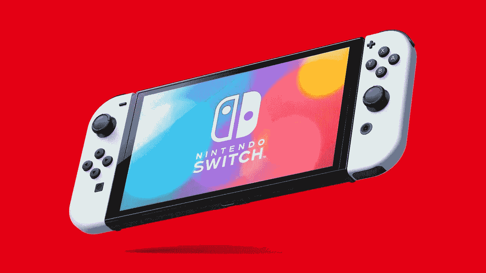
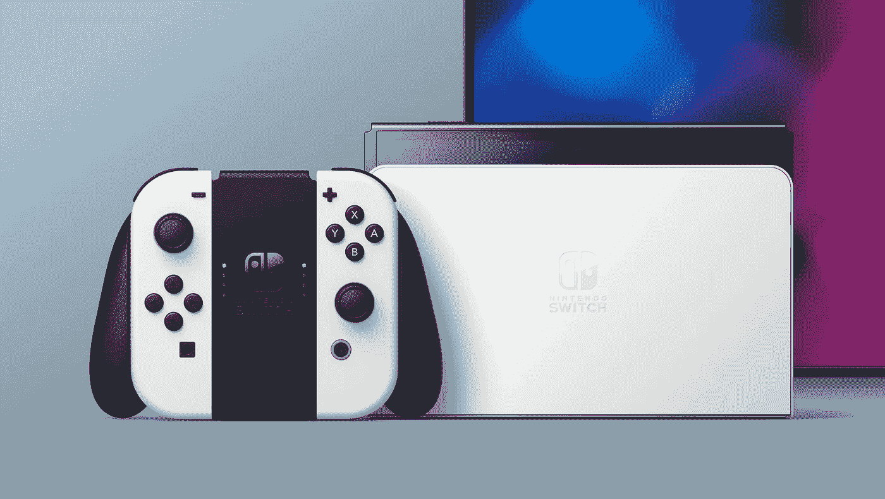
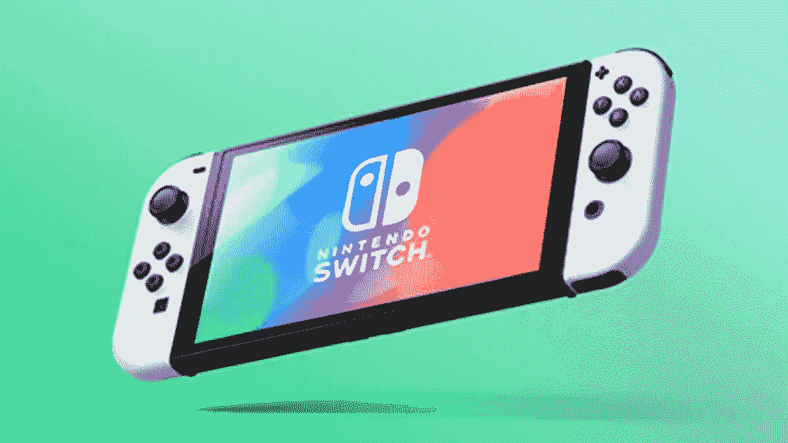

# 新的任天堂 Switch 有机发光二极管型号将于 10 月 8 日发布，售价 350 美元

> 原文：<https://medium.com/geekculture/new-nintendo-switch-oled-model-will-be-released-october-8th-for-350-bbd9b2573e37?source=collection_archive---------60----------------------->

有传言称，任天堂正在研发一款带有有机发光二极管显示屏的新开关。今天任天堂宣布这些谣言是真的。这款新机型将于 10 月 8 日上市，售价 350 美元。

这不是人们想要的“Switch Pro”，但它确实为喜欢随身携带交换机的人提供了一些不错的升级。

没有任何关于电池是否更好的话，也没有比原来的开关改变太多。任天堂表示，这款新有机发光二极管开关的电池寿命(T0)将达到(T2)9 小时(T3)，与目前的开关相同。这款有机发光二极管交换机比原来的略长，重量也略重，分别为 0.71 磅(0.32 千克)和 0.66 磅(0.29 千克)。

新交换机提供了一些非常酷的新功能和升级，例如:

*   有机发光二极管显示器
*   更大的 7 英寸显示屏
*   内置以太网端口
*   配有白色控制器的全新白色坞站
*   新型宽型可调支架
*   64 GB 内部存储
*   增强型音频

 [## 任天堂 Switch 有机发光二极管模型-任天堂-官方网站

### 任天堂 Switch 家族是《超级粉碎兄弟》、《塞尔达传说》等特许经营游戏的大本营

www.nintendo.com](https://www.nintendo.com/switch/oled-model/) 