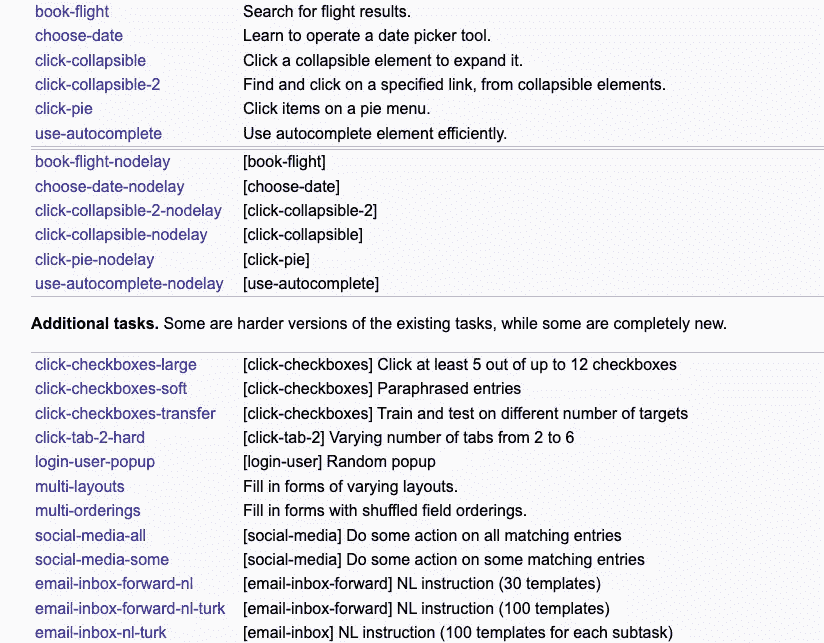

# 新的强大的人工智能控制应用程序和上网冲浪

> 原文：<https://medium.com/geekculture/new-powerful-ai-to-control-apps-surf-the-internet-5b229d94d11d?source=collection_archive---------9----------------------->

Photo by [Luca Bravo](https://unsplash.com/@lucabravo?utm_source=medium&utm_medium=referral) on [Unsplash](https://unsplash.com?utm_source=medium&utm_medium=referral)

***注*** *:如果你想看这篇文章的视频版本，有更多的可视化例子，那么点击下面的链接。*

今天，你将学习人工智能可以用来控制你的计算机上的重要任务的另一种方法，例如在网上冲浪，寻找最好的笔记本电脑交易。基本前提是这样的:我们花大量时间在电脑上执行任务，比如电子表格计算、在线寻找产品或填写表格等等。如果你可以准确地输入你想做的事情，然后让人工智能系统处理剩下的事情，会怎么样？也许你想买最便宜的音乐会门票，或者你想找到有趣的地方去旅行，而不必花太多时间搜索。那将是令人惊奇的，不是吗？不浪费时间，让我们开始吧。

DeepMind 开发了可以使用键盘和鼠标来控制我们的数字设备的人工智能代理。这些动作是基于你(用户)用自然语言写的目标来执行的。AI 系统通过在 MiniWob++数据集上进行训练，学会了执行这些任务。这是一个用于控制计算机的高难度网络浏览器任务的数据集。这些任务包括从简单的点击按钮到填写复杂的表格。

Examples of Miniwob++ Tasks

DeepMind 团队从 77 个人的 104 个任务中收集了超过 240 万个示例。这加起来总共是 6300 小时的计算机任务；这是模型学习指令并将其映射到计算机上的动作的良好起点。为了学习正确的动作，团队使用了模仿学习和强化学习技术。为了打破这一点，我们先来了解一下 AI 系统是如何使用强化学习的。强化学习是基于一种奖励系统方法，通过达到某个目标来获得分数，例如，赢得一场国际象棋比赛。这类似于如果你的狗是个好孩子，就奖励它一块史酷比零食。

Udacity

在某些情况下，很难明确设计人工智能程序中的具体奖励是什么。举一个人工智能代理被指示预订航班的例子。有几种方法可以让它移动鼠标和点击按钮最终成功，希望它不会用你的信用卡预订最贵的头等舱机票。在这些复杂的情况下，我们需要为 AI 系统提供人类的例子，这样它就不会花太多时间来学习实现预期结果的方法。从人类行为中学习就是我们所说的模仿学习。这种人工智能学习的一种流行的现实世界实现是特斯拉用来提高自动驾驶能力的驾驶反馈。那么这如何转化为计算机任务呢？那么，人工智能代理现在可以学习填写表格，根据你的指示发送电子邮件，甚至为你预约所需的步骤。这项研究集中于开发理论上可以用来训练人工智能代理解决任何数字任务的方法。我们已经看到人工智能应用程序的兴起，这些应用程序只允许我们键入指令，然后按照这些指令在视频、音乐和机器人动作等领域执行令人惊叹的任务。

每天，人们花费数十亿小时使用数字设备。想象一个数字代理助手的世界，在那里你不用做低级别的任务，而是专注于更加复杂的活动。

另一家处于这项技术前沿的公司也很擅长。该公司是由一些前 OpenAI 和谷歌员工创建的，所以你知道这是未来伟大工作的秘诀。该团队建立了一个名为 ACT-1 的人工智能软件助手，可以解释书面或口头命令。该小组演示了 ACT-1 如何用于不同的场景。比如在休斯顿找一个四口之家的房子，预算固定。人工智能通过输入搜索词并改变搜索参数来自动搜索网站，直到符合要求的房子出现在屏幕上。其他演示展示了 Salesforce、Google Sheets、Craigslist 和 Wikipedia 等应用程序的有趣用例。如果你想看演示，点击文章的视频版本，或者你可以查看下面发布的 Adept 网站链接。ACT-1 是使用变压器模型构建的。这是用于构建超大规模语言人工智能的相同模型，这些人工智能为谷歌搜索等重要应用提供动力。这个名字也很合适，特别是如果你把这想象成一场魔术表演，如果我们等到最后，我们会看到表演的高潮。

该模型的第一个版本可以作为 Chrome 扩展添加，可以监控浏览器。人工智能软件助手的伟大之处在于，它可以将它在培训期间学到的一切应用到它可能从未见过的其他网站。因此，人工智能理解拖动图标或填充所有类型的表格意味着什么，而不管网站的模板如何。这一特性使 ACT-1 和其他类似的人工智能系统比传统的自动化脚本更具优势，传统的自动化脚本只能迎合特定的网站模板。Adept 声称正在研究通用智能，他们将通用智能定义为可以做任何人在计算机前可以做的事情的系统。首席执行官 David Luan 也表示，自然语言辅助任务的影响将类似于从命令行到 GUI 的转变。你可以与你的计算机交互而不需要记住一系列快捷键和命令，这与你使用语言执行数字任务时所应用的抽象层次是一样的。这可能看起来像是《西部世界》的一集，但是我们在世界各地都有实验室致力于这项挑战。使用大型语言模型，看起来非常困难的事情变得越来越容易实现。对这些 AI 助手的担忧是，它们可能会执行我们实际上并不打算执行的任务，或者代表用户执行恶意任务。虽然像 ACT-1 这样的人工智能代理非常有前途，但为了迎来这个计算机交互的新时代，必须保持勤奋的网络安全和隐私标准。你对 AI 驱动的数字助理有什么看法？你会用这样的系统做什么？我会在下面的评论部分留下本文中讨论的项目的链接，这样当你有时间的时候就可以更多地探索它们。

*感谢阅读！*

**资源:**

*DeepMind*

**网址**:[https://www . deep mind . com/publications/a-data-driven-approach-for-learning-to-control-computers](https://www.deepmind.com/publications/a-data-driven-approach-for-learning-to-control-computers)

**论文**:[https://arxiv.org/pdf/2202.08137.pdf](https://arxiv.org/pdf/2202.08137.pdf)

*内行*

**网站**:[https://www.adept.ai/act](https://www.adept.ai/act)

*Miniwob++*

**网址:**[https://farama-foundation.github.io/miniwob-plusplus/](https://farama-foundation.github.io/miniwob-plusplus/)