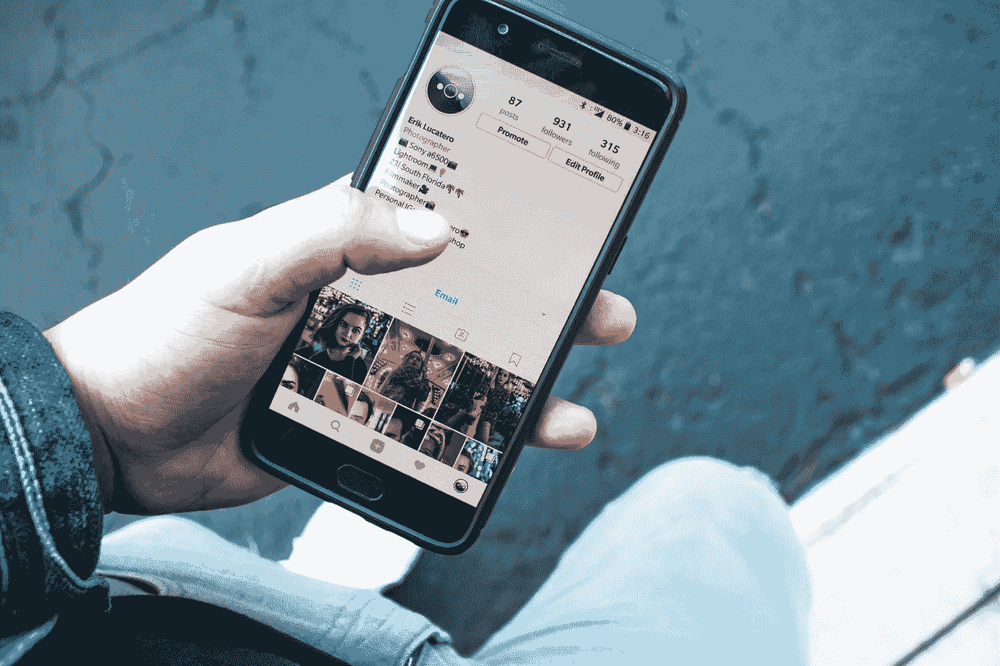

# 新软件可以缓解有影响力的营销人员的痛点

> 原文：<https://medium.com/geekculture/new-software-can-ease-influencer-marketers-pain-points-e3bdfdc0c2f0?source=collection_archive---------10----------------------->

新技术、新机遇，但对营销人员来说也是新问题

Photo by [Erik Lucatero](https://unsplash.com/@erik_lucatero?utm_source=unsplash&utm_medium=referral&utm_content=creditCopyText) on [Unsplash](https://unsplash.com/s/photos/influencer?utm_source=unsplash&utm_medium=referral&utm_content=creditCopyText)

几十年来，品牌一直在利用有影响力的公众人物来代言和推广他们的产品——远在网络繁荣和社交媒体平台出现之前。想一想就会产生几十个例子。足球运动员大卫·贝克汉姆和弗雷迪·永贝里换卡尔文·克莱因