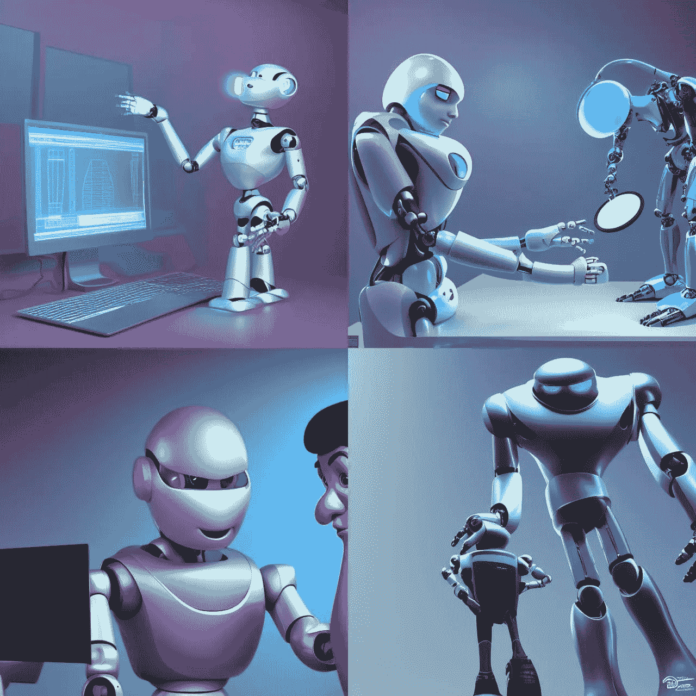

# 刚接触 AI 艺术？先试试 NightCafe Creator

> 原文：<https://medium.com/geekculture/new-to-ai-art-try-nightcafe-creator-first-f7e7a59e46dd?source=collection_archive---------9----------------------->

## 它很容易使用，并且产生了一些我见过的最好的结果

Created by author using NightCafe

在 Medium 上看到一堆关于睡前咖啡创造者的帖子后，我最近试用了它。虽然我已经喜欢上了其他流行的人工智能艺术生成器，包括 [DALL E 和 Midjourney](/geekculture/dall-e-vs-midjourney-how-ai-image-generators-see-human-concepts-much-differently-e5f1b3e14667) ，但我总是愿意尝试其他选项。