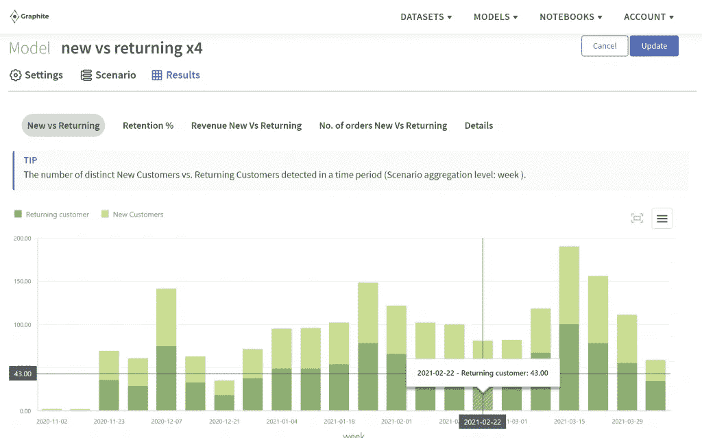

# 新顾客与回头客:电子商务和零售谁更重要？

> 原文：<https://medium.com/geekculture/new-vs-returning-customers-whos-more-important-in-e-commerce-retail-a189a346be0e?source=collection_archive---------30----------------------->

## 无论你是从事电子商务还是零售业，你的客户都是你无可争议的上帝。许多企业主面临的困境是:我应该专注于获得新客户，还是应该纵容我的回头客？

这个问题没有简单的答案。

问任何一个电子商务专家，他们都会告诉你两者都很重要。但是，当涉及到你的业务健康时，其中一个比另一个有明显的优势。

让我们进一步了解这件事。

Image by Jorge Percival, [unsplash.com](https://unsplash.com/photos/MkvehbVPPDw)

# 回头客将永远支持你

谁是回头客？

> *他们是那些让* ***不止一次从你的电子商务或零售业务中购买*** *的人。*

研究表明，这样的顾客在第一次购买后有 27%的机会再次从你这里购买。

事实是，留住一个现有客户所花费的金钱和精力是获得一个新客户的五分之一。你要投入 16 倍以上的资金，才能让你的新客户和你的回头客花一样多的钱。

回头客非常宝贵的主要原因如下:

1.  回头客在你的产品或服务上投入了比新顾客更多的钱。他们的支出是后者的 300 倍。
2.  你有 60-70%的机会说服回头客购买新商品。从营销的角度来看，在他们身上投资比在潜在客户身上大量投资更有商业意义。毕竟，只有 13%的未来消费者会购买。
3.  回头客可以在他们的同行中推广你的业务，增加你的潜在客户群。永远不要低估口碑广告的力量，即使它来自快乐的顾客。最精彩的部分？你不用花一分钱推销自己。
4.  平均而言，一家企业 80%的收入来自 20%的客户。回头客贡献了很大一部分。不要忘记，你如何对待你的老客户也会影响你获得新客户的能力。

回头客为你节省了大量的时间、精力和金钱。这就是为什么你不能动摇与他们的关系。

Image by Etienne Girardet, [unsplash.com](https://unsplash.com/photos/HTTjS5yMAJk)

# 新客户有助于收入增长

另一方面，获得新客户是任何企业建立客户基础的唯一途径。如果你没有第一次购买的潜在客户，你就不可能有回头客。

新客户对您的业务不可或缺，因为:

1.  他们让你形成你的客户群的基础。
2.  它们有助于建立品牌认知度。
3.  它们让您深入了解对您的期望，如何改进您当前的产品，以及要为您的服务/产品增加哪些内容。
4.  他们可以接替那些离开你的公司的老客户。

> 因此，新客户对你的业务增长至关重要。也不能以任何方式忽视它们。

# 专注于将所有客户转化为忠诚客户

这里有一个惊人的事实:60-80%的顾客从你的公司购买了产品，并对你的服务感到满意，但他们可能不会再回来。一次性客户存在。**重新与他们建立联系，让他们成为回头客，这取决于你。**

你必须明白的是，客户关系管理就是一切。

那样的话，新旧就不重要了。作为一家企业，无论是线上还是线下，你的重点应该是与你所有的客户建立良好的关系。让你的顾客感到特别。

以下是一些如何将新顾客转化为忠诚顾客并留住回头客的建议:

1.  保持联系。[客户关系](https://blog.hubspot.com/service/customer-relations#:~:text=Customer%20relations%20describes%20the%20ways,are%20geared%20towards%20customer%20success.)，像其他人际关系一样，需要你的关注和努力。与你所有的顾客保持经常联系。在你业务需求之外的社交媒体上与他们交流。了解他们对你的期望，并尽可能为他们提供最好的服务。
2.  给他们奖励。每个人都喜欢被宠爱的感觉。不要把你的折扣留给第一次光顾的顾客，要确保你的回头客因为对你的信任而得到赏识。折扣、惊喜奖励等。很好地让你的消费者满意。
3.  启动忠诚度计划。赶上这股潮流永远不会太晚。事实证明，此类计划在短短 3 个月内将客户终身价值(CLV)提高了 79%!

Image by Author, [Graphite Note](https://graphite-note.com/) Customers ML Model screenshot

# 石墨纸币边缘

有了尖端的预测分析，Graphite Note 等工具可以让你获得新老客户的所有数据。比较绝对数字和百分比，了解每天、每周或每月你目前保留了多少客户。

让最佳预测分析指导您的营销和客户关系管理。决定哪些顾客需要你立即关注。计划你的营销和促销活动，以适应当前的需要。

> 你的客户聪明且直觉敏锐。你也应该这样。

*最初发表于*[T5【https://graphite-note.com】](https://graphite-note.com/new-vs-returning-customers-whos-more-important-in-e-commerce-retail/)*。*