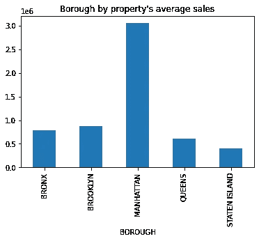
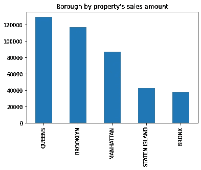
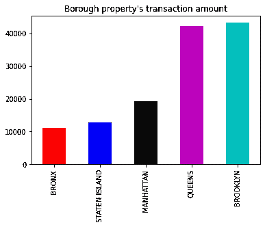
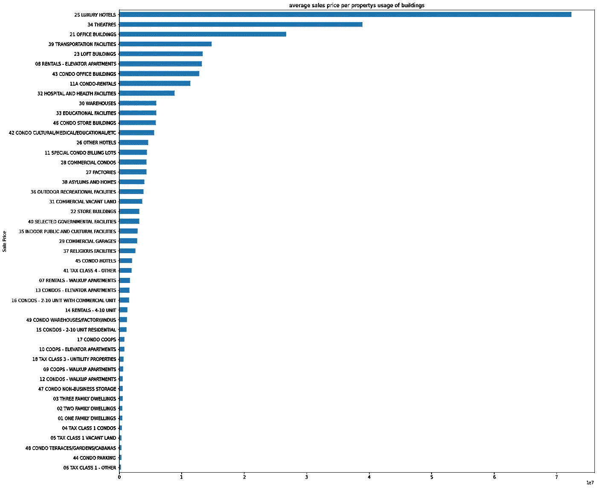
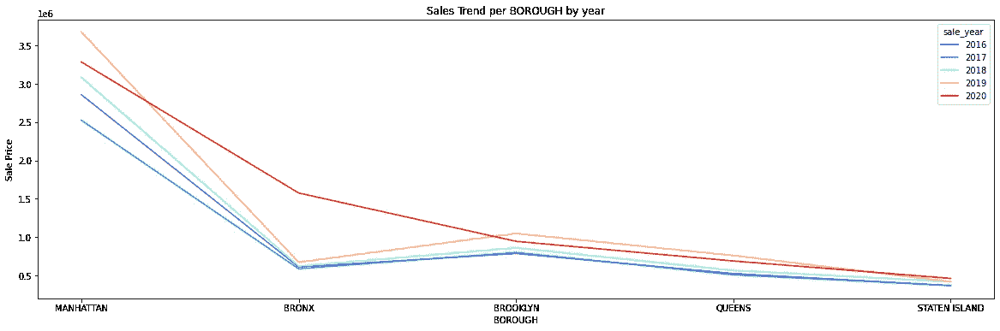
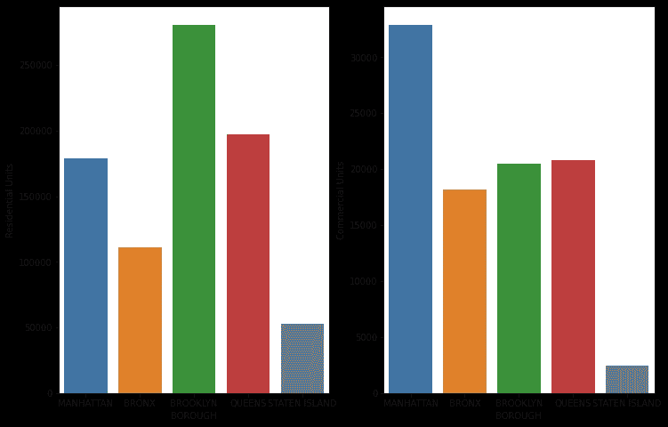
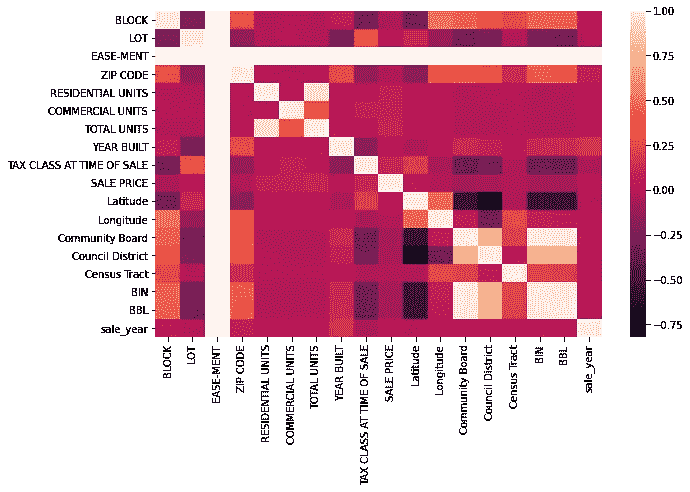
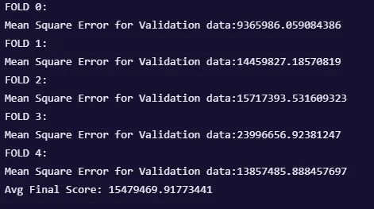
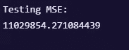
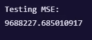

# 纽约市全市年度房地产销售探索性数据分析(EDA)

> 原文：<https://medium.com/geekculture/new-york-city-citywide-annualized-property-sales-exploratory-data-analysis-eda-697e079b3fd0?source=collection_archive---------24----------------------->

大家好，欢迎来到新的真实世界数据分析，向人们展示数据的强大。

今天，我发现了一个很好的数据集，可以用来预测纽约市的房地产价格，它基于一些特征，如区、社区等，所以这可能是一个非常有用的应用程序。

让我们谈谈这些数据集的来源，这些数据来自纽约市的官方网站

年度销售文件显示在纽约市销售的房产的年度销售信息。这些文件还包含诸如邻居、建筑类型、面积和其他数据等信息。

我将本文分为三个部分:

*   预处理数据
*   使用 EDA 探索数据
*   利用机器学习预测房地产价格

# 预处理:

这一步称为数据清理或数据争论，我们清理和转换数据，使其适合可视化和建模阶段，这一步包括:

*   删除重复或不相关的观察
*   修复结构错误
*   处理丢失的数据
*   验证和质量保证

## 删除重复或不相关的观察

在数据收集过程中，重复观察最常见。当您组合来自多个地方的数据集、收集数据或者从客户或多个部门接收数据时，就有可能创建重复的数据。在此过程中，重复数据消除是需要考虑的最大方面之一

## 修复结构错误

我将销售月和销售年添加到数据集，以帮助我进行逐年分析。

## 处理丢失的数据

处理缺失数据有很多策略，我使用的第一个策略是丢弃所有具有缺失值的观察值，但这样做会丢弃或丢失信息，因此您可以自己尝试另一种策略，如随机样本插补，它使方差分布与原始方差非常接近。

## 验证和质量保证

以下是引导分析的一些问题:

*   代表地理位置的行政区和社区是否会影响纽约房地产的销售？又各自是如何受到影响的呢？
*   每个区的平均销售价格是多少？
*   每平方英尺的大小/面积会影响销售吗？
*   物业用途或分类是否影响销售？
*   我们应该关注哪些领域来增加我们的销售额？
*   如何描述每个区的房产交易？

# 探索性数据分析(EDA):

我一直使用 python、matplotlib 和 seaborn 作为可视化工具来生成图表和进行统计分析

Sales Amount Vs Sales Average

你可以看到皇后区有最多的销售记录，但是曼哈顿有最高的平均销售价格，如果你不是纽约人，你可能会问为什么？

> *答案是曼哈顿的地理位置更好，它是纽约市五个区中人口最稠密、地理面积最小的，而且曼哈顿的 GDP 是五个区中最大的，所以这里的房价应该比其他地方更贵，这也证明了皇后区面积最大但不是房价最高的区的数据是正确的*

Properties Transactions

> 交易是没有现金对价的所有权转移

*这张图表显示了每个区的房产交易数量，【2016 年至 2020 年，布鲁克林的房产交易最多，皇后区次之*

Average sales per property usage ( building type)

*豪华酒店和剧院似乎是销售额最大的建筑类别，税收等级 1，公寓停车场是销售额最低的建筑类别*

Sales Trend per borough by years

这里我们可以比较每个区每年的工资，

布朗克斯在其他年份的 2020 年总销量最高

当然，曼哈顿的总销售额最高，但在这里我们可以看到它在 2019 年的总销售额最高

Residential Units Vs Commercial units

这里我们按住宅和商业单元来分配每个区的销售额，看起来布鲁克林的住宅单元销售额最高，曼哈顿的商业单元销售额最高

Correlation matrix

为了总结大量数据，我使用相关矩阵来查看模式并研究每个变量与其他变量之间的线性关系，高度相关的特征在建模和创建图表时非常有用。

# **预测房地产价格(回归问题):**

我选择 XGboost 回归器作为预测价格的最佳和最常见的回归器之一，它是梯度提升树算法的一种实现，梯度提升是一种监督学习算法，它试图通过组合一组更简单、更弱的模型的估计值来准确预测目标变量。

我使用了 k-fold 交叉验证来避免过度拟合，并使模型更好地泛化。

在这种类型的回归问题中，我们倾向于使用均方误差作为损失函数，正如你可以看到的交叉验证的结果和测试数据的评估一点也不好。

Training Attempt

因此，为了克服这种非常高的误差并使这种误差函数最小化，我们可以进行一些功能工程，以从我们的功能中获得最大收益，或者进行超参数调整，以获得最小化 MSE 的最佳参数，我选择通过运行网格搜索交叉验证来进行最新的操作，以获得针对该问题的最佳参数集，即使您有 GPU 来训练模型，这一过程也需要时间，所以请保持关注，我将很快更新本文，以获得更好的结果。

The Result after a Grid Search

如果你想看到所有的代码资产和详细分析的图像，你可以从[这里](https://eu-gb.dataplatform.cloud.ibm.com/analytics/notebooks/v2/ffdf8445-ca99-4049-b99f-735e8932f581/view?access_token=ee0bada4ca3541adfdc4367ab7c6c569029a115ceac79ba2c3b303b61ab1ad53)看到笔记本

希望你有快乐的一天，^^.