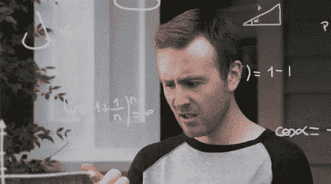
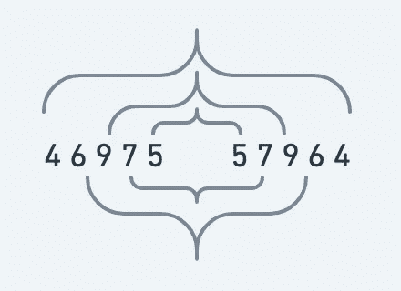
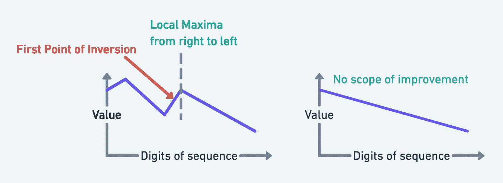
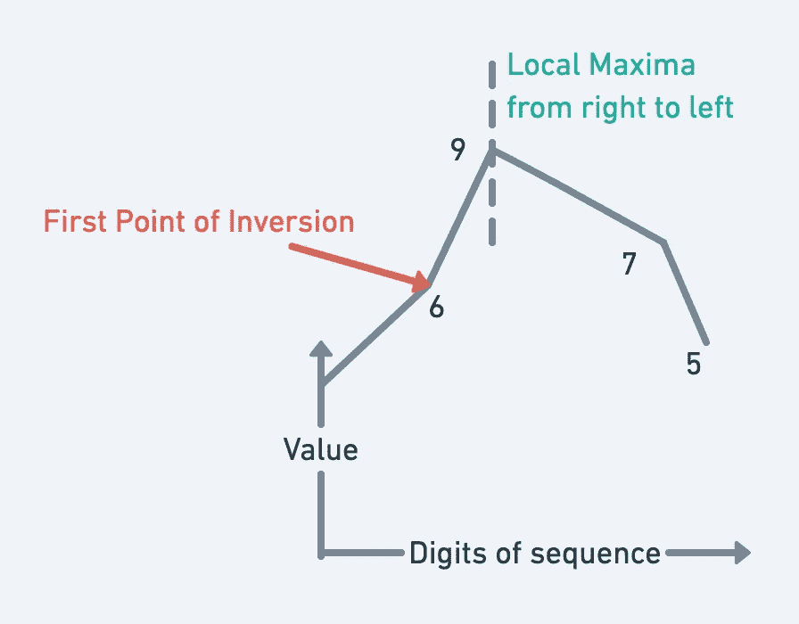

# 下一个更高的回文使用同一组数字

> 原文：<https://medium.com/geekculture/next-higher-palindrome-using-the-same-set-of-digits-2c8056e09755?source=collection_archive---------6----------------------->

**问题:**我们给定一个数字 N，我们必须找到大于 N 的最小可能回文，它可以通过使用与 N 中相同的一组数字来形成。这个问题在许多面试中都被问到，需要逐步理解，也可以应用于其他操作问题。



Let’s dive in!!

# 目录

1.  背景和例子
2.  对最佳解决方案的期望
3.  分解并可视化问题
4.  解决方案和方法
5.  源代码

# 背景和例子

什么是回文？向前读和向后读一样的单词、短语或序列，如 ***夫人*** 或 12321。

假设我们给定了数字 4697557964，这是一个回文。

*可以使用相同数字形成的下一个更高回文是—*

```
4697557964 (Original number) 4756996574 Output
```

# 对最佳解决方案的期望

*   时间复杂度应该是线性的。
*   如果需要，可以使用辅助阵列。
*   因为输入数字可能非常大，所以将输入作为一个字符串。

# 分解并可视化问题

因为回文的意思是数字的一半是另一半的镜像，就像—

```
46975 | 57964 OR 47569 | 96574 
```



Figure 1: Palindrome: A mirror image

因此，如果我们只专注于一个部分，我们正在修改—

```
**46975** (Input) => **47569** (Output we want)
```

它只是使用同一组数字的下一个更高的数字。因此，问题变成了—

## 问题 1:📝

对于前半部分，使用相同的一组数字找到下一个更大的数字

## 问题二:📝

镜像(反转)前半部分得到后半部分并追加。

# 解决方案和方法

## 步骤 1:找到反转点(局部最大值的邻居)

为什么你需要找到一个从右到左的反转点或者一个比右边小的点？

> 反转点是为了获得更高的数量/平方而需要改进的地方

因此我们发现了反转——

> 比如说完整的部分从右到左是递增的(或者从左到右是递减的)，就像{9 7 5 4 3}，这意味着我们不能用这些数字来产生比这个更大的数。



Figure 2: Why Point of inversion?

现在让我们将相同的逻辑应用于我们的输入— ***46975***

因此我们发现 I = 6 为反转点。



Figure3: Point of Inversion (I = 6)

如果你注意到这里—

> 反转点(I)的右侧按降序排序。

因为{4，6，9，7，5 } = > Right 的右边排序，即 9，7，5。

## 第二步:找到合适的替代品

现在我们找到哪个数字(在倒置的右边 **I** )可以用来替换这个倒置，当然这就是我们如何制作一个更大的数字。

我们应该从所有大于 I 的数中选择一个尽可能小的替换数，以得到下一个最大的数，而不是很多。

> 找到最小的可能更大的数字将导致一个更大的数字。

```
4 **6** 9 7 5
  |   
  I   S = ?
```

如果在图 3 中查看，大于 **I = 6** 的最小数是 7。我们姑且把这个 7 称为 S(合适的替代)

你怎么找到 S 的？

*   强力-在右侧迭代，找出比反演(I)大的最小数。
*   最佳方式-右侧排序后，应用二分搜索法找到 s

> 优化 1: 当 I 的右边被排序时，我们也可以应用二分搜索法来找到 s

例如，我们从 I 的右侧开始，我们发现 7 是可能的最小替换。

```
4 **6** 9 **7** 5
  |   |
  I   S <- found 7 min greater than 6
```

## 第三步:交换和镜像

当我们找到合适的替代者时，我们交换 I 和 S，得到一个更大的数字。我们改变了这个—

```
4 **6** 9 **7** 5
  |   |
  I   S Swap I and S digits ==========>4 **7** 9 **6** 5
  |   |
  I   S
```

我们现在取得了更大的成绩，不是吗？是的。但这是最小的可能更大的数字吗？

正如你现在看到的，我们已经有了一个更大的数字，因为我们增加了索引 I 中的数字。

> 在交换之后，I 右边的数字没有必要是随机的，它应该尽可能的小。因此我们可以说是 I 的右边。

因此

```
4 7 9 6 5
  |   |
  I   SSort the part on the right side on I ==========>**4 7 5 6 9**
```

变成了{4 7 5 6 9}，这实际上是比第一步输入的{4 6 9 7 5}更大的最小可能数字，使用的是同一组数字。

因此，我们的一部分，问题 1 现在解决了，即

## *问题 1 ✅*

*对于前半部分，使用同一组数字找到下一个更高的数字*

> **优化 2:** 在第 3 步中，我们已经知道，除了我们替换的元素之外，它是按降序排序的。之后，I 的右侧仍然以递减方式排序。因此，我们直接反转 I 的右侧，而不是简单排序。

现在，为了得到数字的后半部分，我们将它镜像并附加到自身中

```
**4 7 5 6 9 | <Its reverse / mirror>**Mirror and append ==========>**4 7 5 6 9 | 9 6 5 7 4**
```

因此，我们的问题 2 现在也解决了

## 问题 2 ✅

*镜像(反转)前半部分得到后半部分并追加。*

我们可以验证我们的输出，使用相同的数字可以形成的下一个更高的回文是—

```
4697557964 (Original number)4756996574 Output ✅
```

太好了，😊不是吗？

# 示例代码

Sample Code for the problem of next higher palindrome using same digits

感谢阅读这篇文章！欢迎留下你的评论，让我知道你的想法。请不吝赐教，改进这篇文章。
请查看我的[其他文章](https://medium.com/pranayaggarwal25)和[网站](http://pranayaggarwal.github.io/)，祝您愉快！

请随意在这里给我买一杯咖啡😊