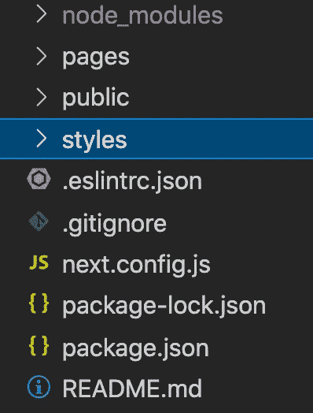
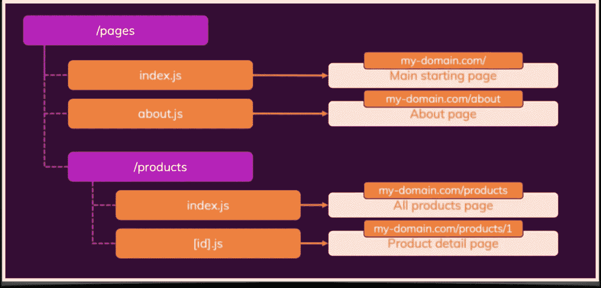

# 下一个。JS—应用程序设置和基于文件的路由

> 原文：<https://medium.com/geekculture/next-js-application-setup-and-file-based-routing-cbb0b70d514c?source=collection_archive---------11----------------------->

Photo by [Danist Soh](https://unsplash.com/@danist07?utm_source=medium&utm_medium=referral) on [Unsplash](https://unsplash.com?utm_source=medium&utm_medium=referral)

当涉及到前端应用程序开发时，我们通常会更多地通过优化来提高应用程序的性能。作为一名 React 开发人员，我沉迷于无数的节点包和配置来提高性能。从 react-router 到 webpack，从图像的延迟加载到服务器端渲染，都需要多次手动微调。然后是一个基于 React.js 库构建的框架，它有多个内置特性，可以减少生产就绪应用程序的手动干预— **Next.js**

# 功能齐全的 Next.js

Next.js 是一个基于 Node.js 的开源开发框架，支持基于 React 的 web 应用程序功能。 [Vercel(原名 ZEIT)](https://vercel.com/) ，维护并领导 [Next.js](https://github.com/vercel/next.js) 开源开发。

Next.js 是一个 React 框架，能够创建在客户机和服务器上运行的应用程序，也称为通用 JavaScript 应用程序。该框架通过简化客户端路由和页面布局等基本功能，同时简化服务器端渲染和代码拆分等高级功能，帮助您更快地构建通用应用。

> React 文档在“推荐的工具链”中提到了 Next.js，建议开发人员在“使用 Node.js 构建服务器呈现的网站”时将其作为一个解决方案

## Next.js 提供的内置特性

1.  [快速刷新(热重装)](https://nextjs.org/docs/basic-features/fast-refresh)
2.  [基于文件的路由(静态和动态路由)](https://nextjs.org/docs/routing/introduction)
3.  [自动代码分割](https://nextjs.org/docs/advanced-features/dynamic-import)
4.  [图像组件和优化](https://nextjs.org/docs/basic-features/image-optimization)(延迟加载)
5.  [预渲染&服务器端渲染](https://nextjs.org/docs/basic-features/pages#server-side-rendering)
6.  [ESLint 集成](https://nextjs.org/docs/basic-features/eslint)
7.  [打字稿支持](https://nextjs.org/docs/basic-features/typescript)
8.  内置组件—图像、标题、脚本等等。

# Next.js 应用程序设置

通过在您的终端上运行`npm create-next-app`，一个基本的样板代码将在您的系统中建立起来。文件夹结构将如下所示

Next.js Folder structure

你可以看到像`pages`、`public`、`node_modules`、`styles`这样的文件夹。`pages`文件夹有助于 Next.js 应用程序中基于文件的路由，它应该包含所有的主页面。`public`文件夹是为所有静态资产准备的，比如图像、图标等。`styles`文件夹包含您的应用程序 CSS 文件。

`next.config.js`是您的 Next.js 应用程序配置文件，它有助于配置环境变量、图像/文件扩展名配置等。
这个配置文件是一个常规的 Node.js 模块，不是一个 JSON 文件。它由 Next.js 服务器和构建阶段使用，不包含在浏览器构建中。

# 基于文件的路由

在单页面应用程序中，路由是从一个页面导航到另一个页面需要实现的关键元素之一。Next.js 通过其名为*基于文件的路由*的内置路由技术为您解决了这个问题。

`pages`文件夹帮助完成 Next.js 中基于文件的路由，该文件夹包含`_app.js`和`index.js`，分别是应用根文件和主页或主起始页。

file-based routing folder structure

在上图中，您可以看到`pages`文件夹包含静态、动态和嵌套路线的文件和文件夹。`pages`文件夹应该只包含组件和所有其他文件，如常量、实用程序必须从`pages`文件夹中移出。

我们将研究如何实现 ***静态、动态和嵌套路由*** 。

Files-based routing technique

## 静态路由

在上图中，你可以看到`pages`文件夹包含一个名为`about.js`的文件。JS 文件的名称本身将成为一个路由，在这种情况下，是一个静态路由。现在，当您导航到`my-domain.com/about`时，浏览器将呈现`about.js`组件。

类似地，对于嵌套路由，您可以在`pages`文件夹中创建一个文件夹，比如说`company`，在其中，您可以包含一个`index.js`来拥有`my-domain.com/company`。现在，如果我们需要一条类似于`my-domain.com/company/contactus`的路线，我们需要在`company`文件夹中添加一个名为`contact.js`的文件。就是这样！您现在已经实现了静态路由！

## 动态路线

假设我们需要一条类似于`my-domain.com/products/1`的路线。当产品 ID 发生变化(动态)时，我们需要使用相同的组件获取特定产品的数据。

在上图中，你可以看到`products`文件夹驻留在`pages`文件夹中，因此我们有了`my-domain.com/products`。为了处理路由的动态部分，也就是`my-domain.com/products/1`，我们需要在`products`文件夹中添加一个 JS 文件，但是因为我们需要一个动态路由，我们需要用方括号`[]`来命名这个文件。这里，我们将`[id].js`文件添加到`products`文件夹中。在这个文件中，我们可以有一个组件来使用 Id 获取产品数据并呈现视图。

您可以使用名为`useRouter`的内置钩子来访问路由参数和查询。在下面的示例中，您可以看到如何读取 ***路径名*** 和 ***动态 Id*** *。*

如果我们需要一个类似于
`my-domain.com/blog/2021/my-only-blog`的 URL，在我们的路由中需要多个动态参数，该怎么办？这可以通过使用以下格式实现— `[...blogid].js`。将此文件添加到您的`blog`文件夹中——查看本文的第二张图片。现在，`[...blogid].js`组件可以在 URL 中有多个动态参数。

要读取动态查询参数，使用— `router.query`,它返回一个数组中的所有动态参数。

## 404 找不到页面

当输入错误的路由/URL 时，Next.js 默认提供一个干净的 404 错误页面。不需要任何配置或代码。

默认的 404 页面看起来像…

Default 404 error page provided by Next.js

此外，Next.js 允许开发人员添加自定义的 404 页面。添加一个 404 组件，并在`pages`文件夹内将该文件命名为`404.js`(查看文件夹结构图)。就是这样。现在你有了自己的自定义 404 页面。当找不到路由时，Next.js 检查应用程序中的`404.js`页面并呈现它，否则它将呈现默认的 404 错误页面。

这就是 Next.js 应用程序设置和基于文件的路由实现的全部内容。

查看本文的第二部分，我在这里解释了 Next.js 中的**预渲染**，如何在 Next.js 中实现**静态站点生成(SSG)和服务器端渲染(SSR)**

 [## 下一个。JS——静态站点生成和服务器端渲染解释

### Next.JS 简单而强大的内置渲染特性。

medium.com](/@dsVinay/next-js-static-site-generation-and-server-side-rendering-explained-bc9cae0885c6) 

*查看示例 Next.js 应用代码* [***此处***](https://github.com/vinayds21/NextJS-Application) *。我在这里实现了 Next.js 提供的所有路由技术，同样，在这里* ***查看生产 URL。***