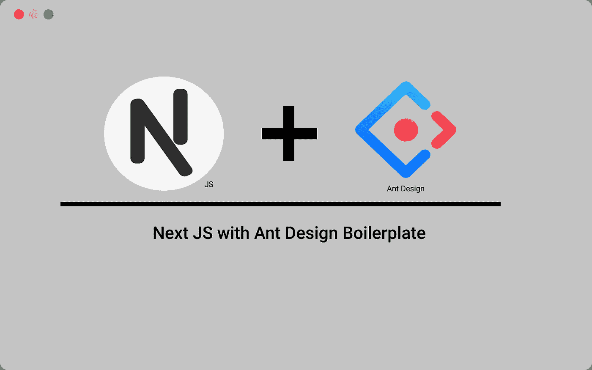

# 蚂蚁设计的下一个 JS

> 原文：<https://medium.com/geekculture/next-js-with-ant-design-f542ebe4e00c?source=collection_archive---------0----------------------->

为 UI 库创建另一个样板文件

[i Hate Reading](http://www.ihatereainding.in)

## 在后台

到目前为止，我已经介绍了 React 提供的所有 UI 库的多个故事。我们已经深入讨论了将这些故事与下一个 JS 集成的故事，等等。在今天的故事中，我们将介绍另一个名为 Ant Design 的 UI 库。Ant Design 仍然是最受欢迎的 UI 库