# 使用 LSTMs 的下一个单词预测

> 原文：<https://medium.com/geekculture/next-word-prediction-using-lstms-98a1edec8594?source=collection_archive---------9----------------------->

使用 LSTM 和注意机制的基于分类的方法的详细实现

这是主文[使用 Swiftkey 数据](/@prerana1298/next-word-prediction-using-swiftkey-data-f121f59bc7d)预测下一个单词的续篇。我将在接下来的章节中详细讨论 LSTM 模型的文本特征和架构。

# 功能开发

## **创建文本序列**

我已经从清理过的语料库的记号中创建了不同长度的序列，并保持了记号的顺序。

**代码示例**

我创建了长度为 2、4 和 7 的序列。

## **编码序列并分裂成 x 和 y**

我已经使用 Keras Tokenizer 对序列中的单词进行了编码，并对序列进行了拆分，使得序列中只有最后一个单词在 y 中，其余的在 x 中。

因此，长度为 2 的序列的第一个字在 x 中，最后一个字在 y 中。类似地，长度为 4 的序列的前 3 个字在 x 中，最后一个字在 y 中。

**代码示例**

下面是编码和分割数据的函数

上述函数还返回编码数据的词汇表和每个编码单词的索引。

**这里的想法是 y 中的每个单词充当一个类，我的目标是根据 x 中的单词序列来预测该类。**

# 堆叠 LSTM 模型

它是通过在 LSTM 层上叠加双向 LSTM 层而开发的模型。以下是 LSTM 模型的架构。

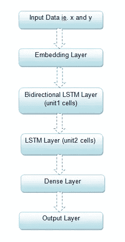

Model Architecture

我已经开发了 3 个这样的模型，分别对应于长度为 2、4 和 7 的序列。在每种情况下，除了单元 1 和单元 2 单元的数量**之外，一切都保持不变。其思想是保留 x 中单词的序列信息，以预测 y 中的下一个单词类。**输出层有一个 softmax 激活，所以我得到了输出类的概率分布。

**代码示例**

## 训练结果

对于长度为 2 的序列:

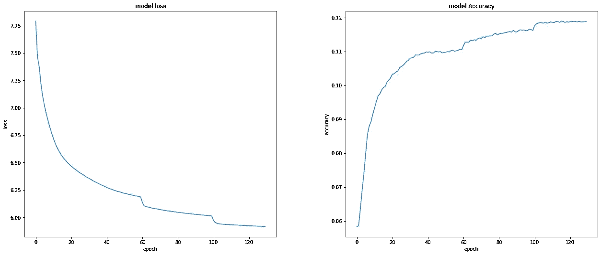

Model Performance for sequence of length 2

对于长度为 4 的序列:

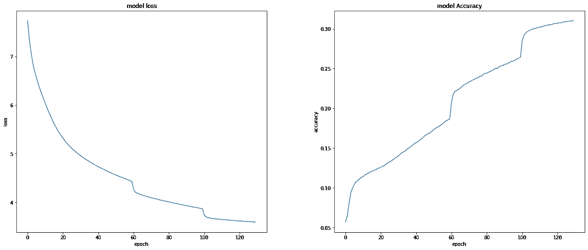

Model Performance for sequence of length 4

对于长度为 7 的序列:

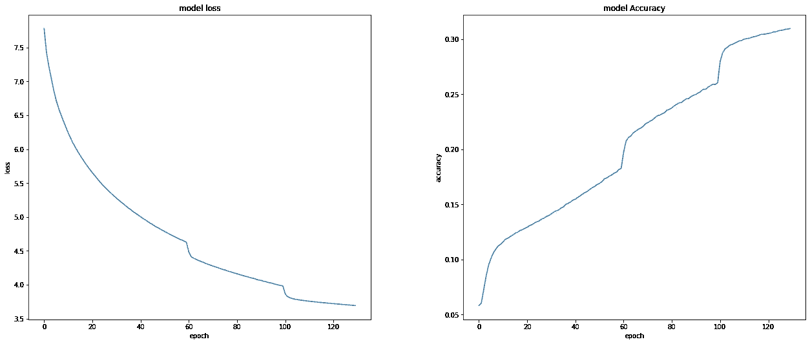

Model Performance for sequence of length 7

**Github 链接:**[https://Github . com/kur chi 1205/Next-word-Prediction-using-swift key-Data/blob/main/LSTM % 20 model . ipynb](https://github.com/kurchi1205/Next-word-Pediction-using-Swiftkey-Data/blob/main/LSTM%20Model.ipynb)

## 试验结果

*   序列 2-损失:9.2959
*   序列 4-损失:27.3950
*   序列 7-损失:22.7704

## **下一个单词预测**

**关键想法:**

1.  单词序列`(history)`作为输入，其下一个单词必须被预测。
2.  如果`history`的长度= 1，那么我们将其传递给序列长度为 2 对应的模型，预测概率最高的类。
3.  如果`history` <的长度为 4，那么我们将其传递给序列长度为 4 对应的模型，预测概率最高的类。
4.  如果`history` <的长度为 7，那么我们将其传递给序列长度为 7 对应的模型，预测概率最高的类。
5.  如果`history`的长度≥ 7，那么我取`history = history[-6:]`，重复步骤 4。

**一些预测:**

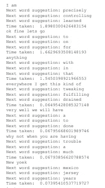

Some next word predictions

总的来说，模型预测相当不错，但由于损失太高，还有改进的余地。

# 关注堆叠 LSTM 模型

这个模型与上一个非常相似，除了我在双向 LSTM 的输出中添加了一个**注意层**。

**为什么我们需要关注层？**

有些时候，当我们预测一个序列的下一个单词时，该序列的所有单词对该单词的预测的贡献并不相等。

例如:考虑句子 ***`我去看医生，因为我病得很重`*** 假设这里，我要预测单词 ***有病*** 。为此，单词 ***变*** 、 ***见*** 、 ***医生*** 将具有更大的权重，因为它们对下一个单词生病的概率贡献更大。

因此，为了给序列中的每个单词提供权重，我们需要一个注意力层。

## 模型的架构

下面是模型的架构流程图:

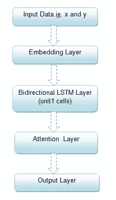

Flowchart of the Architecture

现在来看看注意力层的架构。

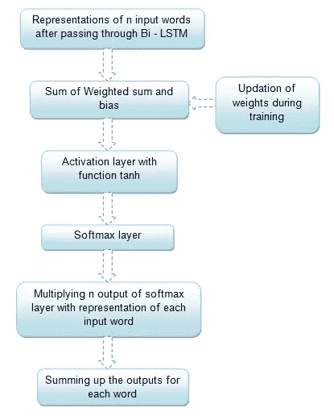

Architecture for the attention layer

## 编码样本

**对于关注层:**

**整体型号:**

**Github 链接:**[https://Github . com/kur chi 1205/Next-word-Prediction-using-swift key-Data/blob/main/LSTM % 20 model % 20 with % 20 attention . ipynb](https://github.com/kurchi1205/Next-word-Pediction-using-Swiftkey-Data/blob/main/LSTM%20Model%20with%20Attention.ipynb)

## 训练结果

对于长度为 2 的序列:

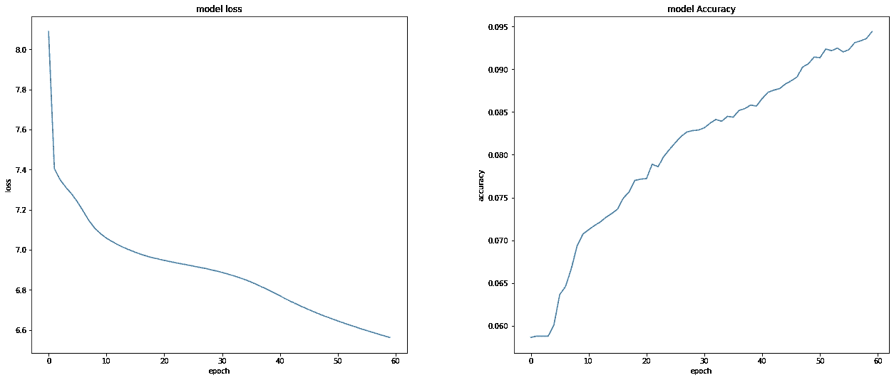

Loss and Accuracy for sequence of length 2

对于长度为 4 的序列:

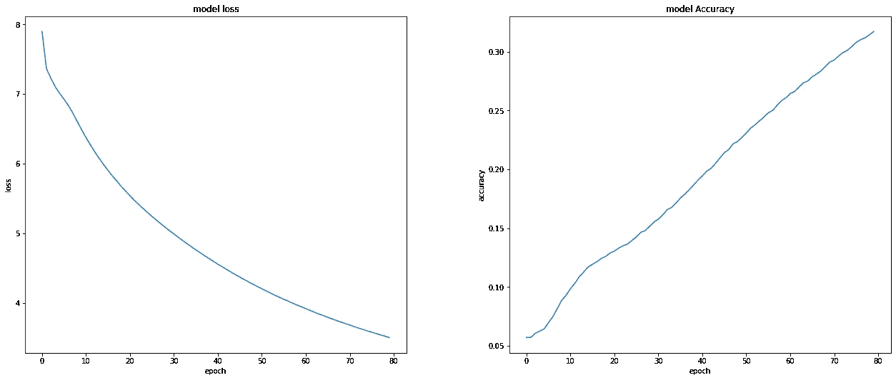

Loss and Accuracy for sequence of length 4

对于长度为 7 的序列:

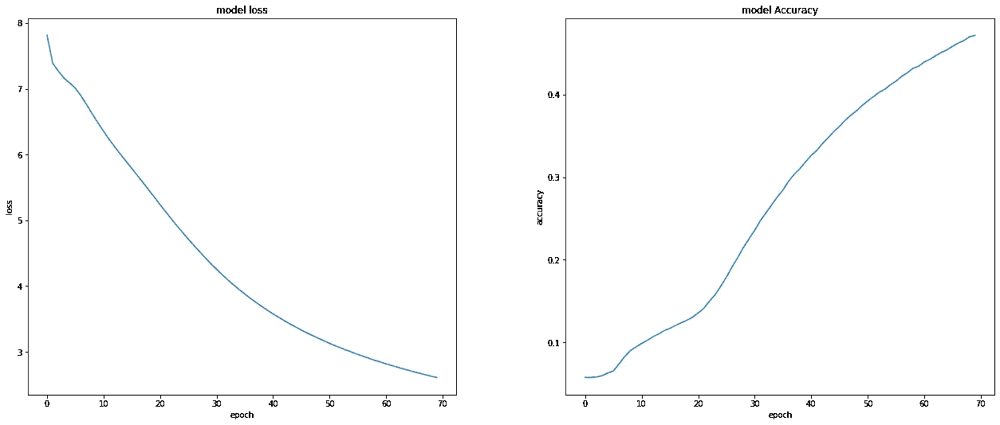

Loss and Accuracy for sequence of length 7

## 试验结果

*   序列 2-损失:7.09
*   序列 4-损失:8.84
*   序列 7-损失:9.24

## 下一个单词预测

**关键思想:**与上面讨论的堆叠模型相同。

**一些预测:**

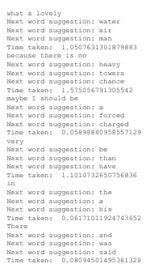

Predictions using LSTM with attention mechanism

因此注意机制显著改善了损失。

然而，我尝试了一些其他基于变压器的模型，看看结果是否有所不同。请参考主要文章。