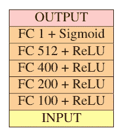
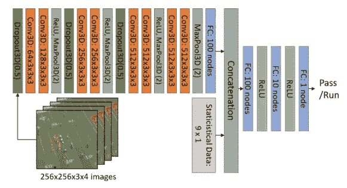
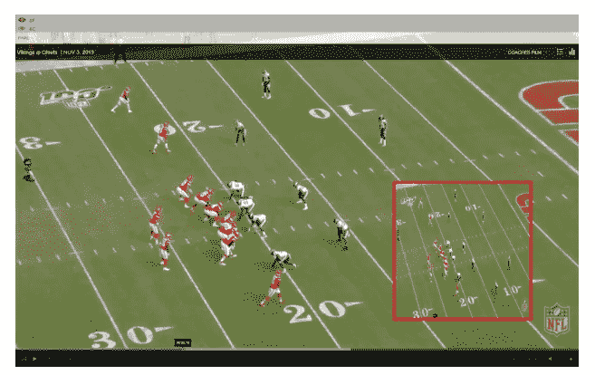
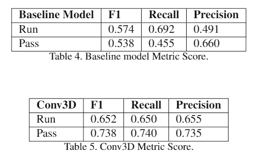
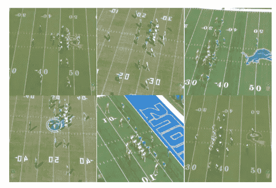
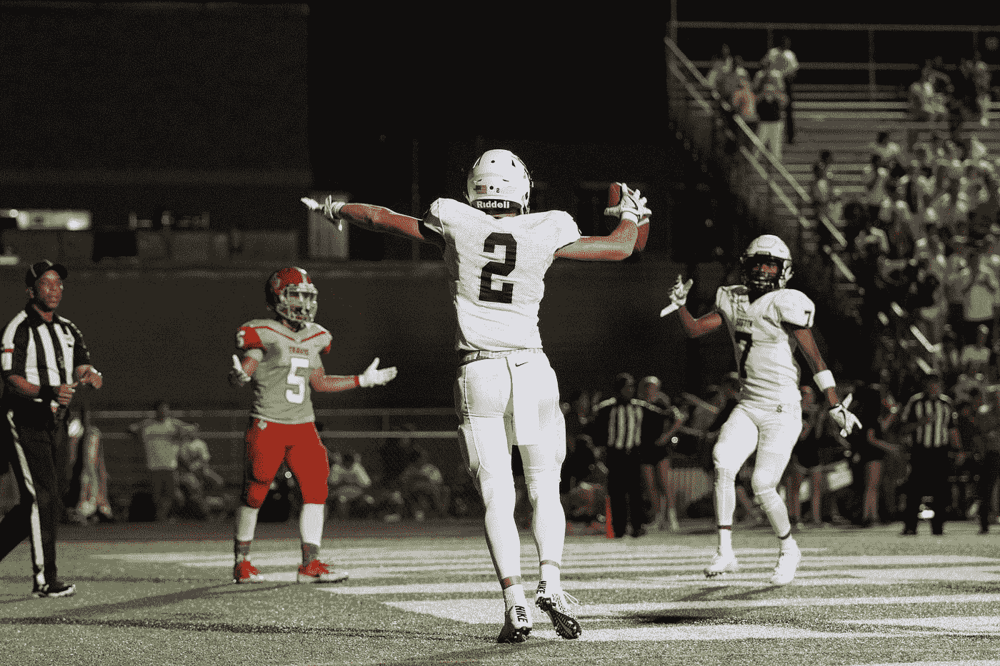

# 使用计算机视觉的 NFL 比赛预测

> 原文：<https://medium.com/geekculture/nfl-play-prediction-using-computer-vision-c44dca8314c6?source=collection_archive---------7----------------------->

Players lining up at the goal line to prepare for the next play. (Souce: Flickr by [SteelCityHobbies](https://www.flickr.com/photos/steelcityhobbies/))

国家橄榄球联盟是美国最大的体育产业。由于其高度竞争性，NFL 吸引了全球大量的观众。特别是，在超级碗期间，超过 1 亿的观众观看了比赛和 ***，一个 30 秒的商业广告的成本在 500 万美元左右。***

要赢得超级碗，球员和教练必须付出长达一年的努力。如今，先进的设备和先进的数据分析使 NFL 球队更容易从可访问的数据中找到有用的信息，以帮助球员在比赛中即兴发挥。

在这个项目中，我们进行了一个简单的二进制分类问题来测试在 NFL 中实现计算机视觉的潜力。更具体地说，给定一个输入，模型预测比赛的类型:跑动或传球。

我们使用了两种不同的输入，非结构化数据和结构化数据。每个输入包括 4 帧球员在场上的位置和游戏中的统计数据。统计数据包括分数、剩余时间、击倒次数和球在球场上的位置。

## **方法**

我们提出了两种不同类型的模型来预测运行或通过:3D CNN 和预训练的 Resnet3D。这两个模型用 4 帧游戏中的视频和统计数据来训练，而基线模型只使用统计数据来训练。

**基线模型**

游戏中的统计数据可以为观众提供信息。仅仅通过观察比赛中的统计数据，就可以预测进攻是会跑还是会过。例如，当比赛进行到第三次进攻时，还有超过 10 码的距离，进攻方最有可能传球，因为传球比跑动有更大的机会前进 10 码。此外，如果球放在对方一侧的 1 码线上，进攻很可能会跑起来，因为获得更短的码是更安全的选择。

就像我们如何通过推断统计数据来预测比赛类型一样，我们相信该模型也可以通过统计数据来学习足球比赛。

我们组成了一个简单的人工神经网络作为我们的基线模型。基线模型的架构如下所示。

Baseline Model Architecture

**三维卷积神经网络**

图像包含足球比赛的独特信息，这是比赛中的统计数据所缺乏的。图像包含球员在场上的位置信息，这对预测比赛类型至关重要。

在足球比赛中，防守方通过观察对方球员的阵型来猜测比赛的类型。也就是说，每个进攻球员在混战中排成特定的位置是有目的的。

没有关于玩家位置的任何信息，很难准确预测游戏。

> 打个比方，只使用游戏中的统计数据就像通过听广播来预测比赛，同时使用图像和游戏中的统计数据就像观看实际的比赛。

显然，当人们实际观看比赛时，他们可以更好地预测。因此，我们决定使用 3D CNN 来利用图像和游戏中的统计数据。

在 3D CNN 中，模型进一步从*两个时间和空间维度提取特征。一个以上的时空图像以传染的方式排列以构建三维空间，从而形成三维空间，并且这种排列使得模型能够提取输入的不同图像/帧内的运动信息。

在我们的项目中，我们可以利用帧差法来预测播放类型。在足球比赛中，在抢球之前，外接球手和跑卫四处移动，突然改变阵型，用不同的打法摆脱对手。因此，我们决定在球被抓拍之前捕捉球员移动的画面。每场比赛总共检索了 4 帧，每一帧捕捉了不同的时间进攻阵型。这允许模型学习运动方案和游戏类型之间的关系

有两个引入输入的阶段。首先，3D 卷积神经网络输入图像数据(N，3，4，256，256)进行处理。然后，在将图像展平到一个数组中之后，在完全连接步骤引入游戏中的结构化数据(N，9)。该模型被进一步训练学习，使用图像和游戏中的统计数据。*

> *直观地说，在观看足球比赛时，观众只要看球员的阵型就可以预测比赛。例如，如果四分卫周围没有跑锋，比赛将很可能变成传球。最重要的是，如果模型可以推断游戏中的统计数据，它将对游戏有更好的控制。我们确实认为该模型可以很好地学习各种阵型模式，足以准确预测比赛。*

**

*Conv3D Architecture*

## ***数据集***

*我们从 NFL-22 获得数据，这是一个官方的 NFL 电影网站。我们只关注堪萨斯城酋长队，因为他们是 2019-2020 赛季> :D 的卫冕冠军*

*每支球队都有 16 场常规赛和 4 场季前赛。在一场比赛中，球队通常有 50 到 60 次传球跑位。对于每场比赛，我们以如下方式捕捉场上球员的 4 帧图像:球被抓拍前的 3 秒、2 秒、1 秒以及球被抓拍的瞬间。除了画面，我们还记录了剩余时间、分数，以及在该剧被拍摄时的击倒次数。*

## *数据预处理*

*一旦为每个剧本捕获了 4 帧，我们就用正确的标签对剧本进行手动分类。然后，我们将图像保存到相应的文件夹中:run 或 pass。*

*框架被裁剪和调整大小。我们试图尽可能少地裁剪以保护玩家的位置。有一些戏剧不包含 4 帧，因为戏剧是在电影开始录制时开始的。在这种情况下，我们复制前一帧来填充丢失的帧。*

**

*The image inside the red border reflects the preprocessed image.*

*图像和游戏中的统计数据都减去了数据中每个特征的平均值。这将强制每个特征以原点为中心。*

*不同的体育场有不同的摄像机视角。因此，每部电影都是从不同的角度拍摄的。然而，我们没有对齐或转换图像来构建一个统一的视图，因为该模型不太通用。我们希望模型能够灵活地学习不同摄像机视图的一般特征。我们相信不同的角度会在戏开始前产生各种关于球队阵型的信息。*

*在收集了 1000 个样本后，我们注意到数据集非常不平衡。数据集由大约 67%的传球和 33%的跑动组成。运行模型时，不平衡的数据集可能会导致重大问题。当传球数量远大于跑动时，它可能会降低模型的性能，因为无论球员在场上的位置如何，模型都可能学会总是预测传球。*

*为了平衡数据集，我们决定从右向左翻转跑步图像，使跑步播放量加倍。这种图像增强在我们的例子中是有效的，因为通过水平翻转图像，我们只是改变了场地的一侧，而游戏的其他一切都保留了下来。在扩充数据之后，我们已经捕获了总共 1355 次播放(5420 帧)。更具体地说，收集了 689 次传球和 666 次跑位*

## *结果*

*显然，3D CNN 的表现优于其他模型，在 F1、召回率和精确度这两种播放类型中得分最高。这表明该模型在预测这两种类型的游戏方面做得相对较好，并且在决策中没有偏见。*

**

*我们对正确分类和错误分类的图像进行了采样，以检查在预测过程中什么类型的地层脱离了模型。*

****

*Left) Conv3D accurately predicted images. Right) inaccurately predicted images*

*我们会将错误标记的图像指示为假图像，而将正确标记的图像指示为真图像。如果我们将虚假图像与真实图像进行比较，我们可以清楚地看到，虚假图像包含更多的噪声，如球场上的阴影，人群，以及球员在边上出现，以及球场上缺少的一片绿草。背景中有人群肯定会使模型混淆应该关注哪一组人。*

*此外，即使用我们人类的眼睛，有时也很难定位被阴影覆盖的玩家。这个模型也许可以排除部分团队，只考虑部分编队。另一方面，真实图像只显示球员在混战中排队。我们几乎看不到任何可能妨碍定位球员的障碍物。从这一分析中，我们能够看到数据质量的重要性和数据可变性的存在。*

## *限制*

*模型精度相对较低的主要原因是由于数据集较小。即使我们设法获得了超过 1300 个样本，也不足以训练模型来提取足球比赛中涉及的复杂性，从而预测比赛类型。此外，在数据本身，我们能够看到一些变化。例如，堪萨斯城酋长队有两套制服:红色代表主场，白色代表客场。在训练数据有限的情况下，当决定哪一方是进攻方时，不同的颜色会混淆模型。此外，许多游戏都是在户外进行的，因此数据会随着不同的天气条件而变化。例如，一些游戏包括大量的雨、雪和球场上的阴影，这使得更难找到球员。所有这些变化都会增加问题的复杂性，阻碍学习的进程。*

## *结论*

*在这个项目中，我们进行了一个二元分类问题来预测打球、跑动或传球的类型。总的来说，我们表明三维卷积神经网络可以有效地提取空间和时间信息。结果证明了我们的假设，即当用图像和游戏中的统计数据进行训练时，模型表现得更好。在数据集相对较小的测试集中，Conv3D 模型达到了 70%。这表明，一旦用足够的数据进行训练，在 NFL 中实施深度学习有很大的潜力。*

*在评论中列出你最喜欢的 NFL 球队！:D，大家触地得分快乐*

**

*Photo by [Katrina Berban](https://unsplash.com/@kattrinnaaaaa?utm_source=medium&utm_medium=referral) on [Unsplash](https://unsplash.com?utm_source=medium&utm_medium=referral)*