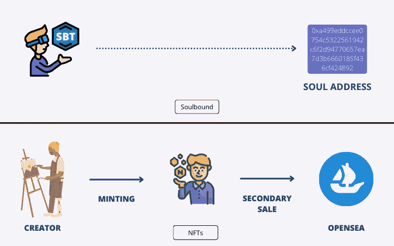

# NFT 2.0 开发:Soulbound Token 开发如何革新 Web3 行业？

> 原文：<https://medium.com/geekculture/nft-2-0-development-how-soulbound-token-development-could-revolutionize-the-web3-industry-6cff798bc312?source=collection_archive---------15----------------------->

现在没有必要抄袭或忍受在重要方面发生的侵权或欺诈行为。用 NFTs 替代实物资产是众所周知的事实。但这甚至不能满足代币稀缺的边缘。获得我们的资产或财产的永久印记，就像我们在日常活动中所做的一样，也是必要的。现在，不费吹灰之力就像有了权威的证明来要求我们的财产。

灵魂绑定令牌！！！听起来像是视错觉；其实很多人盯着看。尽管如此，本发明的 Web3 分支仍然是 NFT。这些 NFT 在区块链的存在不是一件容易说的事情…灵魂绑定的令牌包裹着我们资产的价值，这灌输了一种新的验证过程的方式来保护我们的贵重物品。

[**NFT 市场发展服务**](https://www.appdupe.com/nft-marketplace-development) 现在幸运地捡起这些概念性的灵魂绑定令牌。你可以将你的理想和重要的实物资产公式化为灵魂绑定令牌，在私人区块链中加密你的信息。

# 嗯！谁创造了这个术语——灵魂绑定令牌？？？

毫不奇怪，NFTs 的每一个领域都来自这个星球上顶尖的加密爱好者。以太坊的联合创始人 Vitalik Buterin 是 Web3 这个动态项目的发起人。近年来开拓这一势头将很快被带到用户的光。这个奇特的词——soul bound 的提取，当然是来自一款游戏《魔兽世界》。只有在白皮书的支持和论证下，这一切才有意义。这份白皮书于是被称为— [**SBT 令牌**](https://vitalik.ca/general/2022/01/26/soulbound.html) …。

它强调了融合分散社会(DeSoc)和灵魂绑定令牌的想法或愿景。“灵魂”指的是我们打算在区块链上铸造的更有意义的资产。因此，Web3 项目在这些 NFT 的商业化方面面临着挑战。

因此，让我们进入灵魂绑定令牌的世界吧！陈述 NFT 是无限的不仅仅是一个公理…也许你会在这里知道我为什么这么说…

# 灵魂绑定令牌——将 NFT 嵌入人类生活方式每一寸的奇妙方式！

> 灵魂绑定令牌是 NFT，其加密是私有区块链中的重要活动。这些令牌也是不可转让和公开访问的。创建社会身份标识作为令牌，以实现 DeFi 或 Web3 社会中不存在的服务。例如，它可能是一套公寓的租约。

这些令牌沉浸在一个特定的地址——灵魂。这可以用一个我们常用的例子来解释，那就是简历。简历是一份草稿，包含了我们每一个特定的教育和经历或者能力。

类似地，灵魂绑定的令牌作为一个数字小册子，在区块链中包含你的信息。[**soul bound token development**](https://www.appdupe.com/soulbound-token-development)在 Dapps、marketplaces 和 DAOs 中维持你的诚信和声誉。它还提供必要的凭证，增强信任，并建立你的贵重物品的合法性。

# 为什么我们需要担心灵魂绑定令牌？

在审视传统金融体系的现状时，可信度是一个重要的因素。如果没有信任的空间，我们无法承担任何价值或制度。现有的金融系统缺乏满足用户需求的某些功能。因此，选择灵魂绑定的令牌将提供一个永久且不可删除的社会身份。

灵魂绑定令牌的一些需求如下:

## 起源

大多数创作者通常选择像 OpenSea 这样的集中式平台，通过编程限制来保持 NFT 的稀缺性。因此，它们成为非森林植被的主要来源。

## 梅毒抗性

Dao 完全依赖于 Web2 社交媒体平台，如 Twitter、Discord 或 Reddit。它防止硬币投票或女巫攻击的说服力。

## 密钥管理

分散的密钥管理不能获得最大的安全性或传递信息。因此，许多人找到了像比特币基地或币安这样的集中平台。形成一个去中心化的社会以增加最佳金融交易的可能性成为必要。

让我知道如何保持这两个词，NFTs 和 SBT，分开！将差异分组会让你明白:

# 灵魂绑定令牌(SBT)

1.  SBT 是不可转让的代币，在区块链仍然停滞不前，不可移动。
2.  SBT 是作为其他 NFT 的证明的社会身份。
3.  这些 SBT 与释放 NFT 艺术证明、无抵押贷款或公寓租赁相关。
4.  SBTs 还提供了一个社区恢复，在所有恢复社区中提供成员保证。
5.  他们还是为访问文档、证书或协议提供身份验证的专家。

# 不可替换令牌(NFT)

1.  NFT 是可转移的数字资产，其交易只能在市场中进行。
2.  NFT 只关注艺术品
3.  他们还可能涉及实际案例，如检查任何产品、房地产、医疗数据等的许可。
4.  众所周知，NFT 是数字资产，因此意外或错误地传输这些数据是不可恢复的。
5.  NFTs 也可以是不需要任何身份证明的活动门票。

## 灵魂绑定令牌的应用(SBT)

1.  NFT 艺术
2.  数据访问对象(Data Access Object)
3.  无抵押贷款
4.  证书和文件
5.  在场证明
6.  数字简历
7.  西比尔抵抗攻击
8.  灵魂滴剂
9.  学历证书
10.  NFT 所有权

## 向上投篮

通过对这些灵魂绑定的令牌进行大量的研究，我感觉自己正在脱离物理资产的陷阱。在这里结束我的想法，我可以保证这些在我们面前出现的非功能性思维的足智多谋和敏锐的天性。清理侵权和侵占，至少我们现在有东西来挑战他们。我们终于找到了一个不朽的方法来加密像 SBTs 这样的发明的现代趋势，并将其融入 NFT 市场。我们现在可以在平台或 Dapps 中快速保护我们的 SBT。它是我们的蓝图，只有我们有访问它们的钥匙。

获得最大的存在和支持的专业人士在 NFT 的业务，以获得自己的灵魂绑定令牌。让我们与 NFT 市场发展最好的**公司合作，成为最佳得分手。快速启动 NFT 市场，放大您的红利！！！**