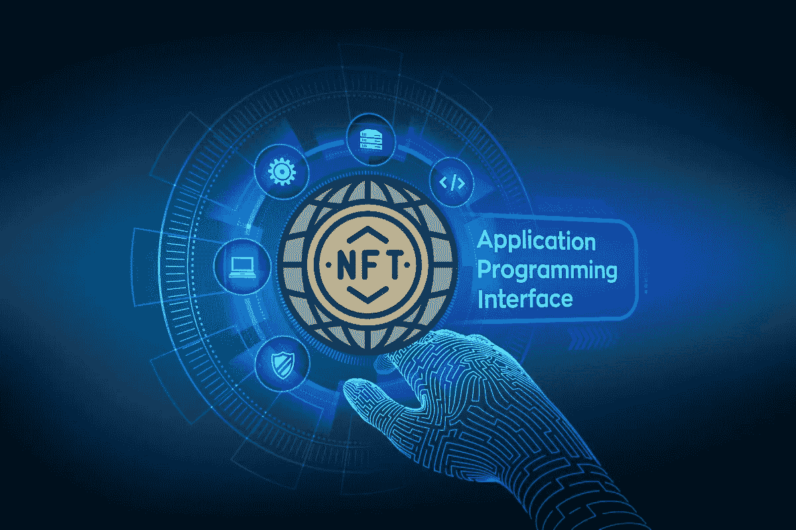

# NFT API 服务平台——寻找激动人心的 API，共创美好未来的新途径

> 原文：<https://medium.com/geekculture/nft-api-service-platform-the-new-way-to-find-exciting-apis-for-a-better-future-693b819df81b?source=collection_archive---------12----------------------->

**NFT API Service Platform**

金融交易已经进入了许多领域，而且每一个领域都是未来的发展方向。NFT 掌握着你开始你一直在等待的创业所需的财富。通常，你可以去他们的办公室，排很长的队，找到订票的方法。但是，现在，在一个 API 的帮助下，这个过程变得非常简单，无论你在哪里，都可以让你的工作变得更容易。从正常的角度来看，这就是 API 的情况。然而，NFT API 将是现代世界的一个突破，它以一种简单的方式处理一切。在为您提供服务的 API 平台的帮助下，所有涉及 NFT 的事情都可以轻松处理，让您的生活更加轻松。

> 在这里，您将了解到对 API 的需求以及关于 **NFT API 服务平台**的更多信息:

**对 API 的需求**

加密领域正在不断开发基于 NFTs 的新东西。NFT 部门的变革和创新速度一直在稳步提高。然而，这些 API 已经准备好推销程序，这是更快开发的主要因素，以便帮助它们成长，并给加密空间一个更大的开发理由。 [**NFT API 服务**](https://bit.ly/3bXxy0N) 还具有额外的**稳定性优势**。

> 以下是大多数公司提供的**关键 API**列表:

**☆使用和检索 API**

取回资产的困难过程之一是打包和取回。然而，基于对标记名的修改，每个查询都应该被更新。检索结果需要时间。此外，engage 和 retrieve APIs 将无缝地与文件处理系统集成，并以令人难以置信的方式帮助缓解这个问题。

**☆钱包 API**

钱包是整个加密领域中任何类型的 NFT 开发的必要条件。然而，它们有各种各样的形式，并且对于每种形式都有专用的 API。整个加密领域的钱包集成将变得非常简单，这要归功于钱包 API。

**☆IPFS API**

NFT 开发服务的一个省时工具是 IPFS API，它是一个存储文件系统，独立于集成的 NFT 服务处理和维护文件。最好的文件处理 API 将使开发者能够创建一个前沿的 NFT 服务。

API 是在更短的时间内为无止境的操作铺平道路的东西。然而，有了最好的 API，您可以立刻创造未来。有几个平台提供了 NFT API，让事情以一种有效的方式发生。

**NFT API 服务平台**

人们将试图从[**NFT API 服务平台**](https://bit.ly/3bXxy0N) 获得 API，该平台在加密货币行业中充当 API 的店面。擅长提供这些平台服务的公司将投入更多时间来开发吸引用户的平台。

**NFT API INTEGRATIONS**

> 以下是 **NFT API 平台需要集成**的主要因素:

✅ **UI**

NFT API 服务提供平台应该有一个简单的用户界面，并能够与用户连接。

✅ **管理面板**

一个管理面板，管理所有类型的特权访问情况，并管理平台和用户之间的互动，最终将有助于增强平台。

✅ **仪表盘**

为了保持 NFT API 服务平台的高端，NFT 平台仪表板将作为一个增长黑客。

✅ **安全**

NFT API 服务平台可以用各种安全协议和防御脚本来增强，以确保平台安全。

这些因素以这样一种方式增强了平台，它可以吸引更多的人并利用他们提供的 API。当你听说这些应用程序已经在 NFT 领域引起了一场革命时，你应该知道 NFT API 将执行的任务。如果你没有听说过它们，下面是它的功能:

**NFT API 执行的任务**

> NFT API 可以执行许多简单而有效的任务，比如:

☀ **获取 NFT 所有者的数据**

您可以使用适当的 NFT API 来提取有关 NFT 所有者的任何必要信息，而不管所涉及的 NFT 遵守什么标准。一行代码就能揭示 NFT 的所有权和转让历史。

☀ **正在搜索 NFT**

一些 NFT API 的功能类似于 NFT 搜索引擎。例如，如果您构建一个 NFT 市场，API 可以让用户使用自由文本搜索任何给定的 NFT。

☀ **获取 NFT 元数据**

通过连接到特定的 NFT API，您可以从任何区块链获取 NFT 元数据。

☀ **正在进行非木材森林所有权核查**

通过几个简单的 API 调用，任何人都可以检索和确认 NFT 所有权信息。

☀ **NFT 基于来源的审计**

NFT API 允许您快速跟踪不可替换令牌的整个所有权历史。

☀**NFT explorer 的开发**

让任何人都能通过名字在区块链搜索任何 NFT 的 NFT 浏览器必须利用这些 NFT API。

☀ **社交媒体-非功能性测试整合**

一些 API 是现成的解决方案，可以轻松地将 NFTs 集成到社交媒体中，这使得社交媒体能够提供出色的用户体验。

☀ **NFT 分析访问**

获得关键的 NFT 分析是任何与 NFTs 合作的业务的要求。然而，借助专为分析而设计的 NFT API，您可以快速提取至关重要的 NFT 数据，并获得关于您选择的区块链的深刻知识。

**结论**

有了[**NFT API 服务提供商平台**](https://bit.ly/3bXxy0N) ，任何人都可以轻松获得 NFT API。不同的 API 平台执行不同的操作；因此，与平台服务提供商合作将使您能够建立一个能够吸引更多人的平台。