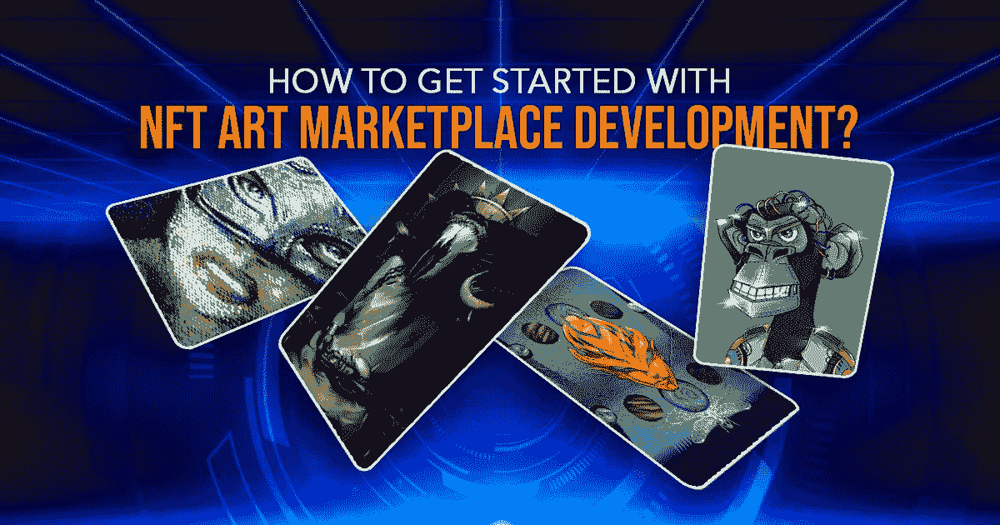
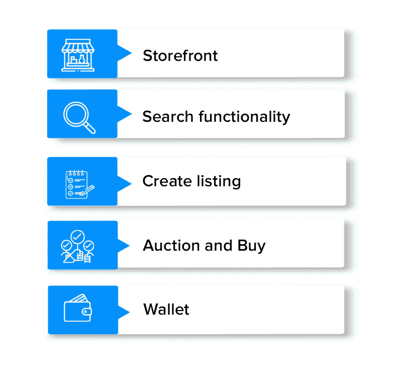
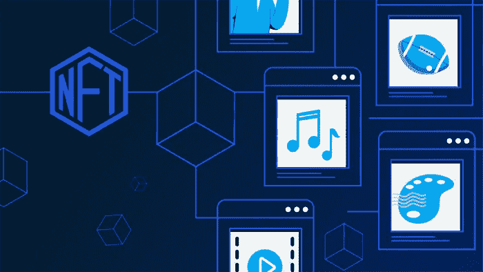

# NFT 艺术市场发展:为艺术家创建 NFT 市场的详细指南

> 原文：<https://medium.com/geekculture/nft-art-marketplace-development-a-detailed-guide-to-create-nft-marketplace-for-artists-fe63d57450ae?source=collection_archive---------10----------------------->

数字艺术品是发展最快的行业之一。创建 NFT 是为了标记独特和不同的数字艺术品，并生成所有权以防止伪造。数字艺术家可以在网上出售他们的作品。标记化的绘画和智能合同使数字艺术家能够添加大量的质量，如元数据、文件链接和所有权身份，从而允许他们保留版权。

NFT 市场为交易者提供了许多新的机会，数字资产日益流行。如果你想学习和了解更多关于 NFT 艺术市场的发展，你来对地方了。在这个博客中，你将了解如何推出 NFT 艺术平台，它的特点等。让我们开始吧。

# **什么是 NFT 艺术市场？**

这是一个平台，让您可以毫不费力地存储和销售 NFT(不可替代的代币)。这些代币可以以固定价格购买或拍卖。如果你有一个加密钱包来使用这样的市场进行交易和保存你的资产，那将是最好的。

用户可以创建一个账户，上传数字艺术品，并在 NFT 市场上出售。一般来说，利基市场已经比传统市场有更高的需求，因为它们包括客户需要的一切，专门营销一些数字艺术品，并有特定的人口统计。

# **NFT 艺术市场发展的主要特征**

以下是 NFT 市场可能具备的一些特征:

## **店面**

一个成功的 NFT 市场通常具有类似于仪表板的店面功能。它为用户提供了他们需要的关于资产的所有信息:

*   业主
*   投标
*   价值历史
*   试映

## **令牌高级搜索**

购买者应该能够快速方便地获得他们所需产品的全部信息。你的 NFT 市场应用应该包括每一个按功能分类的产品(例如，艺术、图片、音乐和视频)。搜索完成得越快，买家的满意度就越高。

## **过滤器**

使用过滤器是有利的。它允许用户根据类别、付款方式、到期日和列表状态来选择资产。添加这个功能来建立一个 NFT 市场的收藏品平台。

## **出价购买**

交易者必须能够在使用市场的同时买卖存储在平台上的 NFT。他们的投标还应包括投标有效日期，并允许他们查看这些投标状态的数据。

## **制作清单**

让客户能够创建和发送数字收藏品。确保他们需要最少的努力来完成任务。尝试建立一个页面，他们可以上传文件，并提供完整的产品描述。标签、标题和插图是必需的。

## **钱包**

客户应该能够使用您的 NFT 市场的钱包来存储、传输和接收 NFT 和加密货币。您可以创建自己的钱包或将多个钱包(如 Formatic、MyEtherWallet 或比特币基地)组合到您的网站上。

## **上市状态**

它有利于能够提供项目并完成产品验证过程的人。它使您能够跟踪身份验证过程的状态。它便于可收集的验证执行。

## **评级**

这是一个为新手准备的功能，他们可能不知道从哪里开始，快速选择东西，以及系统如何工作。用户可以通过查看他们的评级来确定卖家是否诚实。NFT 市场的参与者可以根据他们的经验进行排名并提供评论。它使其他人能够评估用户的可信度。

# **NFT 市场的类型**

如果你打算 [**推出一个 NFT 市场**](https://www.appdupe.com/nft-marketplace-development) ，你应该首先选择一个合适的平台类型。大众平台是 NFT 市场中最常见的类型。艺术、游戏和体育平台。NFT 市场的种类有:

*   NFT 艺术市场:非策划
*   NFT 艺术市场:非策划还是邀请
*   博彩 NFT 市场
*   NFT 体育市场
*   时尚 NFT 市场
*   房地产 NFT 市场
*   音乐 NFT 市场

## **非策划艺术 NFT 市场**

任何人都可以用这个 NFT 来交易他们的艺术品。因此，在这种平台上描绘的数字艺术品的价值可能会有所不同。

**非策划或受邀才能参加的 NFT 艺术市场**

只有当你的目标受众对独一无二的艺术品感兴趣的时候，才推出这种 NFT 市场。要在这样的平台上亮相，艺术家必须经过严格的审查程序，这可能需要几个月的时间。

## **进入 NFT 艺术市场平台的步骤**

这里有一个逐步发展 NFT 艺术市场的指南。

*   用户应该注册并选择他们喜欢的数字钱包。
*   NFT 所有者可以在平台上列出他们的数字资产或 NFT 以及资产的详细信息。现在，他们可以选择销售类型——固定销售或基于拍卖的销售。
*   一旦平台批准上市的 NFT，买家就可以查看。
*   买家选择他们喜欢的 NFT 并开始出价。
*   智能合约将执行交易。
*   现在，NFTs 将被转移到买家的钱包里。

# **NFT 艺术市场发展**

[**NFT 艺术家市场发展**](https://www.appdupe.com/nft-marketplace-development) 现在已经成为艺术家和制作人的市场平台，他们可以在这里列出他们的数字艺术品和收藏。该网站使数字艺术家能够展示他们的优秀和才华，并在世界范围内出售或交易他们的作品，并获得对他们工作的认可。凭借他们的专业知识，NFT 艺术家有很大的机会成为亿万富翁。

创建 NFT 艺术市场，展示数字艺术家的创造力，并为他们提供一个良好的新的收入来源。NFT 艺术平台的发展可以推广当代艺术家，并产生可观的收入。

## **结论**

近年来，对 NFT 市场的炒作越来越多。人们可以在众多市场上购买和创作艺术品、卡片和其他收藏品——大众、艺术、体育和游戏 NFT 平台。NFT 利用区块链的透明和安全的数字记录创造了独一无二的数字宝藏。

你可以创建一个 NFT 市场来主宰科技领域最有前途的行业之一。您应该选择构建什么类型的平台以及应该提供什么样的功能。接下来，选择正确的技术栈是开发过程中最关键的过程之一:区块链和区块链标准、测试工具、前端和后端技术以及开发。