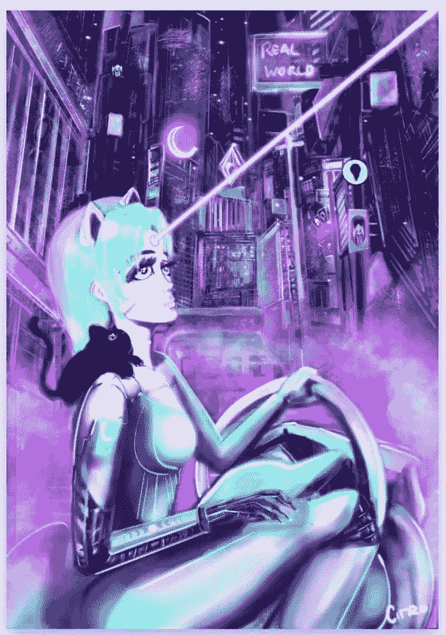

# NFT 艺人聚焦:维多利亚·雪铁龙

> 原文：<https://medium.com/geekculture/nft-artist-spotlight-victoria-citro-50f17209f1a1?source=collection_archive---------17----------------------->

“Kawai Magic cyberpunk stories” by Victoria Citro. [Link](https://foundation.app/@victoriacitro/~/102708)

***“我来自的地方我们的政府对网上艺术品销售有很多限制。他们收取超过 50%的税，这使得任何艺术家都不可能赚到足够的钱来维持生计……加密是我解决这些问题的答案。”****——维多利亚雪铁龙*

# 什么是 NFT？

**定义:**