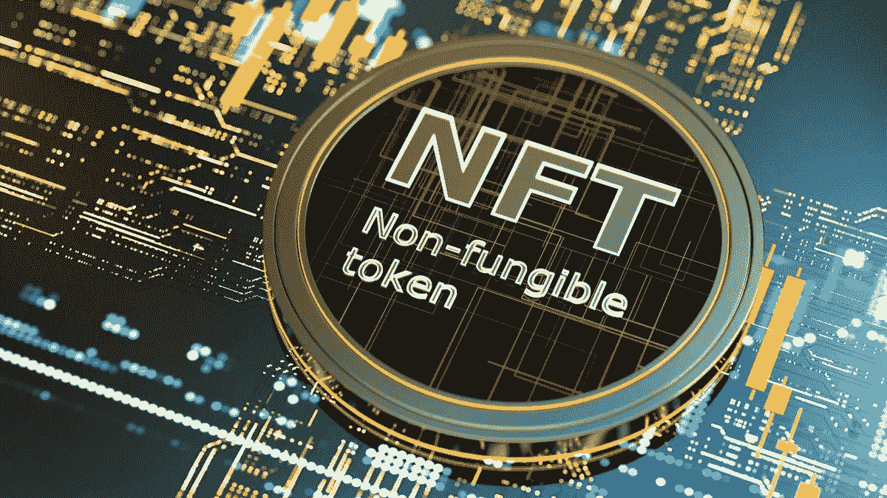

# NFT 集合营销服务及其推动 NFTs 的接触

> 原文：<https://medium.com/geekculture/nft-collection-marketing-services-and-their-touch-to-push-nfts-d3eca0828db0?source=collection_archive---------14----------------------->

十多年来，人们一直在谈论不可替代的代币，这种代币在塑造市场方面发挥了作用——随着我们生活水平的提高，市场也随之提升。在过去，我们可能遇到过许多惊人的事情，在它开始之前成功地带来了我们所渴望的改变。

这正是引入 NFTs 背后的基本原则。标榜为区块链技术的直接应用，NFT 被认为是最令人期待的虚拟领域-元宇宙的关键。当然，作为繁荣的吸引中心， [**营销你的 NFT**](https://www.turnkeytown.com/nft-collection-marketing-services) 项目仍然和维护你的数字化资产一样重要。

# 这些未来派的代币可信吗？

每个网民在拥有它们之前都会跳出的经典争议和问题是，“它们真的值我的一分钱吗？”事实上，这种质疑的美德将是人类有史以来最好的品质，它能打开盖子，暴露出他们所质疑的任何方面。由于 NFTs 占用了空间，因此也必须在这些令牌上安装灯。

作为区块链技术的显著应用之一，代币展示了支持这些数字化代币的真实性的真实性因素。虽然 NFTs 和加密货币有着相同的祖先，但两者从其基础(即代币和硬币)上看是完全不同的。

想象一下，你手中有一项资产，其价值非常高，然而，这并不能保证它们在你手中总是安全的；如果有人偷走了你宝贵的资产，而你现在看到的只是你空空的双手，会发生什么？

发生上述情况是很正常的，在严密的安全和预防措施下，如果它以某种方式发生会有什么后果？你所做的就是寻找它，并为它哭泣，如果是这样，如果有一天它到了你的手里，它很有可能被合金化，甚至有可能用赎金来交换资产。

这就是你在 NFTs 中得到问题答案的地方。创建 NFT 的灵活目的是通过其经过验证的所有权来管理您想要的资产。这意味着这些代币中的每一个都有自己唯一的代币 ID，与加密货币不同，显示了不可替代性的因素。

采用区块链技术构建，每笔交易和铸造过程都分布在数字账本中，不会造成数据或信息的丢失，让您成为自己宝贵资产的唯一所有者。

> 是的，现在可能很清楚这些代币是如何描绘其他数字资产中如此高的需求和资本的。但是，它们能像它们的表亲加密货币一样被有效地交易、出售或购买吗？

就像加密货币一样，它们可以在被称为 NFT 市场的利基市场中毫无争议地进行买卖，甚至可以从一个知名和可信的创造者那里买到。但是，顾名思义，这些代币基本上不能交换，除非拥有者和购买者之间达成协议，双方都不受利润或损失政策的影响。

Non Fungible Token

# 如果您拥有的 NFT/NFTs 需要一个提高知名度的因素，需要一个可以让您的菲亚特流受益的推动力，该怎么办？

像任何其他因素一样，非物质技术也可以通过营销来影响他们到达最终目的地。而这一切都可以从一个目的地 [**NFT 集合营销服务**](https://www.turnkeytown.com/nft-collection-marketing-services) 发起，这涵盖了一个屋檐下的一切。

如果时机成熟，你也可以通过最大限度地推销你的 NFT 项目来实现它。虽然征服全球每个人的想法可能是不确定的，但至少有可能亲密接触不同部门的暴徒，他们将情报传递给他们背后的人，等等…

下面列出的是有效的技术，这些技术被证明显示出对拥有它们的所有者有利的结果。它们是:

1.  内容营销被认为是最有成效的方式之一，通过它你有机会根据你的收入因素实现飞跃。这种有效的营销模式通过博客、调查问卷、论坛、客座博文等媒介积极提高代币的知名度。这仍然是资本的唯一通道。
2.  通过视频营销是另一个显著的因素，让用户毫不费力地掌握知识，并在吸引他们对概念的注意方面取得了很大的成功。继续播放视频内容，如电影、视频卷、gif、图形视频等。，是将用户带到桌面上的基本方法。
3.  当谈到将东西带到名人堂时，如果不是社交媒体，什么是即时曝光和熟悉的关键？Meta Inc .最近增加了列出各自收藏品(NFT)或将其发布到平台上的功能。社交媒体与 web3 的结合和连接再次得到了证明。通过脸书、Instagram、Pinterest、Twitter 甚至 Discord 等社交巨头进行营销，可能会成为促进代币到达最终目的地的完美媒介。

拥有以上熟悉的方法， [**NFT 项目营销**](https://www.turnkeytown.com/nft-collection-marketing-services) 提供了比常规营销更多的方法来提高代币的可见性，从而将您拥有的资产推向下一手。

# 总结一下:

拥有不可替代代币(NFT)可能会成为影响你未来资本的资产。你握着或推着它们；不管怎样，保留这些代币是一个双赢的局面。需要推送的令牌可以通过 NFT 收藏营销服务的专业营销人员明确完成，他们可能会成为您正在寻找的加速因素。