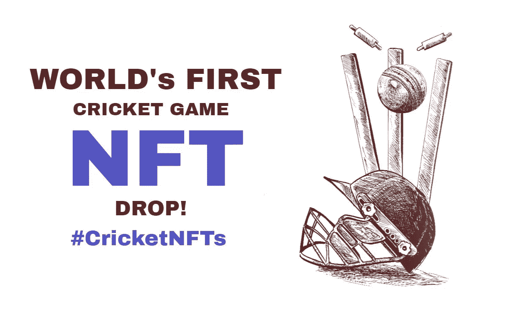
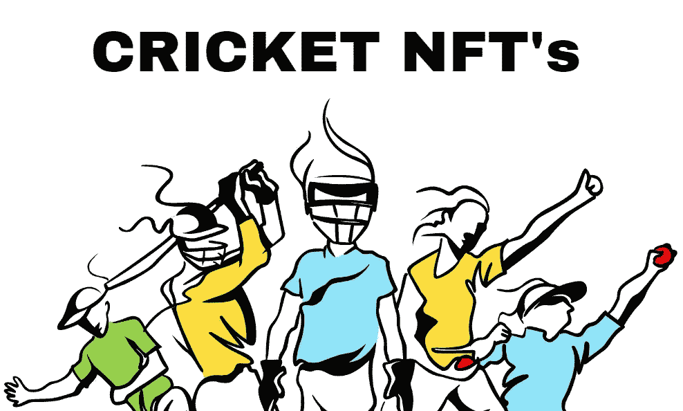

# NFT 板球收藏——元宇宙板球界的明星复活

> 原文：<https://medium.com/geekculture/nft-cricket-collections-a-stellar-resurrection-in-the-metaverse-cricketing-world-168d2ba844ad?source=collection_archive---------19----------------------->

成功和里程碑已经成为密码空间的同义词，因为它每天都在提升宣传。当时和现在数字空间中的每一个标题和新闻都是蓬勃发展的数字空间的完美补充。这种新颖的数字技术正在创造一种创新型经济，这种经济已经提升到了一个新的高度。这种独特的技术被认为以分散的方式为人类提供了极大的灵活性、安全性和透明性。

大量的操作因素和活动正在围绕 NFT 空间发展。目前，我们注意到与元宇宙配套的 NFT 博彩 向 [**快速提升的动向。游戏玩家被授予享受虚拟游戏和实时收入提取功能的特权。NFT 的游戏平台在区块链创造了一个不可思议的数字社区，因为他们的游戏理念与众不同，可以实时赚钱。**](https://jump.trade/?fsz=medium_senpagapandian)

# **NFT 游戏在数字空间的重要性**

在数字空间中有各种各样的 NFT 游戏平台。《以太》是数字空间中最早的 NFT 游戏之一。这款游戏开启了游戏行业的数字革命。几十年来，我们已经看到各种各样的 NFT 游戏被添加到区块链空间。2022 年 [**被认证为 NFTs**](https://jump.trade/?fsz=medium_senpagapandian) 年。所有被不可替代的代币接触过的东西都变成了贵重物品。从 Axie Infinity 到 Crypto Kitties，还有更多内容。

数字空间中有各种各样的类别。NBA Top Shot、SoRare 和每一款基于市场的 NFT 游戏都被视为拥有巨大能力的梦幻游戏领域的高级版本。相比之下，每个 NFT 游戏都以虚拟现实和战斗游戏为核心。

除了战斗类型，还有 Zed run，power drift，Revv racing 和其他各种游戏平台，这些平台基于 NFT 平台的赛车游戏来交易玩家拥有的皮肤，能力和技能属性。目前，有各种各样的现实生活游戏平台被纳入 NFT 的概念，如沙盒、分散土地、Polkacity 等等。

**游戏化的板球 NFTs 和元宇宙**

随着 NFTs 处于最佳状态，无论哪个季节，体育热潮都处于顶峰。NFT 已经跨越了数字空间中广泛的商业领域。电子竞技部门尚未探索元宇宙地区的 NFTs 世界。类似于 NBA top shot 或 Sorare，所有其他与体育相关的 NFT 游戏平台，这些游戏平台要么依赖于幻想游戏参数，其中玩家可以根据正在进行的实际比赛获得奖励。

例如，让我们来谈谈板球。这是世界上最受欢迎和最受关注的运动之一。这是一项国际运动，世界上大多数国家都参加。此外，板球是全球公认的运动。为了取悦板球迷的眼睛，元宇宙的概念被引入。在虚拟和增强现实技术的帮助下，元宇宙可以为球员们的板球比赛赋予生命。在元宇宙，玩家被提供了击球和投球的能力，并且还可以轻松得分。因此，元宇宙 [**NFT 板球赛**](https://jump.trade/?fsz=medium_senpagapandian) 将成为数字空间的顶级游戏平台。

**总结，**

现在，开发世界上第一个 NFT 板球游戏的技术在数字空间中是可用的。将游戏平台发展成伟大事物的界限已经被消除。在过去，我们有想法和想法，认为有一天游戏体验会改变，我们实际上从来没有想过这是可能的。但在 Jumptrade 市场的帮助下，实现这一壮举是可能的。这个 NFT 板球市场将为板球爱好者和球迷提供 NFT 板球优惠和 NFT 超级战利品优惠。这将是一个完美的时间，不仅对于板球迷，而且对于每个人来说，都可以体验一些新奇和特别的东西。因此，它是通过在平台上注册并开始为钱包提供资金来完成的。因此，这将是一个前所未有的机会，因此现在是在 Jump 的帮助下探索板球生态系统中的 NFTs 和区块链世界的时候了。贸易