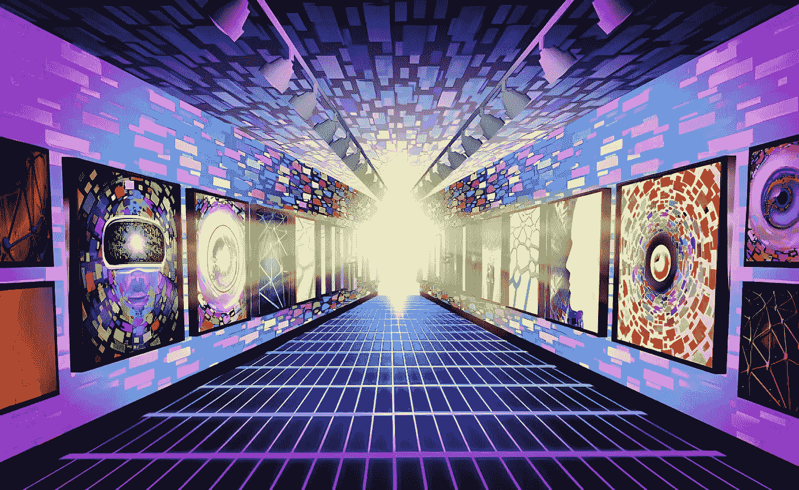
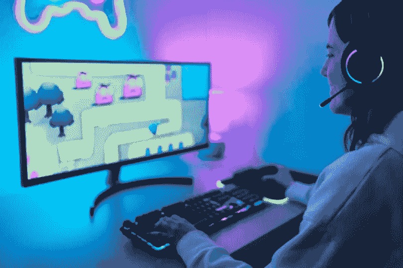
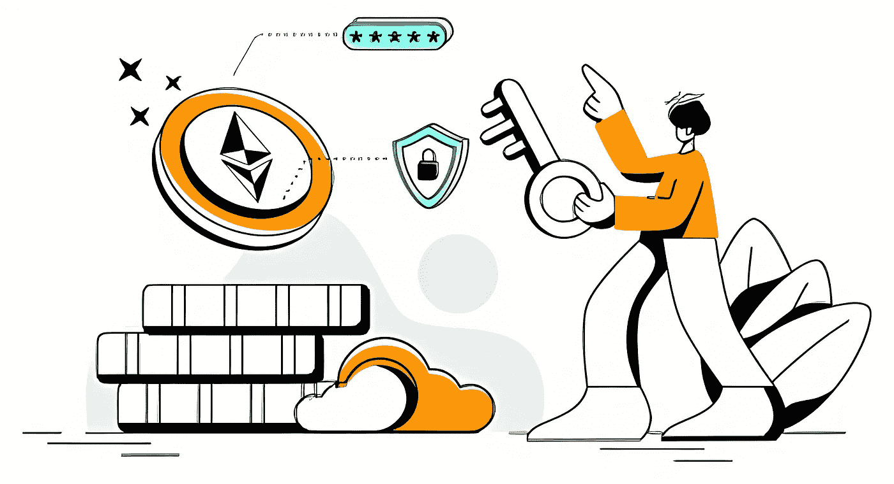
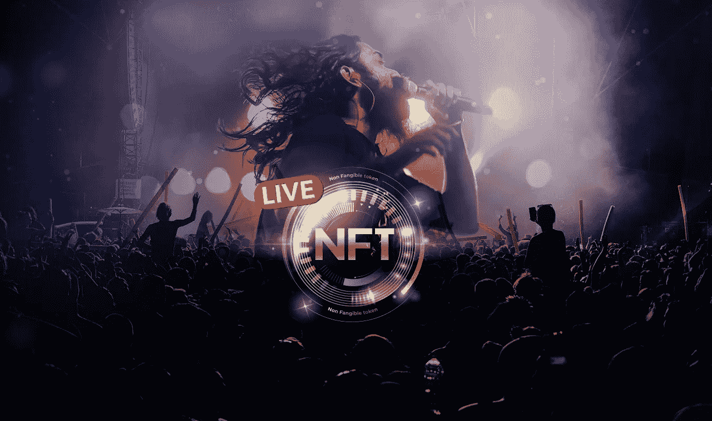
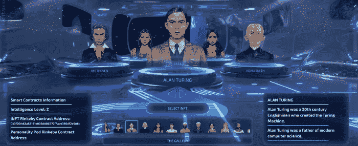
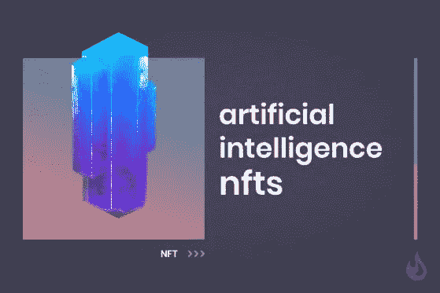
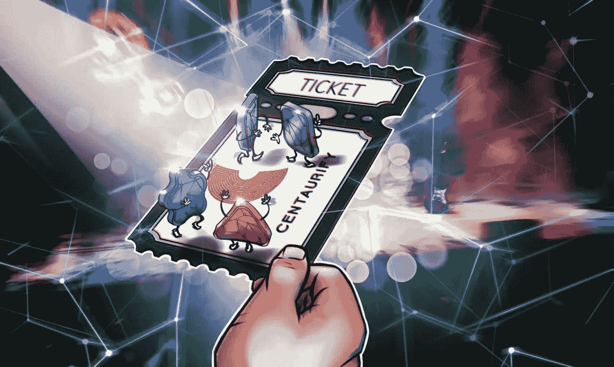
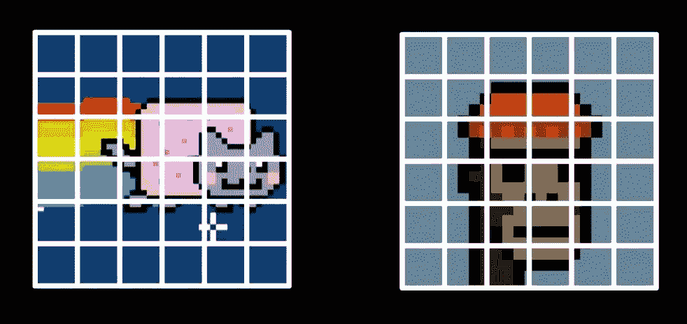
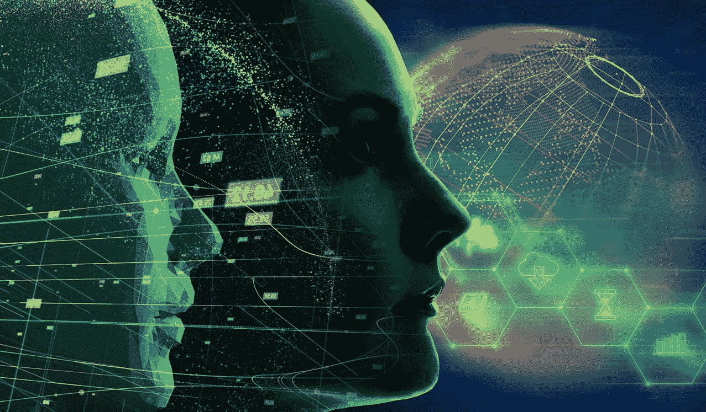

# NFT 发展趋势，你需要知道你的 NFT 业务

> 原文：<https://medium.com/geekculture/nft-development-trends-that-you-need-to-know-for-your-nft-business-b1dd09d41fc4?source=collection_archive---------16----------------------->

NFT 正在全球掀起一场革命，无论我们走到哪里，我们都能看到它在世界的每个角落得到反映。随着 NFT 的出现，我们也可以见证即将到来的市场趋势。在 NFT 创业包括考虑所有这些事实和趋势，这样你就可以向公众提供一个有竞争力的 NFT 解决方案。

让我们快速浏览一下最近席卷全球的所有趋势。这个博客将为你提供对你的 [**NFT 市场发展**](https://www.appdupe.com/nft-marketplace-development) 极其重要的想法。

# 你为什么要适应最近的市场趋势？

NFTs 为拥有数字资产提供了一个新的视角，而不会影响其所有权和安全性。此外，它开始成为个人的最佳投资选择，因为他们可以通过交易这些 NFT 获得更多收入。当个人投资者涌入 NFT 市场时，它为企业进入这个市场提供了无数的机会。任何企业的经验法则是跟随市场上流行的趋势。任何脱离当前趋势的商业计划都将无法吸引潜在客户。

NFT 是使用区块链技术构建的数字资产。当这两者结合在一起时，安全性是无懈可击的。有几个行业已经采用了这种魔法，并取得了辉煌的成就。跟上这些趋势将帮助你创建引人注目的 NFT 企业。这就是为什么更多的重点是为你的企业选择明智的 NFT 趋势，因为它会为你的企业获得更多的牵引力。

让我们来看看 NFT 市场上个人投资者普遍采用的各种趋势，

## NFT 博彩

人们不再有兴趣玩那些堡垒之夜或使命召唤游戏。游戏玩家更喜欢像 CryptoKitties 这样的 NFT 游戏。在视频游戏中，玩家只能在游戏中拥有自己的游戏资产。但在 NFT 游戏中，即使游戏停止播放，玩家也可以拥有数字资产。NFT 的游戏平台，如在区块链以太坊建造的 CryptoKitties，允许玩家培育 NFT 猫来生产新品种。这个游戏平台在短短几年内已经创造了数十亿美元的收入。

NFT 游戏也有一个特殊的类别，叫做“玩赚”游戏，玩家可以赚取一些代币，用这些代币他们可以购买和繁殖虚拟的猫。在 [**Play-to-Earn NFT 游戏开发**](https://www.appdupe.com/nft-gaming-development) 中，这些游戏中的角色被作为 NFT 出售，玩家也将通过执行不同的任务和分配获得收入。

## 金融和非金融服务业

如前所述，NFT 已经跨越了巨大的领域。金融部门就是这样一个行业，它将是迈向非功能性金融服务的下一个目标。现在，NFT 开发公司开始提供贷款，将数字资产作为贷款的抵押品。让我们设想这样一种情况:一个人拥有价值十亿美元的非金融资产，同时又需要钱来满足一些紧急需求。个人可以通过持有 NFTs 作为抵押获得贷款。然而，有许多平台，个人可以持有非金融债券作为贷款的抵押品。

## NFT 与健康

在健康和医疗行业，大多数人会发现很难维护患者的记录。问题不仅在于病人，也在于医疗和制药行业。存储患者的数据对任何个人来说都是一项严肃的任务。即使记录保存和维护得很好，也有很大的机会被篡改。现在，个人可以将他们的医疗数据制成 NFT，并出售给制药行业。区块链技术和 NFTs 将为患者提供对其医疗记录的控制。

## NFT 流媒体和娱乐

NFT 是具有广泛使用案例的数字资产。一个这样的领域是流媒体和娱乐业。在疫情之后，事情发生了变化，人们已经从电视转向流媒体服务。这鼓励了娱乐行业的一些名人以流媒体服务的形式推出他们的服务。其中，NFT 音乐和 NFT 电影是广受欢迎的两大途径。

[**NFT 音乐市场的发展**](https://www.appdupe.com/nft-music-marketplace-development) 改变了音乐人发行音乐专辑的方式。他们可以以 NFTs 的形式直接向粉丝推出他们的音乐专辑，不需要任何中介。另一方面，NFT 电影将解放基于 NFT 角色的电影。例如,《石头城》是一部很受欢迎的 NFT 电影，讲的是喝醉的猫。只有那些谁拥有他们的斯通猫 NFT 将能够达到这个 NFT。

## 幼稚的

iNFT 代表智能 NFT，它像人类一样，通过它人们可以交流和学习。iNFT 不仅是智能的，而且是交互式的，并具有动画功能。它们被小心地提示并存储在智能合约层中。它们对所有者、创造者和网络开放。个人可以主动与他们交谈，因为他们会学到新的东西，改变他们的性格。Althea AI 是第一个对此进行实验的人，并以 500 万美元的价格出售了他们的 iNFT Alice。

据预测，在不久的将来，iNFTs 将会出现在社交媒体账户的虚拟家庭中，就像脸书的元宇宙一样。当有人不在线时，他们的朋友会来到他们的虚拟家园，与他们的个人人工智能交谈。人工智能援助将帮助他们了解用户的行踪，并解释事情。

## 人工智能生成的 NFT

人工智能和 NFTs 是正在彻底改变整个世界的巨大技术。如果他们两个走到一起，一个大的改变发生了。艺术家们不再需要坐下来勾画他们的艺术，因为我们已经有了人工智能，它将承担起管理艺术的角色。人工智能正在学习在没有人类帮助的情况下自己创作艺术品的细微差别。艾丽西娅是一个人工智能，她创作了一个名为 Arlequin 的数字艺术品，并在市场上出售。

然而，由艺术家创作的 NFT 仍将占据主导地位，如果你有一个像 NFT、 [**一样发展的想法，试试 NFT 工作室**](https://www.appdupe.com/nft-studio) ，他们可以像 NFT 一样发展你的想法并进行营销。

## NFT 票务

在 NFT 的发展中，NFT 票务是另一个重要的市场趋势。NFTs 已经成为一种购买演出或体育赛事门票的新方式。此后，人们不必排队购买签名门票和商品 t 恤进入任何表演。人们可以购买 NFT 作为观看任何演出的门票。然而，他们不会拥有观看演出的门票，但也会保留个人数字资产。用户可以使用这些 NFT 在 NFT 市场出售。

NFT 的最大优势是他们可以跟踪他们的供应，也可以计算已经售出的门票。参与者将把这些 NFT 带回家，主持人将提高他们节目的价值。

## NFT 分裂

不可替换的代币对于人们来说是相当昂贵的。例如，一个赛博朋克大约要 400 万美元，这对人们来说是非常昂贵的。在这种情况下，NFT 可以被分割成小块出售给人们，这样他们就可以像股票一样以更低的价格获得它们。NFT 分割是一个概念，处理将昂贵的 NFT 分割成不同的部分，并出售给潜在的买家。

## 数字双 NFTs

在数字化的世界里，每一项有形资产都有一个数字化的孪生兄弟。数字孪生将作为物理资产的精确数字副本保留。大多数受欢迎的品牌都存在假冒问题。人们会发现很难区分真假。当他们开发 NFT 时，品牌可以保留他们的独特性。

# 包裹

NFT 市场显然见证了来自世界各地的大肆宣传。有了这些趋势，你就可以利用最适合你的趋势来开始你的 NFT 平台。你可以从顶尖的 NFT 开发公司**那里获得开发你的 NFT 解决方案的想法。**