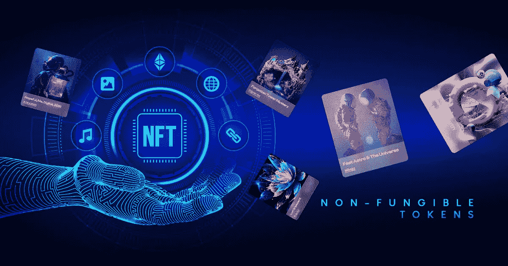
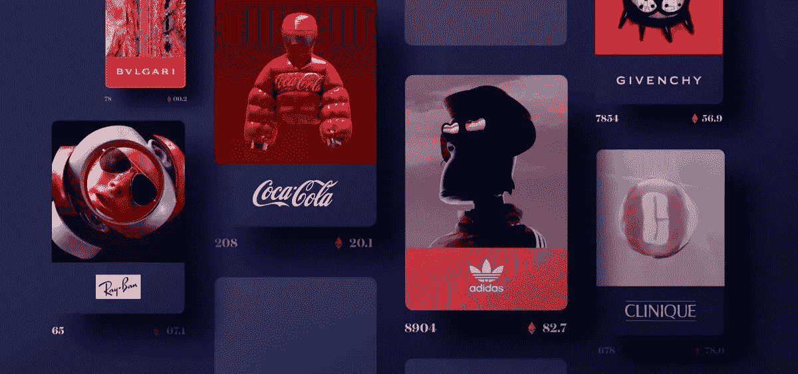
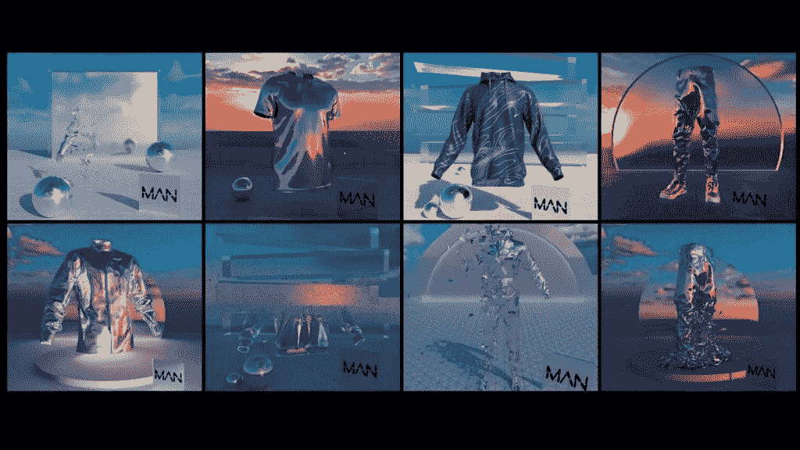

# 2022 年 NFT 发展趋势值得关注

> 原文：<https://medium.com/geekculture/nft-development-trends-to-pay-attention-to-in-2022-6ae1fafddb86?source=collection_archive---------10----------------------->

他第一次认识 NFT 是在 2014 年 5 月。2015 年，tech 慢慢赶上了世界，人们悠闲而稳定地开始接受它。随着 NFT 的诞生，如此多的 NFT 市场开始发展。人们开始创建 NFT，一些人开始创建 NFT 市场。

在科技世界里，任何新发明的东西，其未来的可能性都有三种。一个是它在世界上的成功逐渐增加，并停止在一个点上。第二种可能性是，它在早期阶段取得了巨大的成功，但在成功之前失败了。第三种可能是产品的成功和未来逐渐增加，保持其荣耀的递增斜率。当一个技术产品达到它的终点时，可能没有回报，但我们不能说永远没有。它可能会在根据目标代的进化后卷土重来。

2021 年，NFT 开始大肆宣传。NFTs 在 2019 年左右开始形成趋势，现在，在 2022 年，NFT 趋势变得如此艰难。

# **NFTs，之前大肆宣传**

NFT(不可替换令牌)是存储在数据块中的数字资产，是一种数字分类账。在对 NFTs 大肆宣传之前，人们对这个概念有所怀疑。一旦他们掌握了 NFTs 和 NFT 市场，人们就开始获利。在 NFTs 进入数字艺术和音乐世界之前，新的和即将到来的艺术家总是很难发布他们的作品和项目，并获得应有的认可。NFT 平台是一个伟大的交易市场，交易者通过交易 NFT 收藏品从他们的投资中获取利润。

[**NFT 发展**](https://www.appdupe.com/nft-development-services) 已经开始看到趋势，企业家们正试图在他们的商业模式中适应这些趋势。

# **2022 年 NFT 趋势**

非功能性交易已经流行了一段时间，但是最近 NFT 市场的创造者为数字艺术家、商人等打开了许多新的门户。在数字艺术、体育、电影等领域。通过展示它们，它正发挥着惊人的作用。NFT 平台开创了许多新趋势。现在，让我们来看看 2022 年的一些重要趋势。

## **NFT 赛道上的大品牌**

NFT 已经吸引了来自不同行业的许多品牌的目光。每个人都制定了创新战略，在 NFT 平台上提升自己的品牌。像塔可钟、麦当劳和金宝汤这样的食品品牌已经发行了他们品牌的 NFT 收藏品。路易威登、耐克和古驰等奢侈品牌也发行了 NFT 收藏品。大多数情况下，品牌发布 NFT 收藏品是为了筹集资金，产生新的收入流，促进社交媒体参与，并利用 NFTs 作为提高品牌忠诚度的来源。

NFT 品牌准备 [**创建他们自己的 NFT 市场**](https://www.appdupe.com/nft-marketplace-development) ，给他们的品牌打上印记，给他们的顾客带来独特的体验。

## **NFT 在电影行业发挥作用**

NFT 为电影业提供了各种机会，如众筹、销售和货币化电视和电影项目。有 NFT 的电视连续剧，如“零蛋”和“瘾君子猫”,它们在 NFT 的销售收入高达数百万美元。也有基于 NFT 角色的电视节目，像时代工作室的机器人电视系列。NFT 也用于资助电影项目和电视节目。

## **使用非金融工具贷款**

NFT 贷款是一个蓬勃发展的用例，它主要是由投资者使用 NFT 和 NFT 收藏品作为抵押贷款的新的潜在安排。2021 年开发了许多 DeFi 平台(分散式金融平台)，以支持使用 NFTs 获得贷款。例如，提供 NFT 担保贷款的 DeFi 平台之一是 Arcade。当贷款人和借款人都同意这些条款和条件时，NFT 收藏将被锁定在一个托管账户中，直到贷款被全额支付或违约，该账户由 Arcade 发布的智能合同管理。只有贷款全部付清，NFT 才会被释放；在此之前，它被锁定，不可逆转。

## **最新潮流中的时尚 NFTs】**

时尚产业总是设定它的完美观众。古驰和 Superplastic 之间神奇的伙伴关系导致他们推出了新的 NFT，SuperGucci NFT。这对 t 台粉丝和时尚影响者来说是一股不可阻挡的数字力量。

## **VC 资金流入 NFTs**

当风险投资家陷入 NFT 阴霾时，这一点显而易见。当行业重量级人物 Andreessen Horowitz 在 OpenSea 的 A 轮融资中投资 2300 万美元时，这一趋势开始了。自那以后，风险投资大幅增加。据宣布，2022 年，天鹅绒海洋探险公司和 01 Advisors 将向 NFT 平台 Pixel Vault 投资 1 亿美元。

## **NFT 在社交媒体平台上的行动**

社交媒体一直是有影响力的人、艺术家和创作者的家园。当他们进入社交媒体平台时，对 NFT 的炒作增加了。社交媒体平台允许用户使用 NFT 作为他们的个人资料图片。这一趋势是 Twitter 在 2022 年初开创的。后来，Meta Platforms Inc .也宣布了同样的消息。这种有趣的趋势被这些公司用来验证图像的所有权。社交媒体公司使用徽章或个人资料轮廓等东西来阻止人们在社交媒体个人资料上复制 NFT。

## **结论**

NFT 一直在成长，融入了一个更有优势的版本。NFT 是趋势性的，在接下来的几年里，它们将处于最新的趋势中。它已经席卷了整个世界，而且似乎在未来还会继续下去。近年来，NFT 市场发展服务公司已经提供了许多可能性，如铸造 NFT 或 [**创建 NFT 市场**](https://www.appdupe.com/nft-marketplace-development) 。