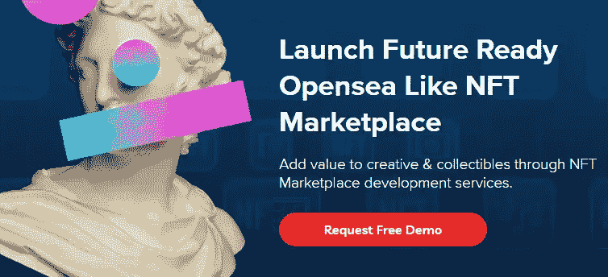
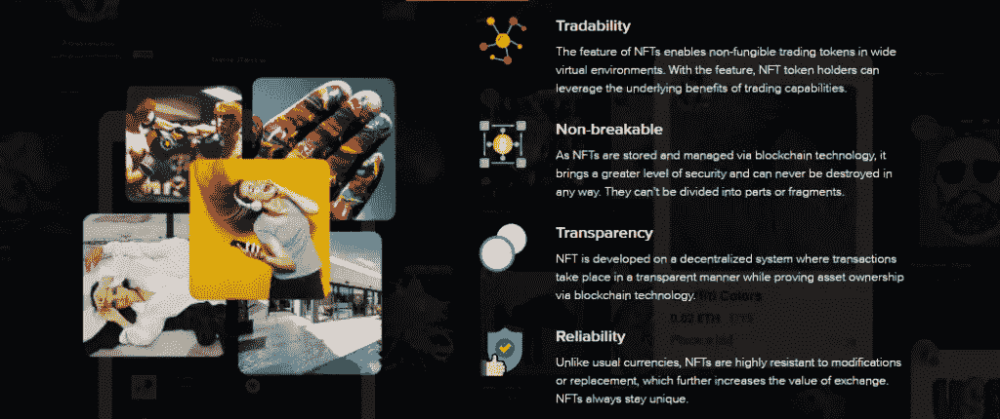

# NFT 交易所应用程序开发终极指南——功能和成本

> 原文：<https://medium.com/geekculture/nft-exchange-app-features-cost-3841360119fe?source=collection_archive---------16----------------------->

# NFT 交易所 App 简介

NFT 可以是任何数字资产，如图像、音乐、语音记录、游戏等。，这是唯一的和不可互换的。人们可以通过 NFT 交易所网站买卖 NFT 来赚取利润。交易所是一个平台，投资者和交易者可以通过竞价交易非交易平台。

[**Request Free Demo of OpenSea Clone**](https://www.suffescom.com/clone/opensea-clone-script)

大多数在数字世界赚取巨额收入的平台都位于 NFT。NFTs 的普及是这几天大家都在讨论的问题。许多企业家表现出兴趣，想在 NFT 交易所试试运气。此外，用户还需要一个平台，在这个平台上，他们的独特资产得到完全保护，并且平台提供完全的透明度。NFT 交易平台是储存和交易您的贵重数码产品的最佳场所。

## [**请求免费试玩 OpenSea 克隆**](https://www.suffescom.com/clone/opensea-clone-script)

# NFT 交易所的用户流量

*   用户需要通过填写所有细节在 NFT 交易所创建一个帐户。他们可以连接现有的加密钱包或创建一个新的，以保持他们的资产在一个地方。
*   用户可以创建 NFTs。通过注册流程后，用户可以登记他们的令牌。他们可以创造不同的系列，并以自己选择的价格出售。你可以通过投标找到出价最高的最佳买家。
*   一旦项目在平台上列出，就可以为客户进行投标/销售。一旦完成购买，双方都会收到购买成功的通知。平台很好的管理着从房源到交易的一切。

# NFT 交易所的最大好处是什么？

**安全**

NFT 交易所是建立在区块链技术之上的，因此它是企业家最受保护的商业模式。用户在平台上列出他们的令牌时会感到安全。平台上的交易是完全安全的。

**流动性**

NFT 造币网站的另一个有利方面是流动性。交易平台具有高度安全的 API，以便向用户提供 NFTs 的即时流动性。

**透明度**

NFT 交易所应用程序上的一切对用户都是透明的。他们可以很容易地检查 NFTs 和交易历史的有效性。使用区块链技术创建平台，用户的所有权是安全可靠的。

# NFT 交易所应用程序发展业务不可或缺的功能

在推出你自己的 NFT 交易所应用程序时，你必须整合一些功能，使你的应用程序在观众中流行，并对用户有吸引力。在NFT 交易所 app 开发过程中，你雇佣的公司必须使用高科技栈来实现满足用户的基本功能。下面，我们列出了您的 NFT 交易平台的显著特点。

# 店面

店面应该显示关于 NFTs 的所有必需信息，让用户放心，因为这是任何交换的主要特征。它包含投标信息，价格历史，预览，业主详情，出价，和其他重要的细节。

**高级搜索选项**

用户可以根据不同的类别在搜索栏上搜索收藏品。用户必须能够在更短的时间内用最少的努力找到商品。所有的项目都应该根据音乐、视频、艺术、图像、迷因等特征进行分类。如果您的客户在搜索 NFTs 时获得快速准确的结果，您肯定会赢得他们的信任并提高客户满意度。

**高级滤镜**

这也有助于轻松快速地找到合适的产品。高级过滤器在许多情况下会影响客户的决策。可以是畅销，价格，主动优惠等。过滤器增加了顾客买东西的机会，因为他们可以根据自己的要求获得清晰准确的信息。

**创建 NFT 列表**

创建 NFT 上市是 NFT 交易所启动整个交易过程的主要功能。创建者在创建和列出 NFT 时必须简化操作程序。NFT 交易所网站上应该有一个单独的页面，用户可以创建 NFT 清单，从提交文件到提交与项目相关的数据。例如，标签、标题、描述等。

# 列表状态

用户可以检查列表状态列表和确认过程。列出 NFT 并发布成功验证过程的用户可以从中受益。这是在平台上实现数字资产验证的有益特征。

# 投标

在 [NFT 市场平台](https://risingmax.com/nft-token-development-company)上，竞价的作用非常重要，可以让收藏品卖出和买入。竞价允许对以固定初始价格购买 NFT 不感兴趣的用户有灵活的价格选择。注册用户可以查看当前投标的状态，这有助于他们决定是否需要进行新的投标。此外，还有一个选项“拍卖”观察列表，可供用户使用。

# 数字钱包集成

当用户注册 NFT 交易所时，他们会寻找最安全、最有保障的地方存放资金。在数字世界最脆弱的时候，没有人会冒险失去自己的财产。因此，你的 [NFT 市场](https://www.suffescom.com/blog/build-nft-marketplace-using-nft-marketplace-clone-script/)应该为用户提供尽可能好的安全性。应用程序中的钱包集成减少了威胁和伪造的机会。它通过提供应用内钱包服务来毫不费力地提交、存储和获取令牌，从而将用户的便利放在首位。

**收视率**

如果你在 NFT 交易所的规模较大，你只需要一些东西来更好地指导你做出正确的决定。然后，新手可以看看现有用户给出的交流评分。高评分说明交流平台是可靠的，你可以无忧无虑的加入。因此，你可以添加这个功能，以便新来者可以毫不犹豫地来到你的平台，并在平台上竞价时保持自信。

# 与我们的 NFT 营销机构合作的下一代商业解决方案

安排演示

# 启动 NFT 交易所 App 的步骤

你想创建一个 NFT 交易平台吗？开始一个 NFT 交易所网站开发的过程，你应该按照一步一步的程序来得到一个理想的产品。在整个过程中，会遇到各种挑战，任务也很复杂。但是如果你有一个准备充分的计划，你可以顺利地执行一切。

选择你的目标市场

你应该专注于垂直市场，而不是专注于水平空间，以探索更好的机会，并将所有精力放在一个利基上，而不是将注意力分散在多个事情上。通过选择你的利基，你必须根据特定客户的期望和要求为他们提供服务。

# 定义项目和设计

在开始开发阶段之前，项目文档是至关重要的。它有助于您在不必要的讨论上节省时间，因为所有内容都以战略和组织良好的方式列在文档上——适当的文档有助于避免风险和达到为整个开发过程设定的里程碑。

**发展阶段**

一旦整个概念被正式化，是时候实现这个想法了。您可以选择最适合您的需求的框架，并保证卓越的性能和可信度。对于 NFT 交易所 app 开发**、**你必须选择一家在[区块链技术](https://www.suffescom.com/blockchain-development)方面有突出专长的公司。

**测试和部署**

下一阶段是应用程序的测试和部署。测试是检测和解决产品问题的关键部分。在测试过程中没有对设计版本进行全面检查之前，不要急于发布它。如果最终产品没有按照你的期望工作，它应该被修改以满足需求。一旦产品没有 bug，你就可以随时发布它进入市场。

# 用于开发 NFT 交易平台的技术堆栈:

## 区块链平台

## 以太坊

对于 NFT 交易平台开发**，**以太坊因其高安全性、透明性等特点成为全球使用最广泛的平台。所有交易历史、所有权历史以及与代币相关的数据都可以在以太坊上公开验证。

## 流动

这是一个分散的区块链网络，非常适合新一代数字资产、游戏和应用。NFT 平台用于创建 NFT 交易所，而 NFT 是使用 Cadence 编程语言创建的。

## 泰佐斯

最可靠的开源区块链平台之一是用于创建应用程序和 NFT 的 Tezos。Tezos 使用以智能合同语言 LIGO 编写的预编译 FA2 NFT 合同支持 NFT 市场开发和 NFTs。

**卡尔达诺**

这是分散平台获得无与伦比的安全性和可持续性的最佳选择。Cardano 是解决互操作性和可伸缩性相关问题的理想平台。

**存储平台**

**IPFS**

IPFS 是一种点对点协议，用于在分散平台上存储媒体内容。不可能存储与 NFTs 相关的媒体文件，所以所有的 NFTs 元数据都存储在 IPFS 上。

**Filecoin**

包括媒体文件在内的所有重要信息都存储在分散式存储网络 Filecoin 上。该平台为开发者提供一切，以一种有组织和安全的方式存储数据。意识到该平台的好处，许多区块链开发公司在启动 NFT 交易所时采用了该平台。

**皮纳塔**

它是处理图像和文件的最佳选择。它为 NFTs 提供了高安全性和可验证的文件。

**NFT 标准**

*   ERC-721
*   ERC-1155
*   TRC-721
*   FA2
*   dGoods

**前端框架**

*   反应
*   某视频剪辑软件
*   有角的

# 建立一个 NFT 交易所的成本是多少？

开发一个 NFT 交易所应用程序需要多少成本？这很重要，因为每个客户都有不同的需求和预算限制。了解客户在什么预算范围内想要什么并据此工作是很重要的。在开始 NFT 交易平台开发**、**之前，最好先了解一下构成整体成本的东西。

实施这些想法所需的交易所功能和时间在决定建设 NFT 交易所的成本方面起着至关重要的作用。

决定 NFT 交易所网站成本的另一个重要因素是选择构建应用程序的平台。

如果企业家希望快速加入竞争，那么白标解决方案是最佳选择。现成的解决方案比从头构建一个应用程序更便宜。

如果客户需要在交换中添加或删除任何功能，完全定制是可能的。成本将取决于所需的定制级别。

项目的复杂性也是成本因素之一。如果项目有复杂的页面和用户界面，开发团队可能会要求您支付更多费用。以下是决定总成本的设计和开发部分:

*   UX/用户界面开发
*   用户配置文件
*   安全性
*   主页
*   产品页面
*   评级页面
*   买方/卖方小组
*   管理面板
*   通知
*   密码集成
*   管理

## 我们能为您做些什么？

我们保证为您提供无与伦比的卓越的 NFT 交易所网站开发服务，无论是小型企业还是大型企业。我们有一个专门和经验丰富的区块链开发人员团队，他们在同行业有着丰富的经验。凭借我们的专业技能和知识，我们已经成功地以经济高效的方式交付了多个 NFT 交易所应用程序。如果你想在数字世界开始你的生意，你可以随时联系我们。更多详情，请联系我们。大多数在数字世界赚取巨额收入的平台都位于 NFT。NFTs 的普及是这几天大家都在讨论的问题。许多企业家表现出兴趣，想在 NFT 交易所试试运气。此外，用户还需要一个平台，在这个平台上，他们的独特资产得到完全保护，并且平台提供完全的透明度。NFT 交易平台是储存和交易您的贵重数码产品的最佳场所。

# NFT 交易所 App 及其特点介绍

NFT 可以是任何数字资产，如图像、音乐、语音记录、游戏等。，这是唯一且不可互换的。人们可以通过 NFT 交易所网站买卖 NFT 来赚取利润。交易所是一个平台，投资者和交易者可以通过竞价交易非交易平台。

一旦一个 NFT 被创造出来，它就会被所有者在交易所上市，他可以在平台上探索观众。竞拍成功后，车主可以从[密码交易平台购买特定的 NFT。](https://www.suffescom.com/crypto-exchange-development)

## NFT 交易所的用户流量

*   用户需要通过填写所有细节在 NFT 交易所创建一个帐户。他们可以连接现有的加密钱包或创建一个新的，以保持他们的资产在一个地方。
*   用户可以创建 NFTs。通过注册流程后，用户可以登记他们的令牌。他们可以创造不同的系列，并以自己选择的价格出售。你可以通过投标找到出价最高的最佳买家。
*   一旦项目在平台上列出，就可以为客户进行投标/销售。一旦完成购买，双方都会收到购买成功的通知。平台很好的管理着从房源到交易的一切。

# NFT 交易所的最大好处是什么？

**安全**

NFT 交易所是建立在区块链技术之上的，因此它是企业家最受保护的商业模式。用户在平台上列出他们的令牌时会感到安全。平台上的交易是完全安全的。

**流动性**

NFT 交易所网站的另一个好处是流动性。交易平台具有高度安全的 API，以便向用户提供 NFTs 的即时流动性。

**透明度**

NFT 交易所应用程序上的一切对用户都是透明的。他们可以很容易地检查 NFTs 和交易历史的有效性。使用区块链技术创建平台，用户的所有权是安全可靠的。

# NFT 交易所应用程序发展业务不可或缺的功能

在推出你自己的 NFT 交易所应用程序时，你必须整合一些功能，使你的应用程序在观众中流行，并对用户有吸引力。在NFT 交易所应用程序开发过程中，您雇佣的公司必须使用高科技堆栈来实现必要的功能，以满足用户的需求。下面，我们列出了您的 NFT 交易平台的显著特点。

## 店面

店面应该显示关于 NFTs 的所有必需信息，让用户放心，因为这是任何交换的主要特征。它包含投标信息，价格历史，预览，业主详情，出价，和其他重要的细节。

**高级搜索选项**

用户可以根据不同的类别在搜索栏上搜索收藏品。用户必须能够在更短的时间内用最少的努力找到商品。所有的项目都应该根据音乐、视频、艺术、图像、迷因等特征进行分类。如果您的客户在搜索 NFTs 时获得快速准确的结果，您肯定会赢得他们的信任并提高客户满意度。

**高级过滤器**

这也有助于轻松快速地找到合适的产品。高级过滤器在许多情况下会影响客户的决策。可以是畅销，价格，主动优惠等。过滤器增加了顾客买东西的机会，因为他们可以根据自己的要求获得清晰准确的信息。

**创建 NFT 列表**

创建 NFT 上市是 NFT 交易所启动整个交易过程的主要功能。创建者在创建和列出 NFT 时必须简化操作程序。NFT 交易所网站上应该有一个单独的页面，用户可以创建 NFT 清单，从提交文件到提交与项目相关的数据。例如，标签、标题、描述等。

## 列表状态

用户可以检查列表状态列表和确认过程。列出 NFT 并发布成功验证过程的用户可以从中受益。这是在平台上实现数字资产验证的有益特征。

## 投标

在 NFT 交易平台上，竞价的作用是非常重要的，以使收藏品得以出售和购买。竞价允许对以固定初始价格购买 NFT 不感兴趣的用户有灵活的价格选择。注册用户可以查看当前投标的状态，这有助于他们决定是否需要进行新的投标。此外，还有一个选项“拍卖”观察列表，可供用户使用。

## 数字钱包集成

当用户注册 NFT 交易所时，他们会寻找最安全、最有保障的地方存放资金。在数字世界最脆弱的时候，没有人会冒险失去自己的财产。因此，你的 [NFT 市场](https://www.suffescom.com/product/white-label-nft-marketplace-development/)应该为用户提供尽可能好的安全性。应用程序中的钱包集成减少了威胁和伪造的机会。它通过提供应用内钱包服务来毫不费力地提交、存储和获取令牌，从而将用户的便利放在首位。

**收视率**

如果你在 NFT 交易所的规模较大，你只需要一些东西来更好地指导你做出正确的决定。然后，新手可以看看现有用户给出的交流评分。高评分说明交流平台是可靠的，你可以无忧无虑的加入。因此，你可以添加这个功能，以便新来者可以毫不犹豫地来到你的平台，并在平台上竞价时保持自信。

# 与我们的 NFT 营销机构合作的下一代商业解决方案

## 启动 NFT 交易所 App 的步骤

你想创建一个 NFT 交易平台吗？开始一个 NFT 交易所网站开发的过程，你应该按照一步一步的程序来得到一个理想的产品。在整个过程中，会遇到各种挑战，任务也很复杂。但是如果你有一个准备充分的计划，你可以顺利地执行一切。

## 选择你的目标市场

你应该专注于垂直市场，而不是专注于水平空间，以探索更好的机会，并将所有精力放在一个利基上，而不是将注意力分散在多个事情上。通过选择你的利基，你必须根据特定客户的期望和要求为他们提供服务。

# 定义项目和设计

在开始开发阶段之前，项目文档是至关重要的。它有助于您在不必要的讨论上节省时间，因为所有内容都以战略和组织良好的方式列在文档上——适当的文档有助于避免风险和达到为整个开发过程设定的里程碑。

## **发展阶段**

一旦整个概念被正式化，是时候实现这个想法了。您可以选择最适合您的需求的框架，并保证卓越的性能和可信度。对于 NFT 交易所 app 开发**、**，你必须选择在[区块链技术](https://www.suffescom.com/blockchain-development)方面有突出专长的公司。

## **测试和部署**

下一阶段是应用程序的测试和部署。测试是检测和解决产品问题的关键部分。在测试过程中没有对设计版本进行全面检查之前，不要急于发布它。如果最终产品没有按照你的期望工作，它应该被修改以满足需求。一旦产品没有 bug，你就可以随时发布它进入市场。

# 用于开发 NFT 交易平台的技术堆栈:

## 以太坊

对于 NFT 交易平台开发**，**以太坊因其高安全性、透明性等特点成为全球使用最广泛的平台。所有交易历史、所有权历史以及与代币相关的数据都可以在以太坊上公开验证。

## 流动

这是一个分散的区块链网络，非常适合新一代数字资产、游戏和应用。NFT 平台用于创建 NFT 交易所，而 NFT 是使用 Cadence 编程语言创建的。

## 泰佐斯

最可靠的开源区块链平台之一是用于创建应用程序和 NFT 的 Tezos。Tezos 使用以智能合同语言 LIGO 编写的预编译 FA2 NFT 合同支持 NFT 市场开发和 NFTs。

**卡尔达诺**

这是分散平台获得无与伦比的安全性和可持续性的最佳选择。Cardano 是解决互操作性和可伸缩性相关问题的理想平台。

# **存储平台**

**IPFS**

IPFS 是一种点对点协议，用于在分散平台上存储媒体内容。不可能存储与 NFTs 相关的媒体文件，所以所有的 NFTs 元数据都存储在 IPFS 上。

**Filecoin**

包括媒体文件在内的所有重要信息都存储在分散式存储网络 Filecoin 上。该平台为开发者提供一切，以一种有组织和安全的方式存储数据。意识到该平台的好处，许多区块链开发公司在启动 NFT 交易所时采用了该平台。

**皮纳塔**

它是处理图像和文件的最佳选择。它为 NFTs 提供了高安全性和可验证的文件。

**NFT 标准**

*   ERC-721
*   ERC-1155
*   TRC-721
*   FA2
*   dGoods

**前端框架**

*   反应
*   某视频剪辑软件
*   有角的

# 建立一个 NFT 交易所的成本是多少？

开发一个 NFT 交易所应用程序需要多少成本？这很重要，因为每个客户都有不同的需求和预算限制。了解客户在什么预算范围内想要什么并据此工作是很重要的。在开始 NFT 交易平台开发**、**之前，最好先了解一下构成整体成本的东西。

实施这些想法所需的交易所功能和时间在决定建设 NFT 交易所的成本方面起着至关重要的作用。

决定 NFT 交易所网站成本的另一个重要因素是选择构建应用程序的平台。

如果企业家希望快速加入竞争，那么白标解决方案是最佳选择。现成的解决方案比从头构建一个应用程序更便宜。

如果客户需要在交换中添加或删除任何功能，完全定制是可能的。成本将取决于所需的定制级别。

项目的复杂性也是成本因素之一。如果项目有复杂的页面和用户界面，开发团队可能会要求您支付更多费用。以下是决定总成本的设计和开发部分:

*   UX/用户界面开发
*   用户配置文件
*   安全性
*   主页
*   产品页面
*   评级页面
*   买方/卖方小组
*   管理面板
*   通知
*   密码集成
*   管理

## 我们能为您做些什么？

我们保证为您提供无与伦比的卓越的 NFT 交易所网站开发服务，无论是小型企业还是大型企业。我们有一个专门和经验丰富的区块链开发人员团队，他们在同行业有着丰富的经验。凭借我们的专业技能和知识，我们已经成功地以经济高效的方式交付了多个 NFT 交易所应用程序。如果你想在数字世界开始你的生意，你可以随时联系我们。更多详情，请联系我们。