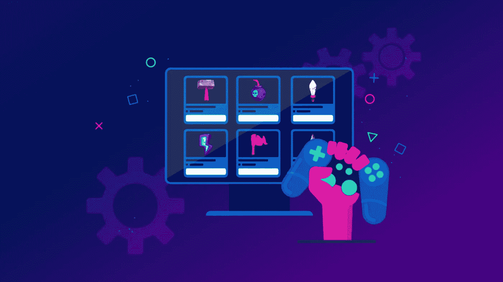

# NFT 游戏市场的发展——是时候为你的利润而战了

> 原文：<https://medium.com/geekculture/nft-game-marketplace-development-its-time-to-play-for-your-profits-86330c513501?source=collection_archive---------10----------------------->

金融时报游戏已经成为一种趋势，它们正在改变游戏的工作方式。随着 Axie Infinity 等游戏的发展，许多人希望通过这些游戏赚钱。这些游戏是一个赚钱和体验新游戏方式的地方。然而，这些游戏用你在游戏中获得的东西来奖励你，并在一个为他们准备的平台上进行交易。这些市场给未来的社区带来了希望，使他们能够获得一切。许多公司认为这是一个获利的机会，并开始建立可以帮助他们的市场。所以，让我们来理清你对这类市场的理解，帮你逛逛[**【NFT 游戏市场发展】**](https://bit.ly/3g1oWs9) 。

## 什么是 NFT 游戏市场，你为什么需要它？

NFT 游戏市场是一个平台，在这里你可以交易在玩游戏时获得的 NFT。它们是吸引玩家在游戏中攫取利润的不可思议的平台。每一个游戏收藏品都有一个你应该给出的价格，它们会作为利润回到你的口袋里。游戏市场就是这样一个地方，让你的可收集角色变成大肆宣传的奖励。

例如，Axie Infinity 的玩家可以在玩游戏时收集 NFT，然后在游戏内置的 NFT 市场进行交易。

## **游戏市场的独家优势**

如果你认为 NFT 游戏市场的发展是一个未来的机会，你也应该去看看它的好处。

Reven UE 流

NFT 游戏市场为您的企业创造收入。

例如，用户在你的 NFT 市场上交易时会产生交易费，鉴于 NFT 的资产比传统游戏中的资产昂贵得多，这笔费用可能会增加并产生影响。

V **风险资本**

你的 NFT 项目可能是下一个获得投资者资助的项目，因为 NFT 游戏市场是一个快速扩张的行业，全世界的投资者都对它感兴趣。

投资者可能还没有看到你的项目，但一个基于你的 NFT 游戏而构建的坚固的游戏 NFT 市场可能会是最后的一部分。

T透明度

一个 NFT 游戏市场是完全透明的，因为它位于区块链。在这里，所有交易都作为区块链上的记录对每个人可见。

然而，由于假冒 NFT 几乎是不可能的，你的用户可能会对你的品牌感到更舒服和忠诚。

# **开始游戏市场前的主要考虑事项**

创建一个游戏 NFT 市场是一项具有挑战性的任务。如果你没有对你的业务流程做一点研究，你可能会遇到这些陷阱:

## ✪ **发展战略**

因为你是这个行业的新手，你可能仍然需要帮助来选择最适合你的 NFT 游戏市场发展的解决方案。开发你的平台最难和最容易的方法是通过从开始开发，并使用 [**白标解决方案**](https://bit.ly/3X09CN1) 。但各有利弊。所以，如果你不做适当的研究，你可能会失败。

## ✪ **你可能会在比赛中摔倒**

如果你试图在适当的研究之前推出你的市场，你可能会在竞争中失败。然而，你可以确保了解市场，你的目标是什么，你的竞争对手是谁，以及其他可能让你担心的重要事情。您可以通过引人入胜且用户友好的平台赢得游戏玩家的芳心。

## **必备功能**

尽管所有的 NFT 游戏市场都不尽相同，但它们都需要这些基本组件才能正常运行。在开发游戏 NFT 市场时，您应该检查是否有必要具备以下特性和功能:

**👉多种付款方式:**多种付款方式会更好，因为它为交易提供了最好的可能性。

👉二级销售:人们可以在二级市场上交易游戏中的物品。这个功能是 NFT 游戏平台开发的一个重要方面，因为它将允许他们在为他们准备的平台上轻松交易这些奖励。

👉**过滤器:**这个选项对于在平台上轻松导航至关重要

👉一个吸引人的店面会吸引更多的观众。所以，一定要定制。

👉排名是一个至关重要的功能，它以各种方式显示卖家的排名，这样他们就可以选择合适的卖家来来回回地交易他们的商品。

## **NFT 游戏市场的发展:诉讼的成本**

任何市场的成本都将基于你的需求。这取决于您选择的功能和您的市场在市场上出现所需的时间。由于每个市场的条款和条件因您的期望而异，因此每个市场都有自己的价格。然而， [**选择正确的游戏市场开发公司**](https://bit.ly/3g1oWs9) 会让你的钱花得值，因为它会根据不同的客户角度制定其他计划。

**NFT Game Marketplace Development-Steps**

## **NFT 游戏市场发展:循序渐进**

您的 NFT 市场平台将根据您的需求提供热情的服务。让我们看看制作过程:

🎮第一步:进行彻底的研究，分析你的目标受众的需求。

🎮第二步:创建一个满足你独特需求的界面

🎮**第三步:**包括前端组件，如排名、过滤器等。

🎮**步骤 4:** 基于您首选的区块链网络设计一个智能合同和令牌协议，作为后端操作开发的一部分。

🎮**第五步:**测试 NFT 游戏市场的漏洞，然后发布。

## **结论**

****NFT 游戏市场的发展可以以一种重要的方式完成，因为它提供了一个最好的平台，可以交易区块链时代顶级游戏的各种收藏品。玩家和所有者得到他们想要的东西，因为他们在游戏中赚取的交易物品给了用户利润。这些企业主将从市场上的每一笔交易中获得回报。但是，为了快速建立市场，您可以使用现成的解决方案来定制您的需求和要求，并降低开发成本。****