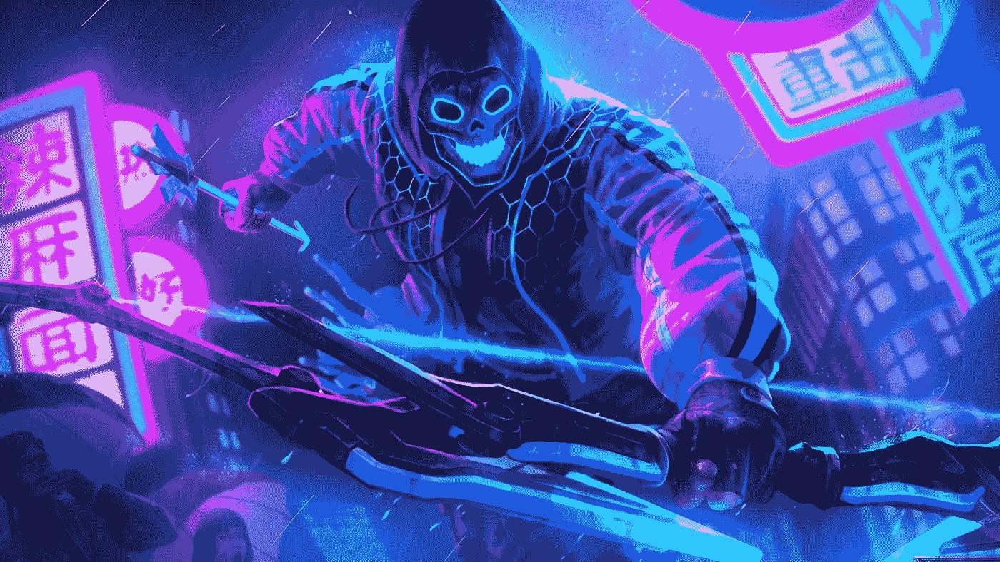

# NFT 游戏平台开发:网络游戏的新时代

> 原文：<https://medium.com/geekculture/nft-gaming-platform-development-a-new-era-in-online-gaming-2db38d6a4226?source=collection_archive---------21----------------------->

在线游戏已经在世界范围内的普通大众中流行，吸引了大量当前参与游戏世界的活跃玩家。这些在线游戏通过出售只能由玩家在游戏世界中访问的各种物品来赚钱。只有顶级玩家在使用游戏平台赚钱。自从 [**NFT 游戏平台**](https://www.turnkeytown.com/nft-gaming-platform-development) 的出现，这种情况已经改变，并允许全球所有参与者参与游戏并赚钱。NFT 游戏在在线玩家中变得非常流行，以加密货币或代币的形式为他们提供放松和资金。

# 《NFT 游戏》序言:

NFT 游戏在区块链和加密货币行业引发了新的热潮。CryptoKitties 之类的早期 NFT 催生了“玩赚”模式。Game-Fi 是一个结合了金融和游戏的全新行业，为游戏玩家提供了在参与中赚钱的机会。玩家可以通过多种方式在 NFT 游戏中赚钱。虽然寻找、赢得或培育不寻常的物品是通过游戏赚取的常用方法，但玩家可以选择尝试其他游戏形式。“玩赚”是广受欢迎的原型之一。

NFT Gaming Platform Development : A New Era in Online Gaming

# NFT 游戏平台的优势:

*   NFT 游戏平台允许玩家在游戏中完全控制他们的数字资产。这是一个可取的选择，因为它使用户能够在出售其 NFT 时从加密货币中获利。此外，有形的所有权可以是一个可靠的收入来源，并提供更多的激励去玩基于区块链的游戏。
*   NFT 的价值随着其稀有程度而增加。区块链促进了数字交易的透明度，并凸显了 NFT 的稀缺性，这两者都提高了它的价值。
*   由于许多人认识到了市场潜力，游戏玩家将 NFT 交易从兼职变成了合法职业。

# NFT 游戏平台开发:

在线游戏玩家对 NFT 游戏的需求增加了。这为企业主、初创公司和企业家打开了一扇新的机会之门，他们可以从数字空间的新商业模式中获利。这种对 NFT 游戏不断增长的需求得到了市场上 [**NFT 游戏平台开发公司**](https://www.turnkeytown.com/nft-gaming-platform-development) 的支持。在区块链技术和在线游戏方面有经验的开发公司为所有希望开始游戏业务的企业家提供必要的服务。

# NFT 游戏平台开发的阶段:

NFT 游戏平台的开发过程非常复杂，需要大量的时间、精力和资金来开发和推出。以下是开发 NFT 奥运会的步骤:他们是

*   第一步是召集一群具有 NFT 游戏平台开发知识的专家，设计游戏，并决定游戏的类型。NFT 游戏的先决条件应该在彻底调查后收集。
*   选择 NFT 游戏平台运行的区块链平台是必要的。区块链网络可以根据各种特征进行选择，包括汽油费、执行速度、互操作性和受欢迎程度。
*   准备游戏的演示版本，展示 NFT 游戏平台的架构、功能和指导原则。它有助于游戏的概念测试，并提高 NFT 游戏的输出。
*   根据游戏的结构，你应该经历内容开发过程中的不同阶段。如果你正在制作一个 2D 游戏，从勾画出游戏的角色、物品和环境开始。然后绘制它们，进行任何必要的设计更改，并使任何需要移动的东西具有动画效果。
*   一个游戏的逻辑和结构是通过游戏的关卡设计来直观表现的。为你的游戏选择玩家移动模式的一般描述。
*   由于游戏 NFT 可以出售或兑换加密货币，因此需要一个加密钱包。它们也被 NFT 玩家用来注册；因此，他们必须包含在游戏的所有发展阶段。
*   交易修改、NFT 运动和游戏网络安全由一个位于区块链的名为“智能合同”的项目负责最关键的是要记住，一旦合并，聪明的合同不能改变；因此，来自游戏和商业行业的标准应该在他们的开发中使用。
*   后端必须集成到 NFT 游戏系统的数据和架构中。必须为应用程序开发 NFT 游戏结构，以访问区块链和游戏代码，并访问所需的数据、功能和指令。
*   为了测试你的 NFT 游戏平台，你需要使用正确的设备。可以使用许多测试工具来评估 NFT 游戏应用程序。一些测试人员选择创建一个演示区块链环境来测试 NFT 游戏。
*   NFT 游戏平台是为部署在区块链网络中而设计、开发和测试的。推出具有强大营销战略的 NFT 游戏平台将是有利的。营销 NFT 游戏是一个例外，但会增加玩家的参与度。

# 关于 NFT 游戏平台开发服务的最终想法:

NFT 游戏平台在网络游戏玩家中变得流行，增加了市场对新游戏的需求。如果你是 NFT 的追随者，了解市场及其运作，那么你可以开发并推出你理想中的 NFT 游戏，从 NFT 游戏中获得额外收入。企业主可以利用 [**NFT 游戏平台开发服务**](https://www.turnkeytown.com/nft-gaming-platform-development) 向 NFT 世界推出他们的游戏。