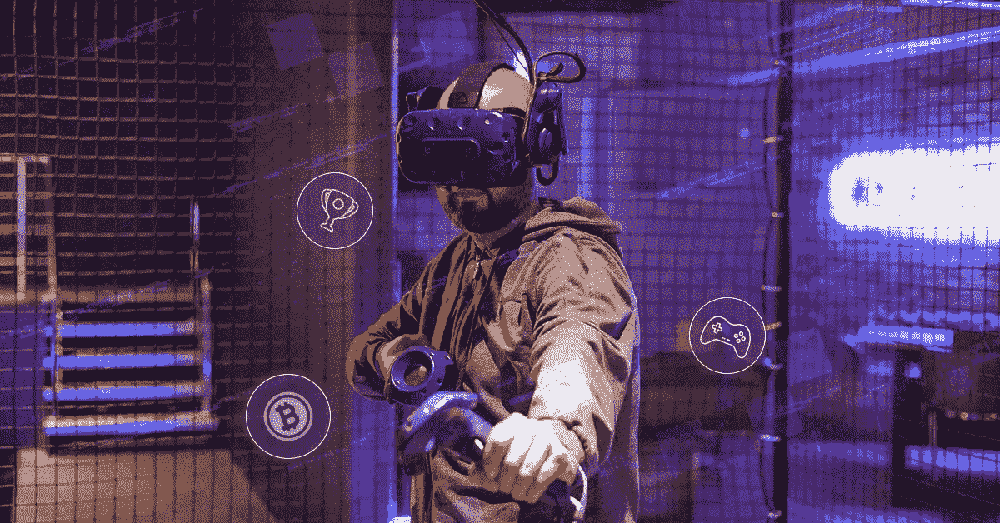
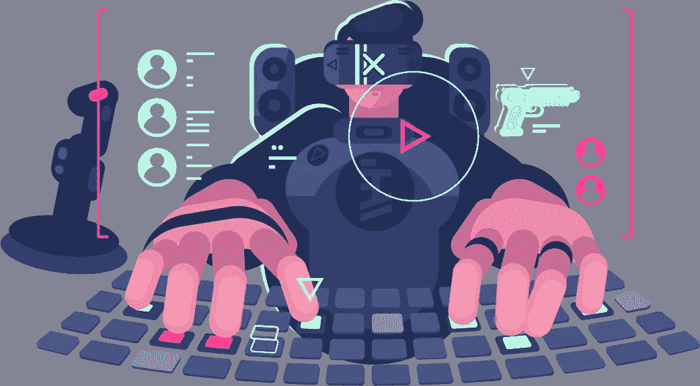

# NFT 游戏平台开发——数字空间中有利可图的商机

> 原文：<https://medium.com/geekculture/nft-gaming-platform-development-a-remunerative-business-opportunity-in-the-digital-space-3bc56ae0a8cd?source=collection_archive---------13----------------------->

## **NFT 游戏平台开发——船上可靠的商业模式！！！**

如果几年前有人问我，NFT 会是最受争议的流行语，我的回答肯定是“不会”。但现在，整个情况已经完全颠倒了。

以前，游戏只是作为娱乐的来源，但现在它已经扩展了其作为盈利创收者的角色。

随着 NFT 游戏的出现，玩家和开发者的视角已经完全发生了彻底的转变。

如果你是一个雄心勃勃的企业家，计划建立自己的 NFT 游戏平台，你需要在加密镇与领先的 [**NFT 游戏平台开发**](https://bit.ly/3Tk7NrQ) 服务提供商建立联系。

请关注这个博客，因为它将涵盖一些关于 NFT 游戏平台开发的重要见解。那么，我们开始吧。

## **NFT 游戏平台——快速浏览**

NFT 游戏平台只不过是分散的、位于区块链的平台，玩家可以在这里玩游戏，并在市场上交易各种游戏资产。

游戏中的资产只不过是人们在游戏过程中发现的资源。这些资产包括化身、皮肤、生物、交通工具、服装等。

这些平台是有益的，因为玩家可以在空闲时间从代币或加密货币中获利更多。此外，这些平台赋予 NFT 持有者强大的所有权、安全性和不变性。

一些最昂贵的游戏 NFT 是——天使(Axie Infinity)和龙(CryptoKitties)。Axie Infinity 是 NFT 顶级游戏之一，每日活跃玩家约 280 万，是击败其他竞争对手的第一款 NFT 游戏。

这些令人瞠目结舌的统计数据鼓励了游戏开发公司、企业家，甚至非游戏开发公司将他们的资金和财务贡献投入到 NFT 游戏平台开发中。

## **玩家如何通过这些平台赚钱？**

玩家有特权获得游戏中收藏品的所有权，或者出租或者交易以获得可观的利润。

这些收藏品可以作为 NFT 保存在区块链，它们的稀有性、质量和受欢迎程度将决定它们的最终价值。通过出售这些代币，玩家可以一次性赚钱。

但是采用另一种方式，即把 NFTs 租给其他人，是一个更好的选择，因为一个人可以在不失去所有权的情况下持续创造有限的利润。

## **NFT 游戏平台中的独家功能**

**可验证的交易** —开发者和玩家可以在游戏平台上访问和确认他们的交易。

**智能合约** —平台中的交易使用之前开发的智能合约进行。这些智能合约提高了平台的安全级别，确保交易过程中没有中介介入。

**透明**——这些位于 NFT 的游戏平台是 100%透明的，因为用户可以监控存储在区块链上的交易，保证了安全性和不变性。

**流动性**——NFT 游戏平台确保即时交易，最终为游戏内资源的更高流动性铺平了道路，这意味着资产可以毫无争议地转换为法定货币。

稀有度——默认情况下，每一款游戏 NFT 都是独一无二的。而独特的游戏 NFT 由于其名气和稀缺性，可以赚取高额利润。

## 有没有可能开发一个 NFT 游戏平台？

是的。在当今的区块链世界，开发一个拥有诱人游戏功能和顶级安全协议的 NFT 游戏平台并不是一件难事。

让企业家高兴的是，有两种可能的方式被广泛用于开发 NFT 游戏平台。

首先，从一开始就开发平台会过度消耗时间、金钱、资源和技术专长。如果您选择第一种方法，您需要密切关注平台开发过程的每一个细节。

但也有一个合适的替代方案:白标解决方案。通过第二种方法开发的 NFT 游戏平台包含各种额外待遇，包括:

*   预算友好的解决方案
*   即时启动
*   您选择的区块链网络

## **NFT 游戏平台为玩家和创业者准备了什么？**

*   开发一个 NFT 游戏平台对于初露头角的企业家来说绝对是一个了不起的想法，他们可以在充满希望的区块链空间留下自己的印记。
*   对代币的需求飙升，增加了它的市场价值。
*   NFT 游戏平台开发允许游戏平台所有者向在其平台上访问和玩游戏的玩家提供奖励。
*   游戏平台丰富的可用性背后的主要原因是它的透明性。
*   从玩家的角度来看，他们有机会创造游戏内资产、多样化的赚钱机会、安全、隐私等等。

## **NFT 游戏平台开发的详细版本**

彻底的研究和构思是让你的 NFT 游戏事业取得巨大成功的基础。有必要对市场、竞争对手和目标受众进行清晰的研究。在这个发展阶段，你需要根据游戏类型、游戏机制和区块链网络来确定他们的概念。

为游戏平台选择区块链网络必须给予最大的关注。区块链的选择基于各种因素，包括执行速度、知名度、互操作性和油费。通过从区块链的智囊团获得准确的建议，你可以开发一个 NFT 游戏平台，可以接触到更广泛的观众。

第二阶段必须选择主题和情节。NFTs 游戏的设计将遵循这些概念。框架、主题和角色可以在你愿意合作的 NFT 游戏平台开发公司的合格游戏开发者的帮助下进行编码。处理 NFT 游戏平台的资产使平台更加活跃。

这是 NFT 游戏平台开发过程中的一个重要阶段，因为这是执行前端和后端的地方。必须根据项目的业务范围选择合适的技术。此阶段完成的另一个重要步骤是钱包整合。

拥有一个 [**NFT 市场**](https://bit.ly/3yVxaYQ) 永远是你在 NFT 赌博的额外收益。有了这个平台，玩家可以在他们收集资产的同一个平台上交易他们的资产。

对 NFT 游戏平台的完整质量分析必须确保其正常运行，不给任何技术故障留下空间。为了让您的游戏平台高效运行，没有任何错误和其他技术复杂性，必须由公司的一组测试人员在平台上进行多次测试。他们会进行各种测试，直到你的平台不再有任何技术故障。

一旦测试过程成功完成，人们需要将他们的注意力转移到他们的 NFT 游戏平台的营销方面，同时推出它。确保与你合作的开发公司拥有广泛的营销工具，包括不和谐营销、电报营销等。，把你的平台带到你想要的观众面前。因此，如果想获得良好的投资回报，就必须特别关注营销。

## **总结思路**

希望你通过这篇博客对 NFT 游戏平台的发展有所了解。如果你热衷于开发自己的 NFT 游戏平台，雇佣一家行业领先的 NFT 游戏平台开发公司是你的下一步行动。

一家行业领先的 NFT 游戏平台开发公司提供端到端的开发解决方案，指导诱人的 NFT 游戏平台的开发。

该公司的开发人员凭借其在该领域的专业知识，提供一流的 NFT 游戏平台开发服务，以合理的价格为企业家提供出色的游戏性和专属经济利益。

但是找到合适的公司并不是一件容易的事情，因为你面前有更多的选择。要找到可靠的技术合作伙伴，你必须投入时间，查看公司在市场上的声誉、客户推荐、他们收取的预算以及其他技术专长。