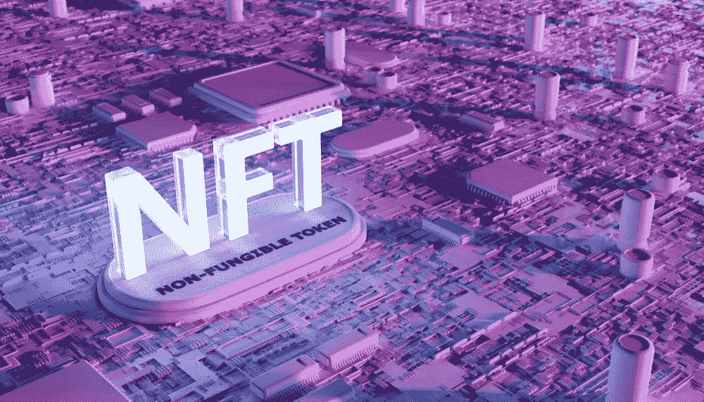

# NFT 影响者营销服务——吸引匿名人群的注意力

> 原文：<https://medium.com/geekculture/nft-influencer-marketing-services-drag-in-anonymous-crowds-attention-c1fe9bbc41d3?source=collection_archive---------18----------------------->

新型企业的优质风险投资正在商界取得巨大进展。cryptos 和附属机构的发展创造了惊人的机会，并在最近获得了越来越多的关注。说到抵达，这些企业正在为更广泛的社区提供惊人的收入选择和相关的商业机会。NFT 就是其中之一，它致力于通过数字资产提供多种收入来源。但是，作为所有企业的主要用途，非功能性服务业需要强有力的支持才能达到预期的目标。通过有影响力的人提出建议具有可信的声誉；有了 NFTs，NFT 影响者营销就有了一个孤立的点，它具有惊人的产生结果的能力。了解将业务推向更高水平所产生的加速度。

Celebrity NFT Influencer Marketing Services

# 什么是 NFT？

缩写为不可替代的代币，这些精英区块链代币是最新的风险投资，其足迹不到十年前。这增强了多种资产索赔增加销售显示最大的独特性和稀有性。艺术、音乐、照片、迷因等数字资产是由用户以一种独特的业务类型创造的。有了这个设施，不同领域的各种隐藏的艺术家冒险进入这个空间，并为他们的资产提供一个接触观众的优质平台。

NFT 表现出独特性和稀有性，这刺激了这些代币的价值，并使它们有机会随着时间的推移而增长。

# **为什么非技术企业需要营销？**

正如前面提到的 NFT 和它们诱人的品质，从这种商业类型中品味财富还有另外一点。营销是这家 NFT 企业成功的一个重要方面。

一看到企业的精英特征和能力，就有各种各样的人带着提出令人印象深刻的独特令牌的动机进入市场。这些行动自然地使市场挤满了多个基于利基的代币，增加了找到任何特定代币的风险。这里出现了突出标记的需要。向更广泛的受众展示代币并探索他们的思想就是营销。通过营销和广告，令牌在多个域中遍历，并且信息被共享。一听到这些提议，社区中的目标受众就会驱车进入特定的市场，并有机会获得特定的资产。市场营销的全面支持对于实施这些行动并取得惊人的成果至关重要。

# **谁是有影响力的人？**

当讨论营销代币时，有不同的路线遭遇行动；其中，一个令人印象深刻的实用程序闪耀着迷人的魅力。NFT 影响者营销服务公司为多个项目提供了额外的吸引人的途径。

影响者是这种营销类型的来源，他们在那里灌输他们的支持，使企业做大。虽然全球已经更新了自我驱动的行动和外交思想，但一个人的演讲或建议吸引许多人的影响是普遍的；影响者营销就是在这个基础上运作的。

有影响力的人本身就有惊人的粉丝群，除了成为粉丝，他们还应该准备好接受偶像提出的一切。这些高调的人可以轻松地向不同的人推荐利基市场。

# **NFT 影响者营销是如何运作的？**

由于 NFTs 在营销时是基于区块链技术的高级业务类型，因此非常需要与区块链的节点和相关数据连接。为此，同样，平等的区块链知识是必不可少的。因此，个人不能为代币提出营销脚本，这需要从有组织的空间发起。

NFT 影响者营销公司是著名的激励者，可以提出令人兴奋的行动，以代表更广泛的社区的利基。通常，名人被划分为有影响力的人是根据他们的名气和粉丝基础。这可以统称为[*C****elebrity NFT 影响力营销服务***](https://www.inoru.com/nft-influencer-marketing-services) 。公司在这里的角色是理解业务的主要领域。在更广泛的理解上，公司允许兼容的影响者参与提案。从指派影响者到使营销航行在正确的航线上，NFT 影响者营销公司保持完整并提供所需的支持。

影响者通过视频和帖子向社区谈论 NFTs。营销公司主动创建吸引人的内容，并推荐有影响力的人向观众发布或发言。通过发布多个影响者的持续视频并在社区中传播品牌，NFT 影响者营销机构在规定的时间内推动结果。

提议的内容经过多次交叉检查，由公司杰出的内容创建者创建。这些指标为业务带来惊人的牵引力，影响者向受众讲述可信的信息，最终，社区被注入真实的信息。这些提议碰巧是微妙的，而不是强加的。著名的影响者营销机构认真对待这些行动，并为营销需求提供积极的行动。

# **最佳 NFT 影响力营销公司**

说了很多关于 NFT 营销机构及其在增加业务增长保证中的作用，这部分讲述了具有惊人的结果产生能力的顶级和最好的 NFT 影响者营销公司。这是清单。

*   [INORU](https://www.inoru.com/)
*   共装订
*   AppDupe
*   单粒谷物
*   令牌头脑。

# **结论**

不断增长的业务要求在该领域有类似的发展，考虑到这一点，营销必须给予更多的重视和关注，以避免波动。事实证明，NFT 是最好的收入来源，令人印象深刻的数字资产来自前线。因此，这些基于代币的企业需要兼容的营销策略。NFT 影响者营销服务就是这样一种有吸引力的营销服务。与最好的和最著名的 NFT 影响者营销机构联系，调整他们的营销策略，进行一次惊人的商业冒险。