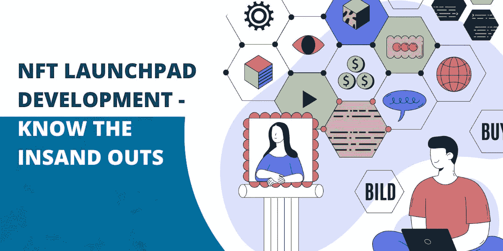

# NFT 启动板开发—了解详细的见解

> 原文：<https://medium.com/geekculture/nft-launchpad-development-get-to-know-the-detailed-insights-6b9095268d1b?source=collection_archive---------14----------------------->

NFT 发射台开发是当今的一个热门话题，因为它是区块链地区不断增长的商业模式。推出不可替代的代币项目进行融资，不仅有利于项目持有人，也不利于投资者。你有推出 NFT 加密发射台的想法吗？这篇文章将是一篇信息量很大的文章，因为您可以了解什么是 NFT launchpad 及其功能和业务优势。穿过去！

## **NFT 发射台开发—简介**

让我们从对 NFT 发射台的深刻介绍开始这篇文章。NFT launchpad 是一个平台，项目持有人可以在这里创造和启动与不可替代令牌相关的项目。因此，他们可以筹集资金，以扩大其项目和业务的范围。NFT 发射台根据先到先得的原则进行项目分发。它也被称为术语彩票方法。随着 [**NFT 发射台**](https://www.appdupe.com/nft-launchpad-development?utm_source=google&utm_medium=guestblog&utm_campaign=Monika) 的开发，企业家或个人可以部署他们自己的 NFT 加密发射台，使项目持有人或所有者能够提出他们的项目进行众筹。

 [## 为您的加密业务选择 PancakeSwap 等 DEX 的五大理由！-设置发布

### 通过这个博客，你可以决定为什么你应该像 PancakeSwap 一样喜欢 DEX，并在加密市场领先。探索…

www.setuppost.com](https://www.setuppost.com/top-5-reasons-to-choose-dex-like-pancakeswap-for-your-crypto-business/) 

## **为什么选择跨链 Launchpad 开发？**

🔓**惠及 NFT 项目持有人**

随着 NFT 项目数量的增加，初创公司或项目持有人正在寻找一个 NFT 发射台，以便获得更广泛的投资者基础来筹集资金。通过这个，他们可以扩大他们的项目。通过这种方式，你可以为项目持有人提供广泛的机会来展示他们的众筹项目。

🔓**在投资者中建立信任**

具有跨链连接的 NFT 发射台开发将为项目持有人带来更多机会来发布他们的项目，这些项目必须经过可持续性验证和批准。因此，这将大大提高投资者对可靠和可持续项目投资的信任。

🔓**利用 NFT 趋势**

> 无论何时何地，NFT 都在我们周围嗡嗡作响。然而，2021 年 NFT 市场规模接近 410 亿美元，并将在未来几年继续增长。重要的是，炒作就在我们身边，并将持续到 2021 年以后。因此，这将是一个很好的机会，一个正在步入 NFT 领域的人。

这样的例子不胜枚举。部署 NFT 加密发射台将有许多原因，因为渴望推出他们的平台的人将在每个可能的方面产生利益。

## **让我们看一看 NFT 发射台开发的商业利益**

💡**项目会有巨大的潜在投资者牵引力**

公平筹资将有助于初创企业、企业或项目持有人在公平的基础上筹集资金。这将以先到先得或抽签的方式进行。这意味着持有最高数量代币的投资者可以参与在 launchpad 上进行的融资。是的，NFT 项目持有人可以有更大的机会接触全球投资者。

💡**版税&流动性**

独特的 NFT 项目列表，确保可持续性，将大大使 NFT 发射台成为一个值得信赖的平台。所以，这样会增加平台的流量。最重要的是，它将为已经发行的不可替代代币提供即时流动性。此外，每一个铸造的 NFT 将有一个版税，这将进行的每一个平台上的交易。最终，这将为投资者带来财务稳定性，并为获得可用性铺平道路。

## **跨链 NFT 发射台开发过程中需要考虑的特性列表**

你确定要推进跨链 NFT 发射台的开发吗？在此之前，最好了解一下 NFT launchpad 的特性集。这是清单。一瞥！

## **结论**

这篇文章不是很鼓舞人心吗？等不及了？继续与公司或企业联系，寻求跨链 [NFT 发射台开发](https://www.appdupe.com/nft-launchpad-development?utm_source=google&utm_medium=guestblog&utm_campaign=Monika)。确保选择一家可靠的公司来提供您想要的解决方案。