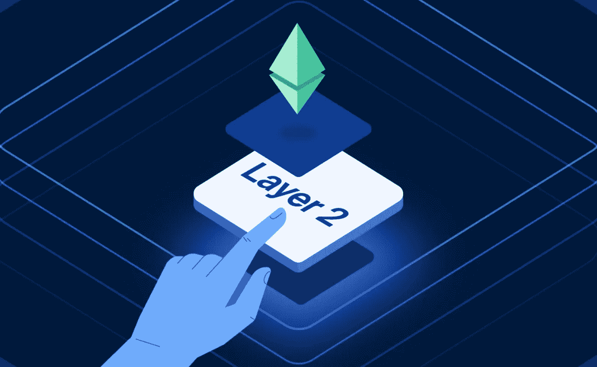
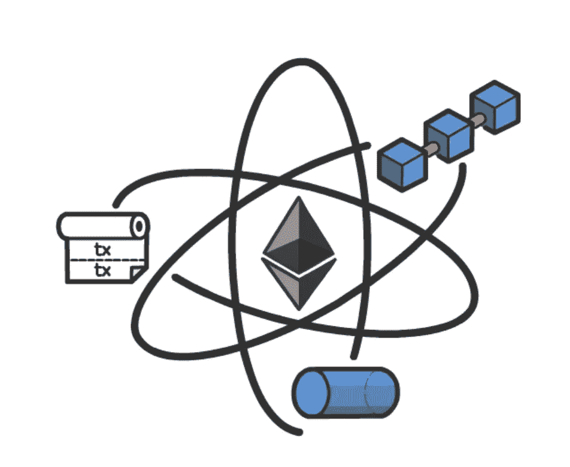

# NFT 第 2 层开发——对其优势和未来的深刻洞察

> 原文：<https://medium.com/geekculture/nft-layer-2-development-a-deep-insight-into-its-benefits-and-future-d19ed84ffa43?source=collection_archive---------9----------------------->

NFT 是一个简单的缩写，目前正席卷全球。虽然虚拟收藏品进入这个世界还只是一段时间，但它们所造成的影响是巨大的。随着关注度和受欢迎程度的提高，NFTs 获得了收益，对这个社区的投资持续飙升。当这种情况发生时，交易平台很自然地会因为过多的流量而失去生存能力。因此，这笔 NFT 交易将受到影响，增加交易费用。这就是 NFT 第二层技术作为一缕阳光进入数字世界的时候。让我们在这篇博客中详细讨论 NFT 第 2 层解决方案。在此之前，先简单介绍一下 NFTs。

# NFT-简介

NFT 意味着不可替代的代币。这些不可替代的令牌已经成为一个非常有趣的概念，密码爱好者正在努力充分利用它们。你基本上可以把任何东西铸造成虚拟收藏品，只要你有它的虚拟表现。它为你提供了所有权和真实性的品质。这些虚拟收藏品的独特特征帮助它发展成为一个价值数百万美元的行业，这是整个加密社区都承认的事实。您可以立即创建自己的数字化代币。然而，当您选择第 1 层 NFT 解决方案时，您将享受不到该社区提供的任何升级。那么，你能做些什么呢？选择第 2 层 NFT 解决方案。

# 什么是 NFT 第 2 层解决方案？

NFT 第 2 层解决方案是一个以太坊第 2 层解决方案，通过将大部分事务处理交给以太坊网络的第一层，使应用程序能够扩展。它完成所有的功能，同时仍然保持它的分散性、完整性和可用性。因此，它帮助用户毫不费力地在任何时间铸造他们的收藏品。它为用户和开发者提供了流畅的体验。除了提高交易速度，它还减少了汽油费。NFT 第二层解决方案最令人印象深刻的一点是它支持超过 9000 TPS(每秒交易量)。不可变 X、Polkadot 和 Polygon 是一些最有效的以太坊第 2 层解决方案。

# 为什么需要 NFT 第 2 层解决方案？

为了适应快节奏的非功能性交易，我们需要可靠的解决方案，帮助使交易更加环保、可行和经济高效。

[**推出采用第 2 层解决方案的 NFT 平台**](https://www.appdupe.com/nft-marketplace-development) 至关重要，因为在这个区块链上的交易安全、快速且可扩展。此外，它们也更环保。这是一个为您提供安全性和透明度，同时减少碳排放的解决方案。现在让我们看看它是如何减少碳足迹的。简而言之，他们只是减少了煤气费和能源消耗。一个可以超越所有限制并建立轻松流程的网络。因此，它将这个行业扩展到所有对密码世界充满热情的人。

# NFT 第 2 层是如何工作的？

只要你了解基本知识，理解这个解决方案的工作原理是很容易的。您可以清楚地看到该层中包含的附加功能，并通过三个简单的步骤了解 NFT 第 2 层的功能。

*   Mainnet 数据用于在第二层(第 2 层)实施正确的交易。它在第一层之外执行交易以减少燃气费。
*   交易及其证明的数据保留在第一层，这确保了安全性。

# NFT 第二层的优势

NFT 第二层提供的好处非常多，这就是为什么对它的需求越来越大。让我们看看这一层产生的最大好处。

*   NFT 第二层的交易费用完全由使用该平台的个人决定。它使用户能够完全控制在平台上设置交易费用。
*   使用 NFT 第 2 层，用户可以控制他们的私钥。这些私钥消除了保管风险，并提供了极大的安全性。
*   在这个第二层平台上发生的每一笔交易都是点对点的，没有气体的。
*   他们遵循以太坊标准，如 ERC-20 和 ERC-721，并确保没有并发症。
*   以太坊确保去中心化，因此在效率方面从其他平台中脱颖而出。
*   它能够在没有碳排放的情况下，每秒执行大约 9000 次交易(TPS)。

您是否对这些第 2 层平台带来的诸多优势感到惊讶？好吧，现在让我们来看看这些平台在未来的应用范围！

# NFT 第二层——它有未来吗？

我们都知道密码世界对当今人们的影响有多大。其他感兴趣领域的人们正在慢慢适应不可替代的收藏品，因此对 NFT 市场发展的需求持续飙升。现在想象一下，有一个更高效、更省油费的升级版。人们不会争先恐后地使用 NFT 第二层吗？嗯，即将到来的需求是我们理解第二层不可替代令牌的重要性的坚实证据。显然，他们还有很长的路要走，在不久的将来会有非常好的前景。

# 最后说，

[**集成了 NFT 第二层解决方案**](https://www.appdupe.com/nft-marketplace-development) 的 NFT 市场是对不可替代代币感兴趣的人的最佳选择。随着世界逐渐在世界和生活的不同方面涉及数字化，尽可能选择它所能提供的最佳选项非常重要。选择一个为您提供古怪功能和相对较低费用的平台是您的最佳选择，因为其他选项都具有较高的价格和较低的质量。总之，NFT 第 2 层解决方案是最明智的投资方式之一，因为它有着光明的未来和不断增长的需求。