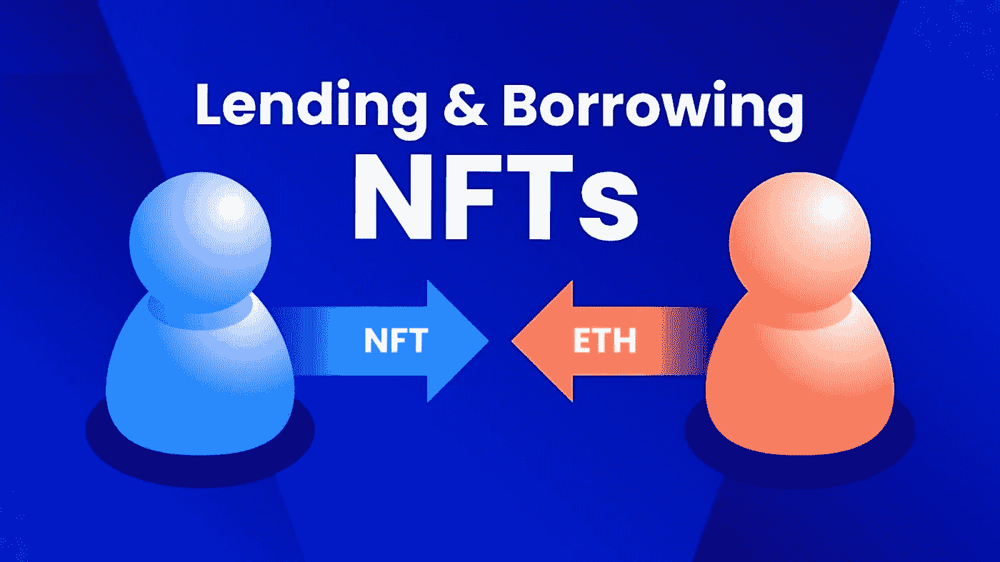

# NFT 贷款和资产支持贷款平台:它是如何工作的，为什么要推出 NFT 贷款市场？

> 原文：<https://medium.com/geekculture/nft-loans-and-asset-backed-lending-platforms-how-it-works-and-why-launch-nft-lending-marketplace-c73e1ef185c?source=collection_archive---------13----------------------->

现在扩大 NFT 支持的贷款市场很容易。通常，NFTs 属于垂直领域，如艺术、文化基因、视频、音乐、游戏和体育。但这一次，它是一些令人惊讶和新奇的东西。现在，NFT 贷款在加密领域已经成为现实。现在贷款的可行性甚至对非金融机构也广泛开放。NFT 代币持有者现在可以通过将这些代币作为抵押品来申请贷款。现在甚至有资产支持贷款平台可以提供贷款。

由于 NFT 具有几个特征，加密狂正朝着带来实质性增长的方向前进。鉴于对这些 NFT 贷款的大肆宣传，也很容易在瞬间获得它们。企业负责人和所有者朝着新的不朽的想法努力。NFT 的**贷款是最好的投资，也是 DeFi 领域发展的途径。**

**可以参考全球领先且暴涨的 [**NFT 借贷平台开发公司**](https://www.appdupe.com/nft-marketplace-development) 。通过学习贷款协议和区块链技术的作用，掌握提示和发展你的业务。**

# **为什么有宣传 NFT 贷款？**

**使用最近的统计数据暴露所有的知识，我可以给你关于 NFT 贷款的最令人信服的证据。**

> **例如，NFT-Autoglyph # 1488 由 142 万美元的贷款组成。这项发明是 CryptoPunks，幼虫实验室于 10 月 28 日取得的成就。这对于 NFTfi 的创始人史蒂芬·杨来说是如此的显著和可接受。NFTfi 是贷款协议，帮助点对点交易。**

**2020 年 1 月，引入了以 NFTs 作为抵押品的想法。项目开始后，web3 社区提出了 Rocket，NFTs 的细分取得了进展。细分仅仅意味着将 NFT 收藏品分成许多部分。**

**类似条状金融、银海金融、滴滴道等竞争平台提供 [**NFT 担保贷款服务**](https://www.protocol.com/fintech/nft-lending-crypto) 。因为在拥有资产的同时，世界的前景接近流动性。同样，有几个竞争对手是势不可挡地收购这些 NFT 贷款。**

# **为什么 NFT 贷款被认为是最好的投资？**

****

**一个上升的现象在 NFT 市场后，NFT 贷款的概念是下一代的连续性。NFT 市场正在蓬勃发展，预计 2022 年的收入将达到 400 亿美元。这种分散化甚至让与 NFT 贷款相关的一切都变得千方百计，并为密码创业者创造了新的机会。例如，已经有平台可以生成 NFT 贷款，包括 Arcade、NFTfi 和 Nexo。**

**作为一个不可替代的令牌，等待用户花费数十亿美元来购买并不容易。就像其他代币一样，这些 NFT 可以参与财务安排。由于非金融资产在本质上流动性更差，因此需要等待数年才能有人购买。虽然很多人并没有表现出购买整个 NFT 的兴趣，反而可能涉及到[**【NFT】**](https://www.cryptovantage.com/non-fungible-tokens/what-are-fractionalized-nfts/)的细分化。相比出售这些非金融资产，NFT 贷款更为可取。NFT 贷款的目的是获得更多的流动性，因此它会吸引用户投资 NFT 贷款。**

> **为了解决这个问题，NFT 贷款今天存在。NFT 贷款面对数字收藏品，并确保 NFT 持有人使用他们的资产与现代战略。全球投资者和企业负责人正在参与这些 NFT 贷款。2021 年 12 月，Arcade 获得了 1500 万美元的首轮融资，这是一场胜利。**

**在著名的区块链如以太坊上铸造 NFT 会招致更多的燃气费和巨大的能源支出。仍然没有像降低汽油费这样的技术来面对这种后果。用这些能量支出来满足用户感觉不舒服。**

**但是，正在进行修正，以解决以太坊面临的这个问题。通过将工作协议改变为标桩模型的证明，功能可以改变。该协议通过提高交易速度，为减少碳足迹和天然气费用提供了蓝图。**

**综合 NFT 贷款的优势和好处，我甚至可以推荐 NFT 贷款是一个很好的投资，你可以开始 [**推出 NFT 贷款市场**](https://www.appdupe.com/nft-marketplace-development) 。**

# **NFT 贷款——这就是它们的运作方式**

****

**了解 NFT 贷款的工作流程和方法通常很有意思。基本上有两个广泛的方面目前赢得了声誉——NFTs 和 DeFi。考虑到他们，他们是密码领域的热门话题。在区块链纲要中引入权力下放是一笔财富。因为它使交易过程和财务数据库保持安全。它允许无权限控制，不允许任何中介沉迷于核心活动。**

**尤其是去中心化的平台，不会像银行一样依赖于中心化的机构。但是它给了地球上任何人一个互联网连接。通过去中心化的手段，任何人都可以在瞬间借出、借入或交易资金。所有这些活动的发生都不需要任何中间人的许可或要求。**

**通过应用分散化的概念，在世界上有几个 DeFi 项目和应用。但是，这是一个国家非技术中心是否能够参与权力下放的问题。因为，NFT 不能自我分裂，所以现在有 NFT 贷款。就像我们如何使用车辆、房屋和土地一样，非金融资产可以作为贷款的抵押品。**

**通过将这两个实体与 NFTs 结合起来，将会有一个新的领域可以探索。有一些平台已经取得了成功。**

## **向上投篮**

**因此，我的结论是，NFT 贷款是一个非凡的投资选择和企业家的有利可图的选择。实际上，NFT 持有者允许他们的 NFT 收藏品抵押他们的部分或整体。因此，他们以加密货币或法定货币的形式获得贷款，作为一种莫名其妙的交换。由于这些非金融资产缺乏流动性，因此这可能是通过 NFT 贷款获利的方式之一。另一方面，DeFi 申请处于与 NFTs 合并的边缘，以确保贷款的可行性。**

**作为一名企业家， [**推出 NFT 借贷市场**](https://www.appdupe.com/nft-marketplace-development) ，这样你就可以推动你的业务更上一层楼。抓住最重要的区块链发展公司来雇佣具有丰富知识的专业人士是成功的。**