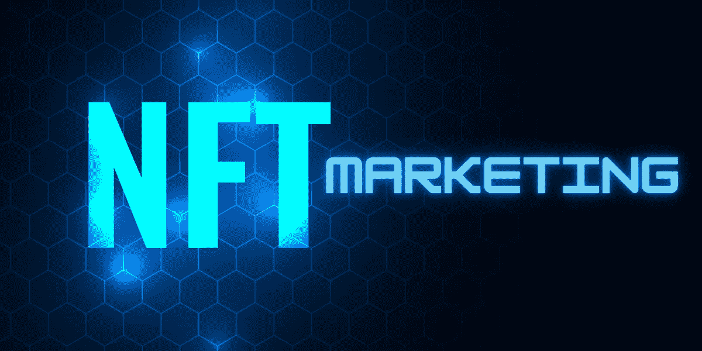
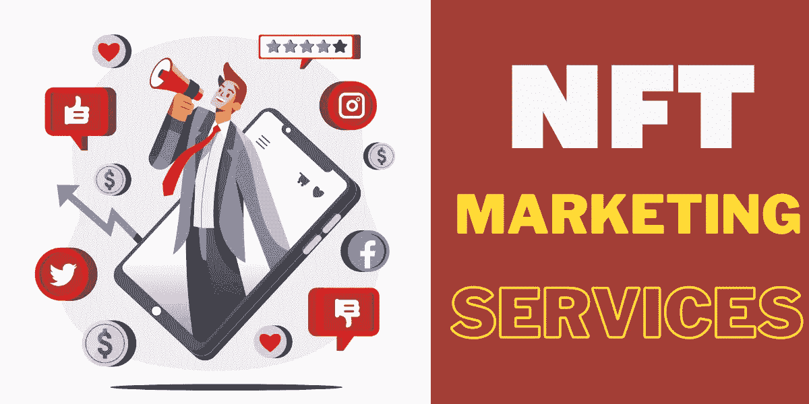

# NFT 营销——跟随 NFT 成功项目之路的终极指南

> 原文：<https://medium.com/geekculture/nft-marketing-your-ultimate-guide-to-follow-the-path-of-successful-nft-projects-4b32023874b1?source=collection_archive---------20----------------------->

NFT 无疑是一个时髦的词，越来越多的创作者正在制作他们独特的艺术形式的 NFT。我们在 2022 年底， [**NFT 市场还在稳步扩张**](https://cointelegraph.com/news/nft-market-worth-231b-by-2030-report-projects-big-growth-for-sector) 。

尽管有很多可用的非功能性食物，但并不是所有的都有价值。NFT 的大规模销售是由你向目标受众推广的 NFT 营销策略决定的。

对于一个 NFT 的新手创作者来说，要想在竞争激烈的拥挤市场中胜出，非常建议 [**向专家**](https://www.infiniteblocktech.com/nft-marketing?utm_source=guestblog&utm_medium=guestblog-18-10-2022&utm_campaign=muralidharan.g) 寻求帮助，他们只提供以结果为导向的 NFT 营销策略，可以让你的项目引起轰动。

在这篇博客中，我们将了解 NFT 营销及其在最大化您的 NFT 项目价值中的作用，我们还将浏览一些以结果为导向的策略。

## **NFTs —快速纲要**

尽管面临批评，NFT 已经设法成为 21 世纪的一个主要的数字轰动。最近，我们听到人们花费数百万购买数码艺术品和收藏品的消息。

简而言之，不可替换令牌是区块链网络上存在的一种加密数字资产，代表不可复制或替换的独特数字资产。

第一个 NFT 名为“量子”，由数字艺术家凯文·麦考伊和编码员阿尼尔·达什在 2014 年创作。几年后，NFT 在拍卖会上以 140 万美元售出。

但第一个 NFT 仍然无法触及数字艺术家 Pak 的“The Merge”创造的纪录，它以 9180 万美元的价格售出，被认为是迄今为止最昂贵的 NFT 拍卖会。

NFT 在 NFT 卖出的《毕普》引起了普通人和大人物的注意，这幅名为《每一天:前 5000 天》的 NFT 画以 6930 万美元的天价售出

## **NFT 营销服务部如何帮助您的 NFT 项目战胜竞争对手？**

价值百万美元的 NFT 项目的定义包括两个任务——开发一个成功的 NFT 项目的第一步；你还需要以正确的方式向正确的受众推销项目。即使你是一个才华横溢的创作者，拥有价值数百万的 NFT 项目，也有可能是因为曝光不足。

毫不犹豫地， **NFT 营销**是一个让你的观众参与了解你的 NFT 项目的绝妙工具。NFT 营销是开发，促进和提供您的 NFT 产品和服务，以您的目标人口和交换产品，为您的客户增加价值。

NFT 营销的最终目标是传播项目意识，将流量转化为潜在买家，并增加项目忠实支持者的数量。因为人们珍惜稀有性和独特性，并愿意为此付出任何代价，当需求旺盛时，一件稀有的 NFT 收藏品的价格就会大幅上涨。

由于 NFT 市场的指数增长和竞争环境，推动 NFT 销售变得越来越困难，您必须制定一个全面的营销计划来实现您的业务目标。

## **NFT 顶级营销策略，保证 NFT 销量大增！！！**

**NFT 上市右平台**

这是提高你的 NFT 销售率的最简单的营销策略之一。如果你想让你的 NFT 引起潜在观众的注意，你必须把它列在正确的 NFT 市场平台上，让潜在买家定期访问。

有许多选项可供您列出您的 NFT 项目，包括:

**日历**

*   [https://nftcalendar.io/](https://nftcalendar.io/)
*   [https://nftprojectlist.com/](https://nftprojectlist.com/)

**市场平台**

*   OpenSea
*   稀有的

这种策略的一个经典例子是塔可钟 NFT 项目。这家快餐连锁店开发了近 25 种 NFT，上市后 30 分钟内就迅速销售一空。

**电子邮件营销**

你可以利用这个策略来发送关于你的项目的信息邮件。您可以选择独特的模板、设计和内容，然后与您社区的目标受众分享，最终创建一个与您的品牌活动保持同步的大型用户群。

**在你的 NFT 上进行 AMA(问我任何问题)会话。**

举办 AMA 会议是提高项目口碑的有效方式。这个策略是成功的，因为它向目标受众阐明了为什么他们必须使用你的项目。

**新闻稿**

新闻稿是提高你的 NFT 项目可信度的最传统而有效的方法之一。

为了有更好的接触，确保你与最好的网站和媒体渠道分享结构良好的阅读材料。

此外，确保这些新闻稿简明扼要，与读者交流购买 NFT 的优势。

**搜索引擎优化**

[**搜索引擎优化**](/startup-grind/seo-is-not-hard-a-step-by-step-seo-tutorial-for-beginners-that-will-get-you-ranked-every-single-1b903b3ab6bb?source=search_post---------0----------------------------) 提高了你的 NFT 的有机知名度。使用这种策略，你的 NFT 项目将获得更好的正面搜索引擎结果页面，最终增加你的项目在竞争对手中的可信度。

要做到这一点，你需要知道正确的搜索引擎优化过程的关键字。这些关键词的选择是非常重要的，因为它会引导你的目标受众找到你的项目。

**内容营销**

通过各种内容形式讲述一个关于你的 NFT 项目的令人信服的故事将极大地帮助你推广你的 NFT 项目。

此外，这也是为你的 NFT 造势的一种经济有效的方式。尽管这是一种老式的营销策略，但它仍然能产生有意义的结果。

关于 NFTs，每个项目必须有一个背景故事，艺术品，音乐，甚至是实物。然而，传递那种耐人寻味的故事可以让你的 NFT 达到数百万人的视线。

**影响者营销**

在这个社交媒体时代，影响者受到广泛追捧，因为他们与产品的关联确保了特定产品的更多受众。

这里大多数社交媒体有影响力的人都有一大批忠实的粉丝。NFT 也不例外。因此，你应该准备通过有影响力的人来推销它们。

他们利用自己的明星身份说服观众来检查你的 NFT 项目，这增加了你的项目的可信度和观众的吸引力。

当观众从他们信任的人那里听到一些积极的反馈时，肯定会反映出对你的项目的支持。

**社交媒体营销**

没有比通过社交媒体更好的方法来推广你的新 NFT，因为社交媒体正迅速成为数字时代不可避免的最有前途的营销策略。

各行各业的人都在使用社交媒体。因此，如果你发布关于你的项目的吸引人的内容，与他们联系会更简单。

你可以利用各种平台，包括 Twitter、Instagram 和 Discord，向广泛的目标受众推广你的 NFT。

然而，你必须首先在你选择的社交媒体渠道上创建一个档案，以充分利用社交网络的潜力。

通过在你的帖子中包含你的 NFTs 的链接，你可以创建一个个人资料，并增加你的有机追随者数量。例如，使用流行标签来识别对 Twitter 上的 NFT 空间感兴趣的人。

**视频营销**

教育或突出您的 NFT 项目的视频剪辑是一种吸引公众的有趣方法，因为有些人仍然不知道 NFT 的概念。通过制作信息丰富的视频，你的项目有更好的机会获得即时和病毒式的关注。

**社区建设**

另一个提高你的 NFT 销售率的好方法是为你的品牌创建一个忠诚的社区。

定期与你的观众就 NFT 项目进行互动可以增加他们对你的 NFT 的参与度。

Discord 和 Telegram 是一些有助于社区建设的最佳平台。

**为什么要雇佣 NFT 营销服务提供商？**

希望你能从上面提到的策略中获得一些关于 NFT 营销的见解。推广 NFT 项目的任务不像在公园散步。然而，如果你打算让你的 NFT 品牌更上一层楼，你现在要做的就是联系一家行业领先的 NFT 营销机构。

该公司由高度熟练的营销专家组成，他们提供经过试验和测试的营销策略，以帮助您的 NFT 达到其目标受众，吸引新的消费者，并产生线索。以下是与可靠的 NFT 营销机构合作的一些主要好处:

*   获得许多先进的营销工具和高质量的解决方案，为您的项目创造奇迹。
*   如上所述，营销机构凭借其在该领域的丰富经验，只提供适合您项目的策略，从而减少时间和精力。
*   因为他们知道当前的市场趋势，他们可以在有限的时间内让你的 NFT 品牌拥有尽可能广泛的受众。
*   除了为您的项目提供营销支持，该团队还帮助您跟踪结果，提高整个过程的可靠性和透明度。

因此，在最终确定你想要的营销伙伴之前，密切关注公司的投资组合、多年的经验以及他们提供营销策略的预算。