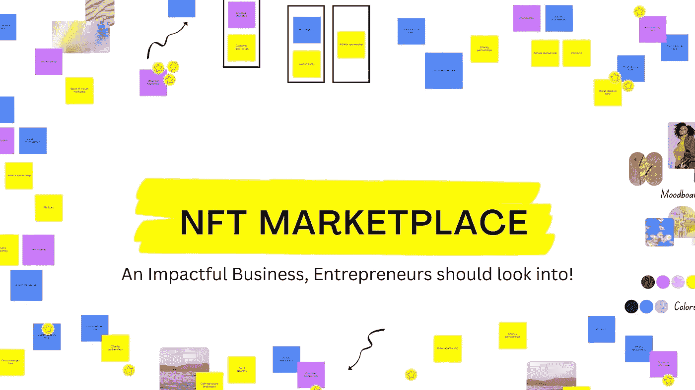

# NFT 市场——一个有影响力的企业家应该关注的商业市场！

> 原文：<https://medium.com/geekculture/nft-marketplace-an-impactful-business-entrepreneurs-should-look-into-711f9fda5c4?source=collection_archive---------19----------------------->

数字创作者的主要工作是创建独特的数字收藏，如视频、图像、gif、音乐、迷因、艺术品和视频游戏资产等等。基于创作，他们会遇到这样的情况，如果有人复制他们的数字作品，那对他们来说是个大问题。通过以 NFT 的身份支持数字资产的所有权和其他细节，他们可以保存他们的所有权。NFT 很有趣，不是吗？

**不可替换的令牌:**

NFT 意味着不可替代的令牌，它持有你的数字创作的授权或认证。NFT 可以代表个人身份、财产权等等。它是唯一的加密令牌。如果你的创作获得了 NFT 奖，那么这个东西的所有权就取决于你了。NFTs 的详细信息存储在区块链中，不能复制。

NFT 是不可分割和不可交换的。大多数 NFT 的买卖过程都在区块链以太坊进行，通常使用的 NFT 标准 ERC 721 就是从这里演变而来的。NFT 市场是出售和拍卖这些 NFT 的在线中心。Opensea、rarible、foundation、币安·NFT 市场和 Solanart 是一些受欢迎的 NFT 市场平台。这些市场对于您的数字资产交易来说非常安全。公海和稀有市场是所有市场中评价较高的。

## NFT 市场是如何运作的？

通常，所有 NFT 市场的工作流程都是相似的。在那里用户注册并安装数字钱包来保存 NFTs。

*   建立 NFT 并定义所有需要的规格
*   可以列出您想要展示销售的数字资产。
*   如果是拍卖，出价最高的将赢得拍卖。
*   NFT 也可以直接在直销上购买。
*   在成功销售 NFT 之后，这些 NFT 根据智能合同被转移到钱包。

随着 NFT 变得越来越受欢迎，NFT 市场的需求急剧增加。利用这段时间来启动你的 NFT 市场，比如 OpenSea、Rarible 和 Foundation，是再好不过了。

## **如何开始开发 NFT 市场？**

1.  为你的 NFT 市场或应用程序开发选择一个利基。
2.  从任何可靠的网站上获取一个开源代码，然后开始工作。
3.  如果你不依赖开源代码，你可以从可靠的 NFT 市场克隆脚本提供商那里获得预先开发的 NFT 市场克隆脚本。
4.  在区块链开发者的帮助下，定制克隆脚本。
    在定制完克隆人剧本后，继续想出独特的设计。
5.  确保智能合同的功能。
6.  确保您的 NFT 市场拥有高端安全选项。
7.  测试市场规格，然后通过合适的营销活动启动您的 NFT 市场。

简而言之，你的 NFT 市场应该是安全、透明和分散的。

## 如何正确地完成这项工作？

如前所述，你可以用预先开发的 NFT 市场克隆脚本启动你的 NFT 市场业务。你可以从一个值得信赖的克隆脚本提供者那里得到它。这听起来可能很容易，但市场上有许多 NFT 市场克隆脚本提供商。在它们中找到一个可靠的可能是一项艰巨的任务。

让我来帮你解决这个问题，当你选择最好的 NFT 市场克隆脚本提供商时，考虑一些你应该考虑的突出因素。

1.  查看克隆脚本的演示。
2.  检查他们的其他著名克隆脚本，如 Opensea clone、rarible clone 和 Foundation clone，以确保他们的专业知识。
    确保克隆脚本支持多个区块链。
3.  克隆脚本提供者提供的克隆脚本必须可以根据您的需求进行定制，所以请查看所提供的定制优势。
4.  克隆脚本应该具有所有市场流行的特性。
5.  克隆脚本应该为您提供雇佣区块链专家和区块链开发者的权限。
6.  考虑其他因素，如成本、评级、评论和他们提供的后期开发支持。

考虑到以上所有因素，Coinsqueens 一直位居榜首。他们一直在为 NFT 的各种业务需求提供 NFT 市场的克隆脚本。他们还提供各种 NFT 市场克隆脚本，如 Opensea 克隆，基金会克隆，币安 NFT 市场克隆，Rarible 克隆，Solanart 克隆，SuperRare 克隆和 NFT 游戏开发为基础的克隆脚本。

他们的克隆脚本是 100%可定制的，有成本效益的，并且没有错误。通过购买他们的克隆脚本，你可以在短短 15 天内启动你的 NFT 市场业务。他们为所有他们帮助过的 NFT 市场提供开发后支持。许多当地的 NFT 市场通过使用他们的克隆脚本成功运作。有了他们的克隆脚本和专属区块链团队的指导。

你可以在这里查看他们的 [**NFT 市场克隆脚本**](https://coinsqueens.com/nft-marketplace-clone-script?utm_source=NFTimpactfulbusiness&utm_medium=geekculture&utm_campaign=RJ) 的演示。从他们那里获取您的克隆脚本不需要 2-3 分钟。我建议你现在就开始。