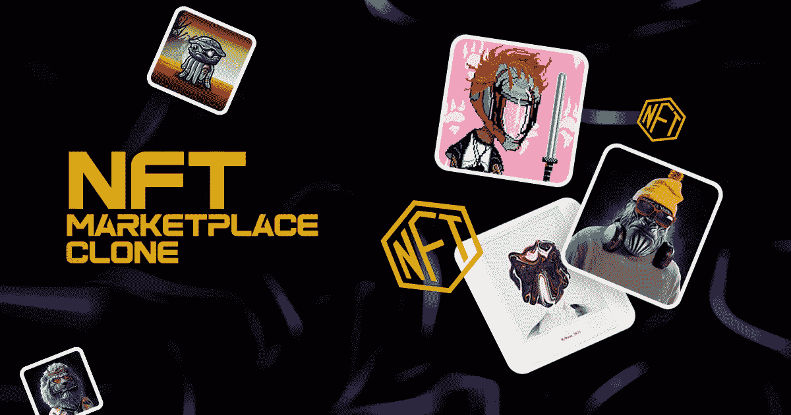
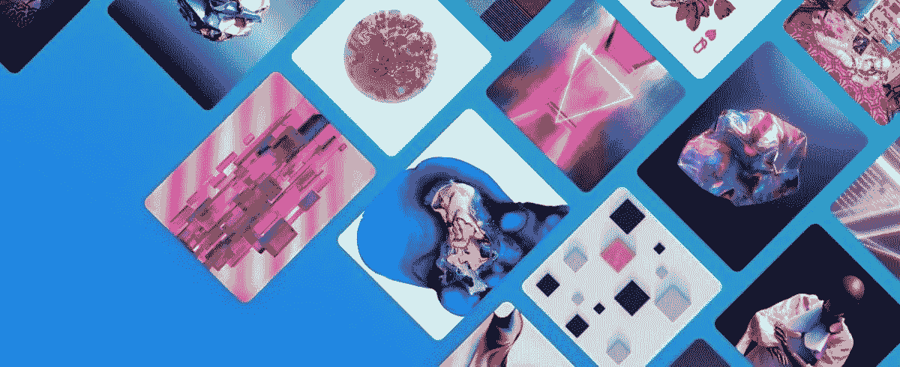
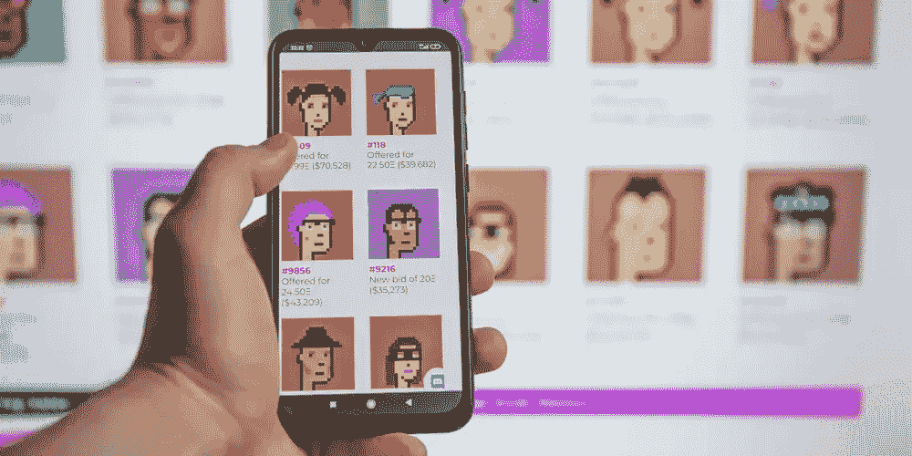
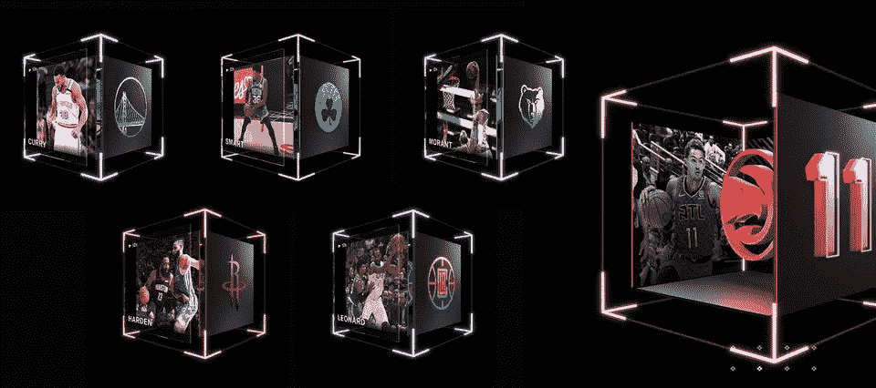
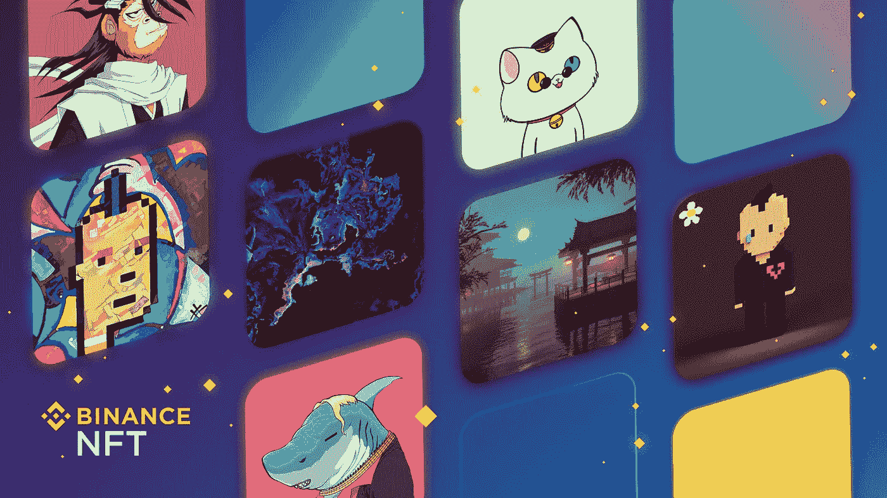
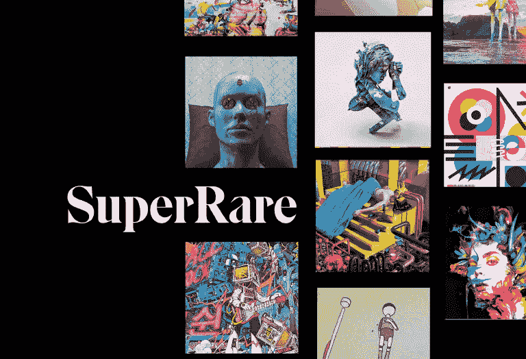

# NFT 市场克隆—使用克隆脚本启动您的 NFT 交易平台

> 原文：<https://medium.com/geekculture/nft-marketplace-clone-launch-your-nft-trading-platform-with-a-clone-script-aafd2373741e?source=collection_archive---------4----------------------->

如今，企业家们对进入 NFT 领域并利用各种可能的方式获取利益表现出了浓厚的兴趣。这是因为这个行业正以难以想象的速度蓬勃发展。

“全球 NFT 市场规模在 2020 年达到 3.4 亿美元，并将在 2030 年底达到 3573.16 亿美元，复合年增长率(CAGR)为 39.6%”。

你甚至想利用现在的机会进入 NFT 市场，这也太快了吗？毫无疑问， **NFT 市场脚本**将是一个完美的解决方案。为此，请联系精通解决方案的公司。事先，检查这个博客有健全的知识。

## **NFT 市场到底是什么？**

在了解博客的主要思想之前，让我们先简要概述一下不可替代令牌。NFT 是具有唯一性的数字资产，持有特征包括真实性、所有权、透明性、稀有性和不可分割性。这些显著地代表了现实世界的物体，比如艺术、音乐、游戏中的物品、推文以及我们周围的任何东西。一般来说，这些代币将在称为 NFT 市场的媒介或平台中买卖。

## **NFT 市场脚本会是一个可行的解决方案吗？**

NFT 市场脚本是一个预先设计的解决方案，让企业家为内容创作者(包括艺术家和音乐家)和 NFT 爱好者提供一个生态系统，以连接和交易数字资产和收藏品。它融入了通用特性，定义了典型的功能。这是一个现成的解决方案，你可以在最快的时间内启动 NFT 交易平台。因此，毫无疑问，对于那些打算进入 NFT 行业的人来说，这将是一个商业上可行的解决方案。

## **以下是 NFT 市场克隆脚本的基本特征**

**店面**

这种功能在电子商务网站上很常见，在网站上，产品会向用户展示。这里也是如此。在 NFT 市场克隆脚本中，NFT 将被展示，因此平台用户可以很容易地选择并开始交易。

**搜索&过滤选项**

使用高级搜索栏可以轻松地从大量数字资产中进行查找。此外，通过应用过滤器，平台用户可以很容易地找到他们实际寻找的 NFT 类型。

**列出数字资产**

列表功能使用户能够通过指定所需的详细信息(如描述、标题和相关标签)来列出他们的数字资产和收藏品。一旦完成上市，交易对手就可以购买这些股票。

**多种支付方式**

在当今世界，有更多的支付网关可供使用，确保用户可以选择他们方便的选择。即使在这种情况下，交易者也可以在购买数字资产时选择支付模式。不同的模式包括 UPI、信用卡、借记卡和加密货币。

**KYC/反洗钱验证**

用户完成初始设置后，必须执行验证程序。这将使该平台成为一个更安全的交易场所。此外，这将防止洗钱。

**钱包支持**

NFT 市场克隆版上的多钱包支持将使用户能够将他们的钱包与他们在平台上创建的账户联系起来。钱包的主要功能是安全可靠地存储数字资产。但是，一旦完成交易，它就可以发送和接收它们。

## **让我们看看你应该知道的流行的 NFT 市场克隆解决方案**

市场上有许多 NFT 市场克隆解决方案。当打算推出一个 NFT 交易平台时，选择和模仿现有的成功平台，如 OpenSea、Rarible 和类似的平台，将会带来各种好处。以下是最受欢迎和最好的 NFT 市场克隆解决方案。看看这些。

[**Opensea 克隆**](https://www.inoru.com/opensea-clone)

OpenSea 是世界上最大的 NFT 市场。很大程度上，这是一个在多边形区块链网络上创建的不可替代代币的无汽油交易平台。然而，这个平台以其交易量和交易用户数 60 万而闻名，这是截至 2022 年 3 月初的数据。

OpenSea Clone 是一个为数字资产和收藏品交易量身定制的解决方案。它的特性和功能类似于 OpenSea。然而，这一解决方案将使像你这样的企业家在几天内跃入蓬勃发展的 NFT 领域。

**OpenSea 克隆的特性:**

*   NFT 铸币厂
*   NFT 礼品
*   多钱包支持
*   目录
*   搜索精简程序

[**隐朋克克隆**](https://www.inoru.com/cryptopunks-clone)

熟悉 NFTs 的人应该知道 Cryptopunks。这些通常被称为数字化身，使用算法基础生成并标记化的小朋克。此外，这在以太坊 NFT 市场占有重要地位。

CryptoPunks Clone 是一个现成的数字收藏品平台，包含基本组件，使用户能够购买和出售可以在算法基础上创建的收藏品。

**隐朋克克隆人的显著特征**

*   商店展览
*   堆栈列表
*   以太扫描
*   数字钱包
*   投标选择权
*   投标历史记录
*   即时购买/出售

[**NBA 顶级投篮克隆**](https://www.inoru.com/nba-top-shot-clone)

NBA Top Shot 是一个位于区块链的体育市场，用于交易体育收藏品，如时刻，运动卡，配件和纪念品。根据最近的一份报告，有 110 万注册活跃用户。此外，根据 CryptoSlam 的数据，NBA Top Shot NFTs 的销售比例增长迅速，达到 72%。

NBA Top Shot Clone 是一个现成的基于体育的 NFT 市场，类似于最初的 NFT 体育市场——NBA Top Shot。该解决方案可以根据不同的个人需求进行个性化。

**NBA 状元克隆的特点:**

*   分散
*   包裹掉落
*   候诊室
*   向导
*   显示优点的东西
*   挑战
*   数字钱包集成

[**稀有克隆**](https://www.inoru.com/rarible-clone)

Rarible 是一个创建、销售和收集数字收藏品的平台。这些将存储在区块链网络上。2022 年 3 月的第一周，用户数量激增超过 53%。它以值得信赖而闻名。

Rarible Clone 是一个预先设计的解决方案，具有与 Rarible 相似的特性和功能。它的主要功能是允许用户创建他们的艺术作品，如艺术、音乐等。然后，造币，列表，在平台上卖这些。通过必要的调整，增加额外的特性来增强性能是可行的。

**稀有克隆的特征**

*   智能合同
*   钱包整合
*   分散
*   政府属性
*   多设备兼容性

[**币安 NFT 市场克隆**](https://www.inoru.com/binance-nft-marketplace-clone)

币安是著名的 NFT 市场，将艺术家和密码爱好者聚集在一起，使他们能够创建和销售 NFT。这个平台提供了一个惊人的数字收藏品。此外，它是可信的。

币安 NFT 市场克隆是一个预制的解决方案，拥有令人兴奋的功能，使您能够在短时间内启动交易平台。这个解决方案很容易定制，支持特性的包含，重新设计 UI/UX 等。

**币安 NFT 市场克隆的特点**

*   虚拟画廊
*   神秘盒子
*   数字钱包
*   搜索数字收藏品
*   评级
*   列名状况

[**超稀有克隆**](https://www.inoru.com/superrare-clone)

SuperRare 是一个基于艺术的 NFT 市场，在以太坊区块链网络上运营。这个市场对艺术家非常有利，因为他们可以拿出独特和罕见的非艺术收藏品。此外，无论如何都不能复制这些内容。

SuperRare Clone 是一个即将推出的 NFT 艺术市场解决方案，将允许企业家通过他们的平台更快地加入 NFT 舞台。该解决方案是根据个人的需求和要求定制的。它是基于以太坊的智能合约运作的。

**超稀有克隆的特征**

*   搜索
*   投标选择权
*   评级
*   店面
*   创建列表
*   列名状况

## **总结**

结束这篇博客，对于个人或企业家来说，这是一个抓住当前不可替代代币的热潮并跃入 NFT 领域的好机会。如果你想这样做，通过与一个可靠的公司或企业联系，在 [**NFT 市场克隆发展**](https://www.inoru.com/white-label-nft-marketplace) 中勇往直前。