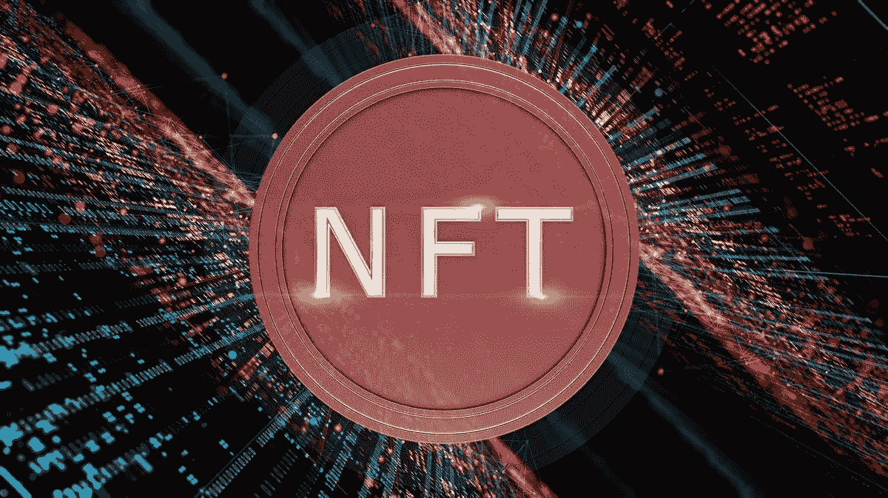
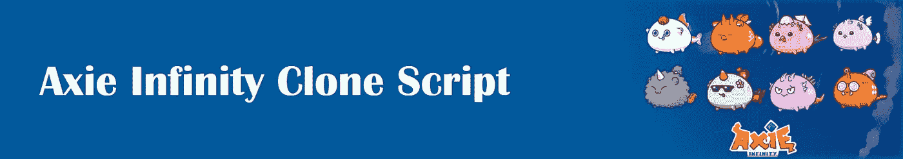
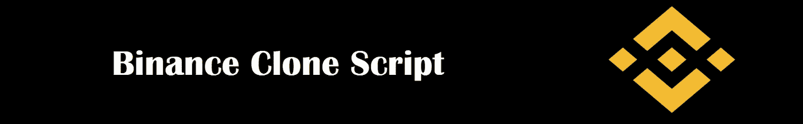
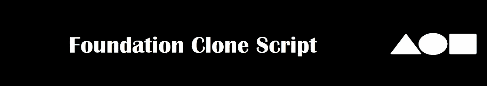
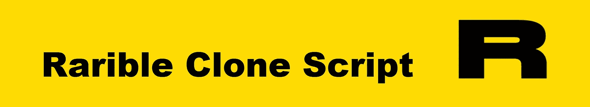

# NFT 市场克隆脚本(简介+功能)

> 原文：<https://medium.com/geekculture/nft-marketplace-clone-scripts-introduction-features-c4fed7517761?source=collection_archive---------18----------------------->

来自世界各地的所有人现在都投身于数字世界，我们可以看到，从艺术到房地产，一切都被数字化了，并保留了所有的价值。成为这个数字世界的一部分是一个看起来遥不可及的梦想。但你要知道，这个梦想并不像听起来那么遥不可及。拥有一个 NFT 市场可以为实现梦想铺平道路。要有一个 NFT 市场，你必须知道选择哪一个角色模型。几个 [**NFT 市场克隆脚本**](https://radindev.com/nft-marketplace-development/) 在这个领域是成功的，他们的成就和特点可以使他们成为巨大的榜样。在这篇文章中，我们将介绍人们可能想要遵循的克隆脚本，如 Opensea、Rarible、Foundation、币安等。敬请关注。

**Axie Infinity 克隆脚本**

Axie Infinity 克隆脚本是一个现成的 P2E(游戏赚钱)NFT 游戏脚本，是 100%无错误和彻底的测试。玩家可以在这里繁殖、饲养、战斗和交易可爱的数字怪物 Axie，赚取更多的资产。在这个平台上，你不是交易 NFT，而是参与一个游戏，这个游戏会根据游戏的结果给你资产。这个克隆脚本可以应用在不同的区块链上，例如，它也可以应用在不同的区块链上，例如 BSC，以太坊，TRON，Polygon Matic，Avalanche，WAX 和 Fantom。

这个克隆脚本的一些功能非常有趣和引人注目，将它们包含在您自己的 NFT 市场中会使它吸引更多的观众。让我们来看看其中的一些，但我会简单地给它们命名，然后，在介绍这些公司时，我会详细说明。

**该克隆脚本的特性**

战斗:这是游戏的一种平台。

土地:这是在游戏中创造你的王国所必需的。

饲养:为可爱的小宠物升级

小爱份:实际上是一个 ERC20 代币

Axie Infinity 碎片:这实际上是 ERC 20 治理令牌

市场:你可以在这个市场上交易你的资产，但是有点不同。

正如你所知，他们实际上有一些可爱的怪物(Axies)会在陆地上战斗，这些怪物是不同的，需要对它们进行一些解释。

这些 axes 出售的座右铭是改善未来 axes 的起源。其中 4088 枚在预售期间售出，从而创造了 Axie Origin 硬币。

神秘之轴:神秘之轴诞生于预售期间保留的原始之轴。神秘轴的稀缺性通过智能契约得到了很好的定义和维护。在接下来的几年里，神秘的轴会进化出特殊的力量。

此克隆脚本支持的数字钱包有:

浪人钱包

MetaMask 钱包

特雷佐-莱杰公司

信任钱包

原子钱包

MyEther 钱包

**币安克隆脚本**

就像其他市场一样，[币安 NFT 市场](https://www.binance.com/en/nft/home)是买卖和拍卖数字资产的最主要场所，其中之一就是 NFTs。币安 NFT 市场是用高度编码的编程语言设计的，它实际上是类似币安 NFT 市场的模型和白标模式，它是安全的。值得一提的是，它是可定制的，而且是 100%无 bug 的。它包含了强大的特性和功能。它同时提供了币安克隆脚本和币安克隆应用程序。拥有像币安这样的 NFT 市场的最佳解决方案之一是白标币安 NFT 市场克隆脚本，因为通过部署白标克隆脚本，您将拥有一个先进的 NFT 市场，其建设成本将低于任何其他克隆脚本。

币安 NFT 市场克隆脚本的功能

用户友好的应用层

多语言支持

更容易进入

广泛的加密货币支持

版税支付支持系统

等级

清单

店面

带过滤器的搜索选项

来自不同领域的可用资产

币安 NFT 市场的各种支持域

博彩业

艺术创作

运动

数字收藏品

服装设计

商品 NFT

音乐

**基金会克隆剧本**

基金会 NFT 市场克隆脚本被定义为基于以太坊区块链的 NFT 市场——被称为最值得信赖的区块链——不用说，它的所有交易都是在智能合约中完成的，这使得交易过程更快、更安全、更有保障。智能合约技术实际上是使其流行的事实。白标基金会克隆脚本是所有信息和资产的安全空间。建议使用现成的基础克隆脚本，因为它不会浪费宝贵的时间，并且可以根据您的喜好进行定制。有许多好处可以说服客户选择它。以下是基础克隆脚本的一些好处:

高定制范围

启动 NFT 市场的现代廉价解决方案

组织即时 NFTs 拍卖

将数字收藏品转化为杰出的非传统收藏品

产生高投资回报率

不需要专业技术知识

管理员可以管理所有的主要因素，如拍卖和投标

由实时性能跟踪功能设计

包含仪表板用户和前沿管理员

有一些因素和特征值得一提，例如:

店面

多钱包集成

NFT 铸币厂

资产分类

分析学

资产列表

不同类型的资产

性能监控器

高级搜索选项

**基金会资助的艺术品**

照片

录像

音乐

运动

名人

虚拟空间

博客

域名

比赛

不动产

时尚

艺术

**稀有克隆脚本**

[Rrible platform](http://rarible.com) 成立于 2020 年，其首席执行官是阿列克谢·弗林，他也是贴纸的创造者。2021 年 6 月，Rrible 从一个风险投资者财团那里赢得了 1420 万美元，目前交易价格为 26.79 美元，24 小时交易量为 13，326，215 美元，比前一天的价格上涨了 9.80%。它也是可定制的，并且它给有创造力的艺术家以 NFT 的形式销售他们的创作，例如绘画、电影和音乐专辑的机会。用于创作独特艺术作品的 NFT 令牌称为 ERC 721，用于制作同一艺术作品不同版本的令牌称为 ERC1155。除了具有创造性、安全性和无 bug 性之外，稀有的 NFT 市场克隆脚本也很经济，换句话说，用户可以很容易地在一瞬间创建一个 NFT 平台，没有任何困难。

稀有克隆脚本有哪些特性？

我想到的第一个特性是使用所谓的 Rrible 列出、销售和购买 NFT 的能力。

它兼容不同的设备，如手机、桌面等，因此它给用户带来了快速访问他们自己的市场的好处，无论他们在哪里，何时在系统上操作。

您可以在 Rarible 中使用各种钱包，它不局限于特定的钱包，因此用户可以更容易地使用任何一种货币来使用该平台。

对于用户来说，安全是最重要的因素。在稀有的平台上。用户可以放心，任何危险都不会威胁到他们的信息。

Rarible 利用**智能合约**使流程更加有效和简单，并遵守处理可转让性和所有权的 ERC-721 标准。

寻找你想要的 NFT 的搜索过程可能会让人不知所措，因为可能没有过滤额外信息的选项，但这对于 Rarible 来说不是问题

另一个因素是，Rarible 可以应用于任何区块链网络，虽然 Rarible 克隆脚本只能支持以太坊、Flow 和 Tezos，但它可以根据客户的需求进行定制。

竞价是平台的本质，直播竞价状态才是用户想要的。

每个人收到的稀有克隆脚本由内置的 NFT 艺术家注册表组成，其中包括在您的平台上注册的所有 NFT 艺术家的简介。

**Opensea 克隆脚本**

Opensea 克隆脚本是一个 NFT 市场脚本解决方案，包括业内最成功的市场之一 Opensea marketplace 的所有关键功能。所有用户都可以使用它来拥有共享 Opensea 特性的市场。再次建议使用白标 Opensea 克隆脚本，防止浪费时间，因为它是现成的克隆脚本，可以轻松部署。Opensea 可以部署在各种区块链上，如以太坊、索拉纳、创、币安智能链、多边形、卡尔达诺，Opensea 支持的集合有艺术、游戏、元宇宙、音乐、视频、公用事业和其他、摄影、体育、域名。如果你听到这个克隆脚本提供的强大功能，你可能会重新考虑你选择的克隆脚本。

元掩码登录

例如，监视列表和报告选项

NFT 钱包集成

多重铸造(ERC 1155 标准)

多种货币支持

版税支付支持

元宇宙能力

NFT 上市

简易建筑

顶级 NFT 上市

NFT 贸易

多个钱包

多个 API 集成

**分散克隆脚本**

分散土地是第一个由以太坊区块链驱动的虚拟现实环境，它于 2017 年推出，创作者是 Ari Meilich 和 Esteban Ordano。这是一个交易 NFT 的好地方，这个世界给了你去探索用户在那里建造的土地。第一、第二和第三层塑造了这个环境。每一层都有其独特的功能，智能合约可以跟踪每一个所有权。而且不用说它事实上是由 DAO(去中心化自治组织)控制的。

下面是这个惊人的克隆脚本的特性列表。

完全分散的平台

元宇宙投诉见下文

可穿越的 3D 体验

对等网络交互

增强型内容分发

二级市场创建

资产邻接

沙盒测试市场

全球和即时市场方案

分散的土地所有权分类账

集成加密货币钱包

多支付网关集成

KYC 和反洗钱保护

双因素认证

本文的目的是描述一些当今最著名的克隆脚本，以及它们的特性和优点，这样您就可以很容易地决定使用哪种克隆脚本。一旦你决定了特性和好处，你可以联系提供上述克隆脚本的公司，如果需要的话可以咨询一下。他们会耐心满足你的所有要求，并参与设计和部署 NFT 市场。一些最著名的公司有 Radindev、Hivelance、Appdupe 等。如果你找到每个公司的网站，会有一些专家的信息会有帮助