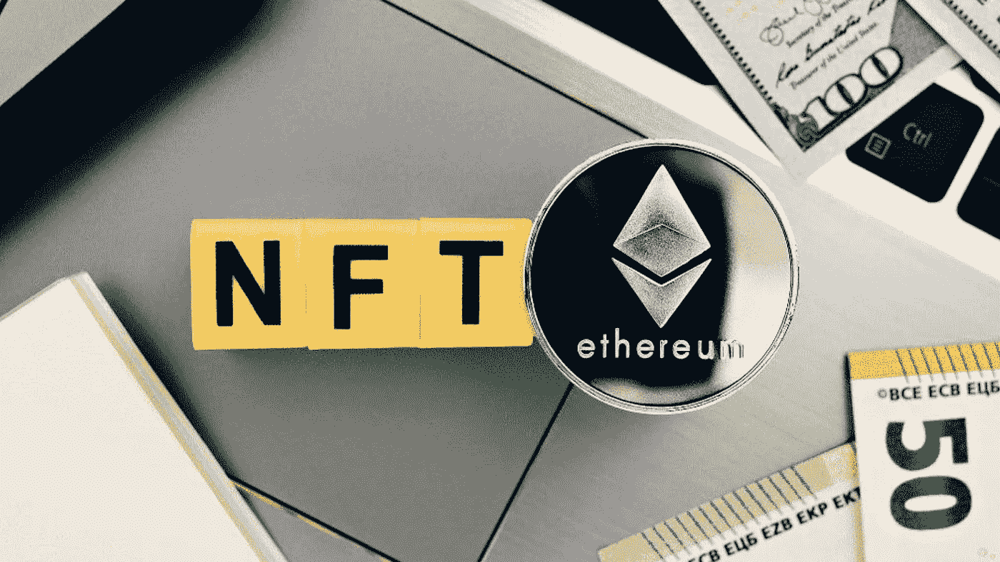
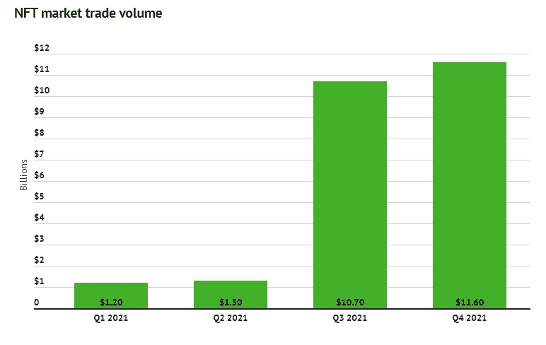

# 以太坊、BSC 和各种区块链网络上的 NFT 市场开发

> 原文：<https://medium.com/geekculture/nft-marketplace-development-1de1d5ef17f4?source=collection_archive---------22----------------------->

NFT Marketplace

NFT 市场是一个价值十亿美元的市场，由于年轻人对区块链和密码的兴趣，这个市场有着光明的未来。NFT 市场以不可替代的代币的形式持有数字内容，这些 NFT 可以是任何类型的艺术、音乐、视频或任何数字财产。这些数字资产是通过任何区块链网络铸造的，每个 NFT 都有自己的元数据，一旦 NFT 在区块链网络上铸造，NFT 就不能被移除。这些 NFT 市场有自己的一套条款和法规来维护平台的流程，因为它们大多是分散的，所有流程都由预编程的智能合同执行。

## **NFT 市场发展**

目前的 NFT 市场主要是在区块链趋势网络上开发的，如以太坊、币安智能链、索拉纳、多边形、卡尔达诺等等。区块链专家根据区块链生态系统规划 [**NFT 市场发展**](https://maticz.com/nft-marketplace-development) ，NFT 市场将建立在该生态系统之上。每一个 NFT 市场都有其自身的优势，这与用于开发 NFT 市场的区块链生态系统有关。通常情况下，区块链专家按照以下顺序建立 NFT 市场

*   确定区块链平台
*   分析项目的范围
*   选择技术组合
*   UI 设计
*   前端和后端的编码
*   部署智能合同
*   设置数据库和 IPFS
*   API 集成
*   在测试网上
*   发动

NFT 市场价值在 2021 年最后一个季度已经筹集了超过 110 亿美元，预计这一价值将在 2022 年进一步上升。因此，推出一个具有先进的未来功能的 NFT 市场将吸引更多的用户使用该平台，并将通过赚取数百万美元将 NFT 市场带到盈利的一方。

NFT market trade volume

## **NFT 市场发展公司**

NFT 市场发展公司的许多密码专家和企业家正在世界各地推出他们自己独特的想法和功能的 NFT 市场。他们选择他们的区块链生态系统来根据他们的业务需求建立他们的 NFT 市场。NFT 市场开发公司致力于各种技术堆栈，向世界展示最好的 NFT 平台，其更新的功能以各种方式使用户受益。每个 NFT 市场的功能和优势各不相同，这是因为用来构建平台的区块链生态系统。以下是在以下区块链网络上创建 NFT 市场的好处。

*   以太坊
*   币安智能连锁
*   卡尔达诺
*   索拉纳
*   多边形

## **以太坊**

以太坊是流行的公共开源区块链网络，多年来已经被大多数密码爱好者所采用。以太坊的最终好处是快速部署、许可网络、网络规模、可扩展性、激励层、令牌化、互操作性、开源和性能。以太坊的市值已经超过 3000 亿美元，拥有超过 15 个活跃节点、4000 万个唯一地址和 50 万个每日交易，这表明了用户对区块链生态系统的信任和适应。

## **币安智能链**

币安智能链是一个可信的平台和快速增长的区块链网络，具有高交易速度、低燃气费、跨链兼容性、EVM 兼容性和令牌化。随着生态系统的爆炸式增长，在 BSC 上开发您的市场将吸引大多数加密用户使用您的平台。BSC 交易费用比以太坊交易费用低 20 倍左右，这也是 BSC 能够接触到加密领域大多数用户并拥有超过 650 亿美元市场的原因之一。

## **卡尔达诺**

Cardano 生态系统是第三代加密技术，采用双层核心架构 CSL(Cardano 结算层)和 CCL(Cardano 计算层)。第一层 CSL 承载所有交易，第二层 CCL 用于部署智能合约和管理网络。卡尔达诺区块链网络提出了股权证明的过程，它成为一个生态友好的网络，更少的天然气费，更快的交易。

## **索拉纳**

索拉纳带来了关键的创新，为未来在区块链技术，使用证明历史的工作序列。这导致每秒超过 50，000 个事务的高性能。Solana 由八项关键创新组成，旨在向数字世界展示一个先进的未来生态系统。随着 Sealevel 特性的创新，网络可以使用多个验证器核心并行处理数万份合同。

## **多边形**

Polygon 主要关注互操作性，并为开发人员提供大多数工具来设计高性能、高可伸缩性的区块链平台。Polygon 是第一个完全支持以太坊虚拟机的网络，polygon 最大的好处是可以用于大规模采用。随着许多项目迁移到 polygon，这显示了基于 polygon 的项目的光明前景。polygon 的市值超过 70 亿美元，其在社区市场中的快速增长将在各方面使您受益。

**总结**

NFT 的市场价值已经超过 10 亿美元，这将继续向前发展，并将在加密领域树立几个里程碑。投资者和企业家可以接近最好的 [**NFT 市场发展公司**](https://maticz.com/nft-marketplace-development) ，把他们对 NFT 市场的想法带到现实世界。像 Opensea、Foundation、Rarible、Nifty 等 NFT 市场在加密领域表现良好，许多与上述类似的 NFT 市场也在同时开发并部署到全球市场。启动你在 NFT 市场发展的工作，在加密领域建立你的商业帝国。