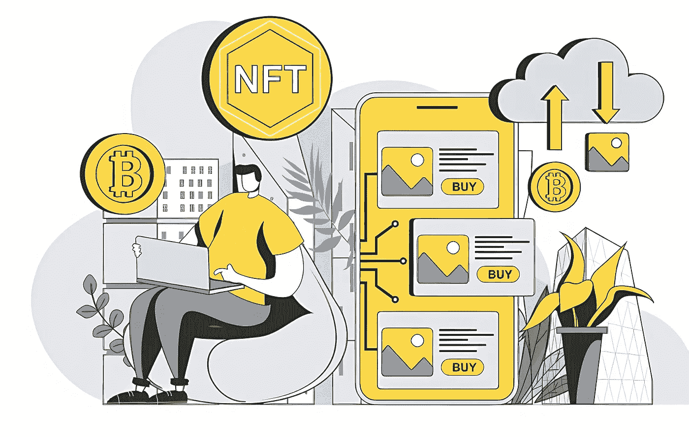
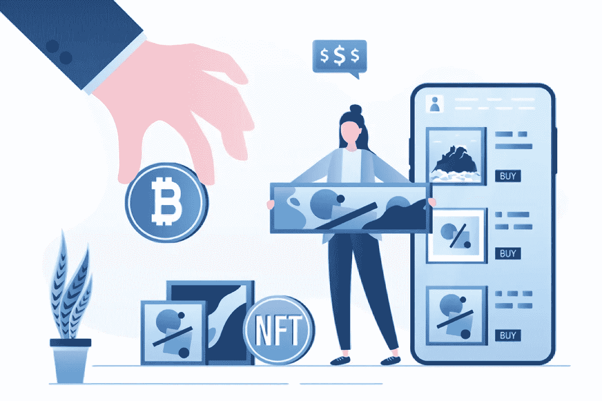
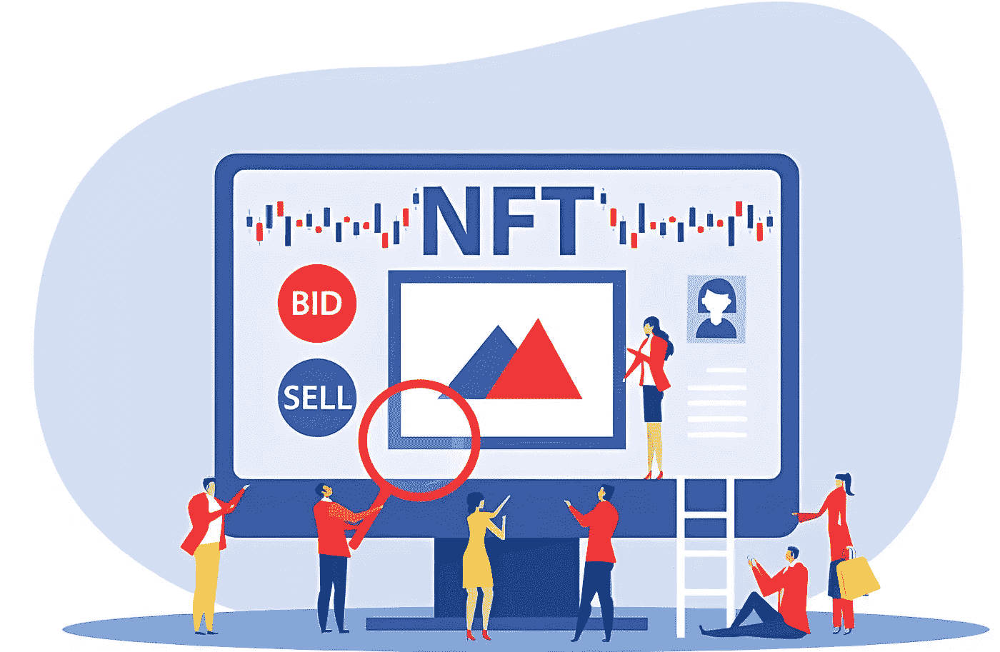

# NFT 市场开发成本:详细分析[2022]

> 原文：<https://medium.com/geekculture/nft-marketplace-development-cost-detailed-analysis-2022-bf09df87394f?source=collection_archive---------16----------------------->

几年前，如果有人告诉你投资 NFT，你可能不会听他们的。但现在，情况完全不同了，人们纷纷涌向市场，从各种各样的数字创作者那里购买他们的 NFT 收藏。了解到 NFT 市场的广阔潜力，人们不仅投资购买非功能性食品，而且还计划以一个完美的商业计划进入这个利润丰厚的市场。如果你对在 NFT 市场创业有类似的兴趣，以下是你应该了解的 NFT 市场发展情况。

NFT 市场是创收的最佳途径，因为你将继续作为创作者和收藏者交易他们的 NFT 的门户。这就是为什么大量的人正朝着发展一个有竞争力的 NFT 市场前进。对于任何商业想法的起飞，规划预算是最重要的事情。这个博客将告诉你 [**开发你的 NFT 平台**](https://www.appdupe.com/nft-marketplace-development) 的成本。

# **NFT 市场——详细概述**

NFT 市场是一个为数字创作者和收藏者建立的平台，用于创造和交易他们的非数字作品。数字创作者可以通过上传数字收藏品并将它们标记为不可替换的标记来管理他们的 NFT。同一个平台还负责在个人之间上市和交易 NFT。NFT 平台有助于让用户与平台上的其他投资者和平地进行非金融交易。

NFT 平台将鼓励知名艺术家和业余艺术家将他们的 NFT 藏品挂牌出售和拍卖。因此，艺术家参与 NFT 的贸易活动不会受到任何限制。该平台对任何流派的艺术家开放，让他们参与 NFT 滴。收藏者还可以浏览平台上列出的各种 NFT 藏品。

# **市场中不同流派的 NFT 集市**

NFT 市场处理各种数字收藏品的上市。你只需要知道市场上存在的不同类型的 NFT 平台。通过了解类别，你将能够选择你的利基，并开始专注于此。以下是你应该知道的不同类别的 NFT 市场，

## **基于公用事业的 NFT 市场**

不可替换的令牌不仅仅意味着提供所有权和真实性。通过公用事业 NFT，他们将能够达到与实时世界连接的标准。公用事业驱动的 NFT 市场是 NFT 空间的另一个增长场景。

## **利基点对点 NFT 平台**

与 NFT 环球市场不同的是，它们没有列出大量的 NFT 收藏品。他们特别关注利基，只列出那些不可替代的个人令牌。例如，Nifty Gateway 平台注定会列出独家的 NFT 数字艺术收藏。

## **名人 NFT 商场**

NFT 热也吸引了许多名人，因为他们收集了大量的非功能性食物。像阿米特巴·巴强和麦莉·赛勒斯这样的名人也向粉丝发布了他们的 NFT。名人 NFT 市场将举办艺术家和知名人士的 NFT 收集。

## **环球 NFT 商场**

这些是二级 NFT 市场，人们可以毫不费力地列出和交易任何领域的非功能性交易。NFT 的范围将从数字艺术品到音乐 NFT 代币等等。OpenSea 和 Rarible 是这种 NFT 市场的完美例子。

## **多元宇宙 NFT 平台**

多元宇宙是一个强有力的假设，人们相信除了他们居住的宇宙之外，还存在不止一个宇宙。在区块链时代，多元宇宙的概念包括提供在物理世界中拥有效用价值的巨大体验。近日来，基于多元宇宙的 NFT 游戏已经统治了游戏行业。然而，你也可以选择开发一个。

# **NFT 市场是如何运作的？**

当您 [**启动 NFT 平台**](https://www.appdupe.com/nft-marketplace-development) 时，请确保您在 NFT 解决方案中包含所有这些功能，以便为您的用户提供热情的体验。

*   用户将为自己创建一个帐户，并通过提供他们的用户凭据进行注册。
*   下一步是用加密钱包创建一个帐户，并将其与 NFT 平台集成，用于存储、交易和交易数字收藏品。
*   数字创作者可以将他们的数字文件上传到平台，并将其标记到 NFT 中，同时添加相同的描述。
*   创作者可以出售或竞标他们的 NFT。如果他们希望出售他们的 NFT，他们可以确定同样的销售价格。禁止，他们可以给用户的投标底价。
*   该平台将验证数字收藏品并发布它们的认证以继续进行。
*   一旦获得市场批准，创作者就可以在平台上出售或竞价。
*   拍卖结束后，卖家或创作者将被告知或通知到平台上。
*   NFT 平台应该支持法定货币和加密货币的交易。

# **您的 NFT 平台将具备的卓越特性**

让我们看看您的 NFT 平台中包含的重要功能。

*   **店面**

NFT 平台的店面仍然是重要的特征之一。它们就像一个仪表板，列出了关于 NFT 的信息，他们的出价、预览、定价、所有者的详细信息等。

*   **用户简介**

用户，无论是数字创作者还是收藏家，都可以在平台上创建自己的个人资料。他们的个人资料应该列出所有关于他们的 NFT 收藏和其他细节的主要信息。

*   **拍卖选项**

拍卖是数字艺术家的一个流行选择。他们可以选择拍卖他们的数字收藏品。您可以让您的用户通过英式拍卖和荷兰式拍卖方式拍卖他们的 NFT。

*   **搜索栏**

搜索选项将帮助用户从大量的 NFT 中搜索并找到他们想要的 NFT。他们也可以把他们的非传统艺术分成不同的类别，从数字艺术，虚拟世界，朋克等等。

*   **NFT 列表**

NFT 市场应该使创作者能够在平台上列出他们的非功能性翻译。创作者还将列出他们的 NFT 以及他们的描述、文件名、标签、定价等。

*   **加密钱包**

加密钱包对于存储和交易 NFT 非常重要。但是，您可以允许用户在加密钱包中注册，并将他们与您的 NFT 平台相链接。

## **开发 NFT 市场所涉及的阶段**

*   决定你的 [**NFT 市场发展**](https://www.appdupe.com/nft-marketplace-development) 的重点领域。
*   将重点放在用户友好的特性上，以包含在您的 NFT 平台中
*   与您的开发团队一起，您可以完成将集成到您的 NFT 平台的区块链网络。截至目前，以太坊和币安在 NFT 平台开发中被广泛使用。但是，您可以选择最适合您需求的一个。
*   为每一部分用户设计单独的面板，让他们毫不费力地选择服务。你可以以这样的方式设计，用户、创建者和管理员将在 NFT 平台上获得他们自己的面板。
*   完成您的文档，因为它们是了解您的平台开发的准确预算的关键。
*   为你的 NFT 市场选择可靠的 UX/用户界面设计，这将改善用户体验。
*   为您的 NFT 平台实现令牌生成器
*   最后一步是在市场上测试和部署您的解决方案。

## **完成 NFT 市场开发需要多长时间？**

谈到成本，有许多因素你应该考虑。您在 NFT 市场中考虑的这些因素将在决定 NFT 解决方案的价格时发挥重要作用。除了这些因素之外，完成这些任务所需的时间也将在下面的段落中提到，

*   UX/用户界面开发将需要您大约 42 小时来完成
*   开发团队将花费大约 72 小时
*   主页设计需要 84 小时来开发
*   高级搜索和过滤选项需要 95 个小时来处理和开发
*   与平台集成的区块链技术将需要 97 小时的时间框架
*   集成多种选择的支付功能将在 43 小时左右。
*   产品页面开发将花费你将近 44 个小时。
*   开发一个管理面板将需要 84 小时才能完成

## **在估算 NFT 平台开发成本时，考虑了哪些因素？**

NFT 市场的发展对开发商和企业家来说是最具挑战性的事情。当你选择从零开始构建你的 NFT 平台时，它会花费你相当长的时间。这是因为你必须弄清楚你需要从基地得到什么。从技术层面到区块链网络集成，你必须全神贯注。以下是在决定 NFT 平台开发价格时起主要作用的一系列因素，

*   NFT 市场的功能
*   安全级别
*   在您的 NFT 平台中选择区块链技术
*   定制手册
*   NFT 平台的性能和效率

除了所有这些因素之外，在计算您的 NFT 平台的整体报价时，还将考虑您选择的定制级别。你的平台和商业模式的利基都将对决定开发你的 NFT 市场的最终成本产生影响。

大约来说，NFT 市场开发 的总 [**成本将花费你大约 20，000 美元。这只是一个估计的报价，因为整个成本将只取决于您选择的功能和特性。**](https://www.appdupe.com/nft-marketplace-development)

## **总结**

开发 NFT 市场涉及太多复杂的步骤，你必须跨越这些阶段才能成功推出 NFT 平台。然而，有白标 NFT 解决方案，提供即时，现成的解决方案，让你可以冒险进入 NFT 市场不久。