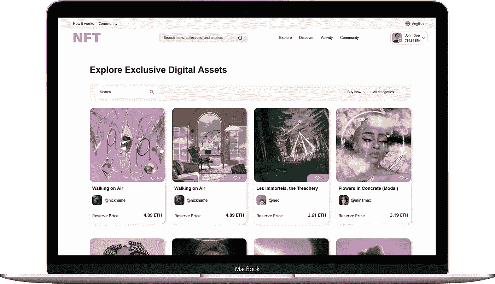

# 从现在开始，NFT 市场的发展是绝对必要的。原因如下！

> 原文：<https://medium.com/geekculture/nft-marketplace-development-is-absolutely-needed-from-now-on-heres-why-10d120100dbf?source=collection_archive---------17----------------------->

根据历史，世界上第一个被称为不可替代令牌(NFT)的数字产品于 2013 年问世。差不多十年过去了，现在，我们在这里，幻想着这些数字代币的下一个主流用例。虽然在 2010 年代中期有一些积极的发展，当时以太坊网络支持的智能合约(还记得 OpenSea、CryptoPunks 和 CryptoKitties 吗？)，NFTs 的实际启蒙者阶段又花了几年时间。

2021 年是数字世界的 NFTs 年(以及疫情在现实世界中引发的锁定)，不知从哪里开始，在区块链注册的 JPEGs 和 gif 文件卖出了价值数千到数百万美元的密码。谈到 NFT 交易，*NFT 市场的发展已经成为数字经济的重要组成部分，随着我们在博客中的进一步发展，我们将会看到更多。*

## *NFT 市场:回顾*

*大多数人都知道什么是 NFT 市场；“这是一个可以使用加密投标交易各种 NFT 项目的地方，”将只是在今天的互联网上可以找到的一般定义之一。当谈到可以通过这些平台交易的资产范围时，NFT 市场开发解决方案的多样性是众所周知的；像素化的 JPEGs、数字艺术、数字卡、音乐专辑、游戏中的物品、虚拟土地、可兑换的数字服装、酒精饮料等等。*

*今天，区块链生态系统中有数百个 NFT 市场，既有独立企业，也有平台内企业，如游戏内市场。是的，我们不能忽视这样的平台内企业，因为它们经常占据 NFT 市场排行榜的首位。OpenSea，魔法伊甸园，Rarible，基金会，俏皮网关，Axie 市场，皇家，跳转。Trade、FanCraze 和 Sorare 在 Web3 生态系统中很受欢迎。由于竞争如此激烈，即将到来的 NFT 市场开发项目需要有其独特的销售因素(USP)才能在 NFT 市场大放异彩。*

* [## NFT 市场开发|不可替代代币市场|白标 NFT 市场|…

### NFT 市场的发展正在塑造即将到来的创业公司的未来，以在竞争中胜出。构建您自己的…

bit.ly](https://bit.ly/3SbkG6m) 

## 不同的 NFT 市场发展模式

在进行 [***NFT 市场***](https://bit.ly/3SbkG6m) 开发活动时，对于一个风险企业来说，根据其资源和意图来执行该过程是很重要的，并且它可以利用多种模式来构建该平台。

*   对于手头有足够资源(时间和金钱)并且头脑中有独特商业愿景的项目来说，从零开始开发是可行的。NFT 市场从无到有的发展允许端到端的最大化定制，使企业主能够自由决定他们的风险平台。
*   **来自独立开发者或 Web3 应用开发公司的定制 Whitelabel NFT 市场解决方案**对于想要在大规模发展之前试水的小规模创业公司或风险企业来说，可能是一个很好的选择。由于这些平台是预先构建和测试的，因此花费的时间和成本相当低，并且将用户端可定制性添加到组合中只会对企业有所帮助。
*   **定制的 NFT 市场，如独立开发商的现有平台**，比白标解决方案更容易推出。这些平台通常类似于现有的 NFT 市场(如 OpenSea)，具有可修改的用户终端，可以根据企业所有者的需求进行调整。所花费的成本和时间与白标解决方案相似。

## NFT 市场平台的主要特征

*   内置或外部可集成的**加密钱包**是任何 NFT 市场开发项目的必备条件，因为它将有助于保存加密和非功能性交易。
*   一个**店面**，提供关于市场上出售的 NFT 资产的详细信息，包括描述、价格历史和所有权历史。
*   一个**搜索引擎**，让平台用户可以立刻搜索到自己喜欢的 NFT 收藏。向 NFT 市场提供这样的功能是至关重要的，因为它有助于提高用户满意度。
*   **过滤和排序**选项是搜索引擎中的子功能，帮助用户进一步细化搜索结果，以轻松查看符合他们偏好的 NFT 收藏。
*   一个**列表门户**帮助卖家轻松地列出他们的 NFT 产品进行审核，然后出售。在这里，他们可以铸造所需数量的非功能性测试，并发送给他们进行审核。
*   一个**管理员门户**允许 NFT 市场管理员通过执行充分的审查操作来调节 NFT 上市过程。此外，他们还可以访问平台的业务统计数据和关键绩效指标(KPI ),以获得分析见解并改进业务。
*   拍卖门户是 NFT 市场开发项目中的另一个必备元素。在这里，潜在买家可以对 NFT 的物品出价，任何人都可以查看实时出价历史，做出明智的决定。
*   **评论和评分**帮助新用户在进行下一步行动之前，更多地了解在 [***NFT 市场平台***](https://bit.ly/3SbkG6m) 中列出的 NFT 系列。

## 为什么现在发展 NFT 市场是必要的？

尽管加密的冬天让局外人对 Web3 空间产生了可怕的看法，但它仍然像以前一样蓬勃发展(尽管规模很小)。NFT 市场的发展在未来几年不会过时，因为 NFT 正在迅速成为主流，游戏、票务、数字收藏品和 metaverses 等用例为世界带来了新的可能性。

随着网络 3 生态系统对非功能性测试的如此狂热，一个基于 NFT 市场模式的企业可以毫不犹豫地获得巨大的成功。此外，我们不应该忘记，NFT 市场开发项目如今包含了来自其他 Web3 方面的额外功能，如分散金融(DeFi)和分散自治组织(DAOs)。随着更多创新的到来，NFT 市场的发展将成为 Web3 中一个有吸引力的商业模式。

## 总结想法

因此，我们可以说 [***NFT 市场的发展***](https://bit.ly/3SbkG6m) 在 Web3 领域是一个极好的风险投资机会，不管整个加密市场的情况如何。他们的能力，以配合趋势的节拍和消费者接触的性质，使他们成为一个可行的选择，以获取利润。如果你想在 NFT 市场创业，选择与专业的 NFT 市场发展公司合作，他们可以在这个过程中帮助你。这样一家公司在这一过程中的实力确保您的平台将使用与您的业务需求相匹配的高级技术堆栈来创建。*