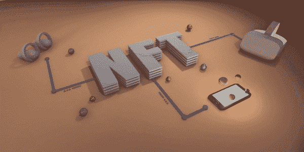
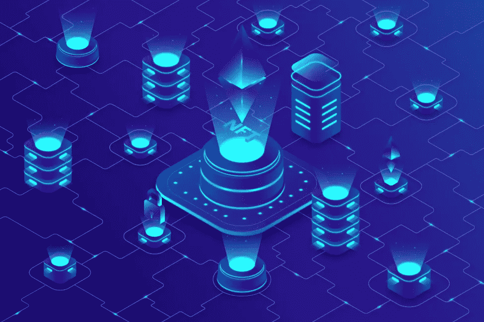

# NFT 市场开发是创建数字商业的最新方式

> 原文：<https://medium.com/geekculture/nft-marketplace-development-is-the-latest-way-of-creating-digital-businesses-d26afa58495?source=collection_archive---------19----------------------->

区块链技术的出现永远改变了全球经济的运行方式。NFT 和加密货币改变了数字交易的金融格局。这些变化带来了更好的安全性、真实性和更强大的加密协议。

随着我们步入 2022 年，许多企业和企业家想知道 [***为什么 NFT 市场***](https://www.blockchainappfactory.com/nft-marketplace-development?utm_source=Geek+Culture&utm_medium=09-05-2022&utm_campaign=VishnuK) 发展和 NFT 市场邀请增长？NFT 市场有什么特别之处，能给企业带来可观的收入和增长？

NFT 给数字世界带来了什么，为什么每个人都想要一个？这篇博客回答了这些问题，并提供了对这些主题的见解。

## 什么是 NFT？

NFT 是加密令牌，充当数字证书。这些证书确保了任何数字资产的唯一性。NFT 代币本质上是独特的，其价值基于投机而变化。NFT 所有者拥有数字资产的唯一所有权。

## 我们如何交易 NFT？

购买和出售 NFT 的过程发生在一个叫做 NFT 市场的在线平台上。在这里，用户可以购买或列出任何 NFT，并参与 NFT 拍卖。人们可以使用借记卡或信用卡和加密货币在这里买卖 NFT。

通常，数字内容创作者、社交媒体影响者、艺术家、游戏玩家、游戏收藏家、品牌和名人使用 mint NFTs 并向他们的观众销售。市场是这些人将他们的工作货币化并创造收入的一种手段。观众可以使用这些平台与他们的名人互动，并建立他们想要的 NFT 的所有权。

NFT 本质上是不可改变的，NFT 所有者甚至可以在二级市场上交易他们的数字资产后证明他们的所有权。用户也可以用版税编程 NFTs，并确保其内容在所有权变更后继续受益。这些好处是 NFT 市场和 NFT 市场发展具有如此吸引力的原因。

因此，对 NFT 市场和 NFT 市场发展的需求增加了。企业和组织希望进入这个有利可图的市场并创造利润。下面列出了 NFT 市场发展所需的基本步骤。

**第一步——定义你的受众**

任何 NFT 市场发展的第一步都是确定你的受众，并定义你的解决方案能提供什么。这一步有助于您针对他们对平台进行个性化设置。它可以是任何东西，从艺术到体育，它可以是任何东西。

**步骤 2 -选择域名**

域名是企业名称。因此，仔细寻找你想要的域名是很重要的。你可以从 GoDaddy 这样的网站购买主机和域名服务。

**步骤 3 -开发用户界面**

首先，后退一步，想象一下市场会是什么样子。确保它看起来干净整洁，没有杂乱。与最好的 UX 设计师想象你的前端。这样，你就对用户界面有了一个清晰的概念，并可以从那里着手。

**第四步——选择区块链网络**

区块链网络是 NFT 市场运作的基础技术。成功的 NFT 市场开发过程包括引入智能合同。这些协议确保所有过程的发生没有任何中介的参与。因此，找到一个你产品的目标社区的区块链网络是很重要的。

**第五步——整合数字钱包**

现在，你可以集成第三方数字钱包，如 MetaMask 或比特币基地钱包，或任何基于 web 3.0 的钱包。这一过程确保简单、安全和快速的交易，而不影响平台的功能。

**第 6 步-整合所需功能**

这一步是将必要的功能整合到 NFT 市场中。成功的 NFT 市场需要具备几个基本特征。此外，考虑向平台添加其他功能，以改善功能和用户体验。

**第 7 步-测试和启动**

这一步是在不同的场景中测试平台，看看它是如何工作的。测试阶段对任何产品来说都是至关重要的，因为它展示了市场上存在的任何错误或故障。在测试阶段之后，您向受众发布产品。

***现在，有专门的客户支持团队为用户服务。***

## NFT 市场开发期间所需的功能

人们喜欢 NFT 市场的一个原因是它有许多特色。轻松支付、快速交易、快速结账流程和时尚的用户界面等功能改善了用户体验，吸引了更多用户。

*以下是成功的 NFT 市场必须具备的基本特征*。

1.店面

2.搜索功能

3.清单

4.通知

5.买卖 NFT

6.拍卖行

7.数字钱包集成

8.评级和反馈

## NFT 市场的未来

NFT 消除了所有权争议的可能性。每天我们都会看到 NFTs 在各个行业的应用。NFT 市场是有利于买方和卖方的平台。它们提供的好处和可利用的机会是 NFT 市场发展增长的原因。

现在是进入这个有利可图的行业的理想时机， [***创造一个 NFT 市场***](https://www.blockchainappfactory.com/nft-marketplace-development?utm_source=Geek+Culture&utm_medium=09-05-2022&utm_campaign=VishnuK) 。任何对这项有利可图的投资感兴趣的人都应该马上与 NFT 市场发展公司合作。世界上有几家这样的公司。您可以研究每一个，看看哪一个最适合您的需要和要求。