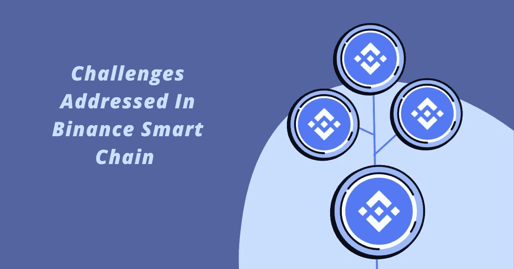

# 基于 BSC 的 NFT 市场发展:如何在币安智能链上创建 NFT 平台？

> 原文：<https://medium.com/geekculture/nft-marketplace-development-on-bsc-how-to-create-nft-platform-on-binance-smart-chain-143977923c44?source=collection_archive---------11----------------------->

NFT 仅仅是数字资产的表示，它们更像是为其真实性和唯一性提供证明。但是，投资者和交易者认为这是他们投资的最好方式。这就是为什么每天都有人涌入 NFT 平台买卖他们的非功能性交易。当一种产品或服务在人群中获得最高分时，企业试图将他们的视野扩展到那个领域。随着 NFT 市场的日益扩大，将会有很多像你这样的初露头角的企业家决定在 NFT 圈创造你的明星地位。

在 NFT 市场的发展中，最常见的是，人们对选择正确的区块链网络感到困惑。币安智能链正在成为以太坊的最佳替代区块链网络。如果您不了解 BSC，以下是您如何继续进行 BSC NFT 市场开发**的方法。**

****在 BSC 上开发一个 NFT 市场是什么概念？****

**NFT 市场早期是由以太坊区块链网络开发的。一切都很好，直到基于以太坊的 NFT 平台的数量不断增加。当 NFT 平台的数量增加时，网络拥塞成为一个严重的问题。这最终降低了交易速度。以太坊面临着网络拥塞，但仍然向用户收取最高的燃气费。NFT 迷开始觉得使用以太坊区块链网络没有特权。为了结束这种混乱，某些 NFT 市场决定为他们的 NFT 市场发展选择不同的区块链。**

**币安智能连锁很快成为 NFT 市场发展的选择。人们开始分析他们能从 BSC 获得的所有商品，并希望以此发展他们的 NFT 市场。BSC 从币安链的巨大转变导致它在二元链电枢上运行。这就是吸引更多用户采用 BSC 进行 NFTs 的引人注目的转变！**

**就 NFT 市场而言，BSC 是一个 NFT 解决方案，将在币安智能链中执行 NFT 操作，如创建、铸造、销售和招标 NFT。**

****为什么选择币安智能连锁进入 NFT 市场？****

****

**在 NFT 的市场网络中，大部分都是用以太坊区块链建造的。BSC 技术完全兼容[**【EVM】**](https://ethereum.org/en/developers/docs/evm/)以太坊虚拟机。这也将允许 BSC 在基于以太坊的应用上运行。这将有助于投资者穿透关于账户余额和块散列的实时数据。区块链中的操作码将有助于执行日常任务。然而，随着技术的发展，市场对计算能力的需求越来越大。**

**币安智能链是众所周知的以下股权证明协议。由于 BSC 与 EVM 兼容，开发人员选择了它而不是以太坊。币安智能链是一个独立的区块链网络，与币安链并行运行，因为它们都是交叉兼容的。以太坊雇佣的工作证明以消耗大量时间和精力而闻名。与此相比，BSC 消耗的能量和时间更少，因为它运行在利益相关方授权的证明上。**

****币安智能链面临的挑战****

****

**币安智能连锁网络对人们来说是超前的。BSC 市场将鼓励用户用他们的 NFT 交换他们的 BNB 硬币和 BEP 代币。在 BSC 中，用户可以在三秒钟内创建他们的块。开发者寻求以太坊之外的网络的主要原因是因为他们高昂的交易成本。BSC 跨越了网络中的挑战。对 NFT 市场选择 BSC 有深刻的理解，**

*   **BSC 的交易速度非常快，有助于用户准确处理交易。在以太坊，用户不得不花费大量时间处理他们的交易；到那时，他们将开始失去兴趣。因此，在 BSC 上推出 NFT 平台将有助于你吸引大量用户。**
*   **燃气费是以太坊的主要问题之一。这一挑战迫使 NFT 交易员改变态度。在币安智能连锁，交易费用比任何其他区块链网络都要低得多。**
*   **BSC 支持不可替代令牌的高端安全性，因为互操作性是 NFTs 最重要的因素。币安智能链还将支持跨链互通。**
*   **币安智能链是 EVM 兼容的，因为这是开发分散应用程序所需的重要功能之一。**
*   **BSC 中隐含的智能合同将审计 NFT 市场中的所有活动。这将防止平台被黑客攻击或操纵。**
*   **币安链钱包将配置一站式数字资产仓平台。NFT 爱好者将能够检查他们的余额和转移资金。**

****如何在 BSC 上创建 Nft 市场？****

**币安智能链吸引了大量的 NFT 爱好者，因为它在网络中获得了特殊的属性。它不仅支持跨链兼容性，还提高了交易速度。在 BSC 上开发 NFT 平台将允许用户用他们的 NFT 交换 BEP 和 BNB 令牌。同样，为您的 NFT 平台选择 BSC 也有多种选择。**

**[**白标 BSC NFT 市场开发**](https://www.appdupe.com/nft-marketplace-development) 是一个预先设计的解决方案，是一个现成的脚本。您可以定制此解决方案，并根据您的需求进行定制。尽管您选择了一个白标脚本，但您需要经历某些步骤才能将其作为一个完整的产品。**

*   **为您的平台确定令牌规格**
*   **确定你的 NFT 解决方案的利基，并最终确定你必须集中精力的领域。**
*   **为您的 NFT 平台创建用户界面。**
*   **开始为您的智能合约创建代码**
*   **多次测试您的 NFT 平台**
*   **通过测试阶段后，在市场上部署它们。**

****您的 BSC NFT 市场中包含的有趣功能****

*   **NFT 平台的店面仍然是一个索引，用户可以在这里找到与 NFTs 相关的所有信息，如他们的历史、交易、用户资料等。这将有助于用户清楚地了解用户。**
*   **高级搜索和过滤选项将帮助您只需点击几下鼠标就能搜索到您想要的 NFTs。**
*   **交易者可以在平台上快速地出售、购买或交易他们的非功能性交易。如果用户不希望以固定价格出售他们的 NFT，他们可以选择投标并通过拍卖出售他们的 NFT。**
*   **一旦 NFT 被令牌化，它们就可以在平台上上市交易。卖家可以决定是出售还是拍卖。**
*   **用户可以注册自己的加密钱包，并与 NFT 平台互联。因此，他们可以在平台上轻松存储和交易他们的 NFT。**
*   **该平台应支持多种支付流程，以便用户可以选择自己可行的支付方式。**
*   **用户可以在平台上列出的 NFT 上分享他们的评论和评级。**
*   **该平台应该从制造 NFT 的那一天起就列出关于数字资产的所有统计数据。这将有助于用户了解他们的市场价值。**

****总结****

**世界上的 NFT 阶段每天都在上升。企业家们正在利用这一全球场景，开始带着 NFT 的产品进军 NFT 市场。你可以振作起来 [**在 BSC**](https://www.appdupe.com/nft-marketplace-development) 上推出 NFT 市场。**