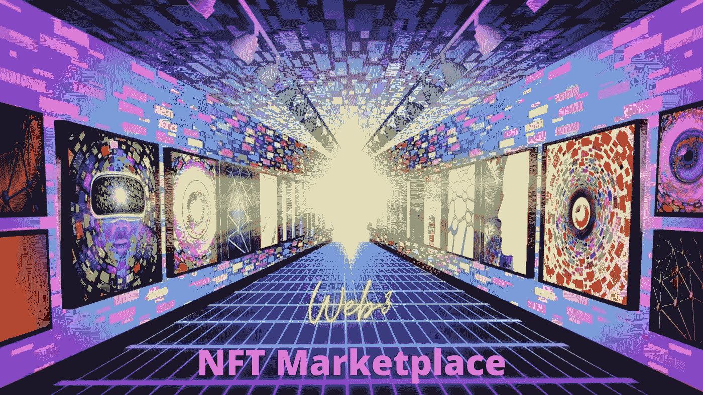

# Web3 上的 NFT 市场开发

> 原文：<https://medium.com/geekculture/nft-marketplace-development-on-web3-39c025750e50?source=collection_archive---------21----------------------->

**NFT Marketplace Development On Web3**

NFT 市场是一个为未来的人才准备的地方，他们将他们的艺术作品带入非传统艺术社区，引领你进入数字化系统。早些时候，有一个庞大的艺术体系只是被搁置一旁，但有一个庞大的艺术体系已经被转化为 NFT，并以数百万的价格售出。他们让世界容忍了成吨的收藏品在一个叫市场的地方被铸造成 NFT。

技术几年内就升级了，各有各的幻想。技术的发展对最新版本的 [**NFT 市场发展**](https://bit.ly/3xpneVX) 产生了重大影响。NFTs 在电影体验中处于领先地位，就像 web 3.0 以各种与它们相关的事物为基础一样。

此外，区块链是 Web3 最重要的方面之一，它已经成为各种应用程序的中心，如加密货币、不可替代令牌(NFTs)、分散金融(DeFi)和其他相关应用程序。

# **让我们看看 Web 3 的 NFT 市场发展**

# **什么是 Web 3.0？**

我们通常在 Web 2 上运行，这导致了互联网新的高级阶段 web 3.0 的发展。你想了解 web 3.0 吗？它指的是未来的互联网，包括区块链、物联网(IoT)、人工智能(AI)、机器学习(ML)、增强现实(AR)、虚拟现实(VR)以及其他先进的新兴技术。尽管该技术仍处于起步阶段，但 web 3 已经产生了重大影响，并开始推动互联网轰动，其程度远远超过我们所看到的。它有能力把每个人的注意力吸引到他们身上，它有自己吸引人们的方式。

# **我们为什么需要 Web 3.0？**

去中心化是导致 Web3 诞生的最重要的因素。用户数据将分布在与生态系统相连的“节点”上，而不是局限在服务器上。其他技术是对区块链网络的补充，后者是设备连接的基础。除了之前的 Web 2.0 功能之外，Web3 还赋予了用户更多的权利，允许他们通过出售数据来赚钱。此外，其他 Web3 技术通过允许在任何地方使用智能系统，努力让生活变得更美好。

## [**Web 3.0 开发**](https://bit.ly/3xpneVX)

NFT 市场的发展是每个人都在努力的。这是每个人都开始建造的最大的东西，以达到他们从未有过的高度。他们选择了领域，他们选择了区块链，他们创造了轰动。NFT 市场开发 是由主要的市场开发公司完成的，他们通过这种开发方式将所有人带到他们身边。

现在，一切都改头换面了。 [Web 2.0](https://medium.datadriveninvestor.com/what-are-web1-web2-web3-e64d4a010ce4) 让每个人都对他们获得一席之地的方式感到满意。随着 Web 3.0 的到来，对市场的期望更高了。他们的特点令人难以置信，随着 NFT 市场的发展，每个人都更容易理解这一点。

人们已经开始接受 web 3.0，并做出了相应的调整。现在，随着 NFT 市场的出现，人们已经进化了很多。许多公司已经开始建立一个基于 web3 的市场，你可能是下一个将互联网的未来掌握在你手中的人。

## **未来**

互联网的未来掌握在你手中，你可以成为明星。有了一个基于 Web3 的 NFT 市场，你可以成为那些试图了解未来模式的后代的榜样。开始寻找一个市场发展公司，用最新的可以在夜空中发光的种子。

## **结论**

NFT 市场在 web3 上的发展将会对想要搬进来的人产生影响。你可以成为别人愿意接手的榜样。一个有 NFTs，一个有区块链，还有一个基于你愿意雕刻你的作品的技术。web3 上 NFT 市场的发展是未来人群的一个轰动，也是未来几代人的一个大喊。用最好的 NFT 市场发展来启动你的 web3。