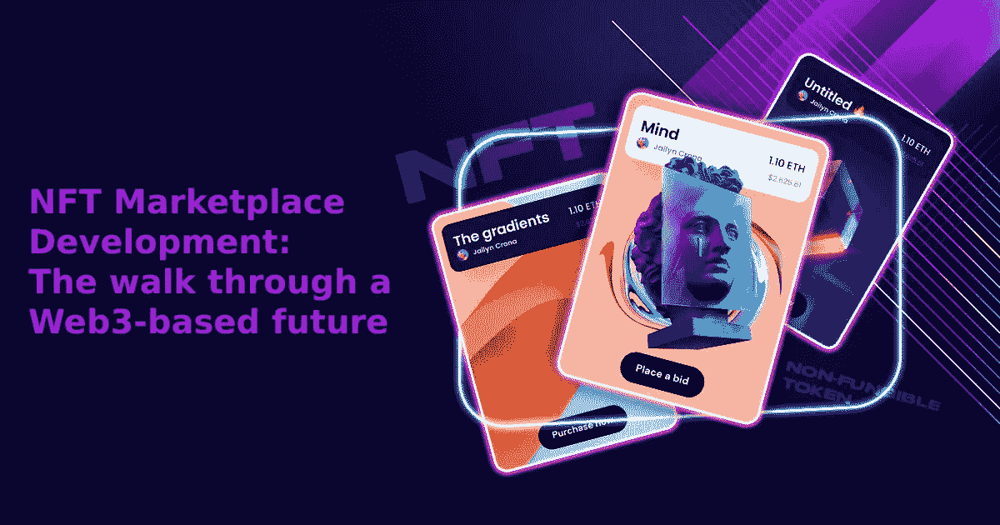

# NFT 市场发展:走过基于 Web3 的未来

> 原文：<https://medium.com/geekculture/nft-marketplace-development-the-walk-through-a-web3-based-future-b223a5a79d70?source=collection_archive---------19----------------------->

从一开始，它就实现了承诺的一切。是啊！一切都是你渴望成为的样子。这项业务永远不会太远，也不会太少，而且都被编入数字生活的安全模块中。区块链有利于走向成功，这也是 NFT 欢呼的地方。启动你的 [**NFT 业务**](https://bit.ly/3COs4QH) ，成为密码之王。NFT 市场和交易所是 web3 起步的关键方面，许多公司会带你参观这个公园。那么，成功的企业需要什么？他问！有人回答说，这是一个以实惠的价格交易大量 NFT 收藏品的平台。因此，NFT 市场可能是一个成功的加密业务的最佳开端。看了这篇文章，他小声说他是对的！这是一篇关于 NFT 市场发展的文章。

两位初露头角的企业家之间的相互转换促成了这篇文章。他们甚至不确定平台的工作方式。所以他们的争论一直持续到这里。

 [## NFT 市场开发|不可替代代币市场|白标 NFT 市场|…

### NFT 市场的发展正在塑造即将到来的创业公司的未来，以在竞争中胜出。构建您自己的…

bit.ly](https://bit.ly/3COs4QH) 

## **NFT 市场是如何运作的？**

以下是需要遵循的事项:

*   你必须在开始程序之前在平台上注册。
*   您需要设置一个钱包来实现轻松交易。
*   为了交易的发生，你需要选择你想要购买的资产，或者你甚至可以铸造你的资产，你可以在以后出售。
*   你可以出价或直接购买。
*   拍卖的结果是出价最高者获胜。
*   然而，在出售你的 NFT 之前，首先要注意的是确定付款方式。
*   但是，NFT 是上市，如果它被批准。
*   智能合同实现了卖方和买方之间的交易。一旦前者接受出价，交易就完成了。

看完这些，他们有了清晰的认识。但是争论从未结束。这次谈话有不同的内容要看。那是什么？他们想从一开始就见证市场的创建，并想成为一名企业家。

他要求告诉我需要考虑哪些事情，建造一个！

## **要考虑的事情！**

他们两人坐在一起，倾听来自最著名的机构对将要考虑的事情的信任的声音:

*   你需要决定利基受众/利基和基于它的受众
*   在继续下一步之前，对市场有一个清晰的了解
*   你需要的区块链构建你的 [***NFT 平台***](https://bit.ly/3COs4QH)
*   开发方法:您需要如何进行

现在一切都好了！但是，如果你不知道应该成为你的节目的一部分的特征，这听起来像什么？谁说我没有？其中一个人提高了嗓门。然后，把它列出来，另一个说:

## **列出的功能**

*   **店面**:吸引人的店面会吸引更多的观众
*   **过滤器**:帮助用户浏览平台
*   清单:它给出了 NFT 的所有内容，并附有适当的描述和其他信息
*   购买和销售:它展示了不同的购买和销售方式，如拍卖、直销等。
*   **钱包**:安全的钱包轻松完成所有交易。

他们需要在市场上选择他们想要的功能，因为他们包含的功能数量决定了构建有效平台的成本。

## **开发程序**

**1。分析您的业务需求**

分析基本的东西和你将要执行的是第一步。你应该为建立一个未来的平台制定一个蓝图。

**2。定义需求和设计**

这是你决定你的需求后的下一步。在这里，你需要做一个基本的线框，考虑所有的 UI/UX 设计组件。它应该简单易用，仍然具有吸引力。用最少的功能创建一个简单的原型来分析工作流、应用程序的功能和变化。

**3。把它变成现实**

既然你明确了要求，那就从前端入手，立刻带来更多的受众。选择最好的开发人员，根据您的需求创建最好的框架，从而节省时间和金钱。

**4。后端开发**

后端开发需要整合区块链技术。它涉及 DApps 或智能合同，最终有助于处理和记录整个交易。它们都有不同的规格。

**5。最终检查和放行**

一切都很清楚了，你需要进入测试阶段，在这个阶段，错误被清除，平台被激活。该平台进行了严格的测试。

**6。质量维护和支持**

一旦平台上线，它将被监控一些事情。无论是顺利运行还是其他可能失败的事情。因此，该平台将定期更新，并确保该平台能让您轻松工作。

他们现在清楚地了解了开发过程，但是正在等待设置。由于两者都是新领域，这将是一个挑战。因此，为了最早进入市场，他们以合理的价格获得了 [***白标解决方案***](https://bit.ly/3COs4QH) ，然后根据他们的需求进行更新。

## **结论**

从他们的谈话中，你可能已经对平台的发展有了清晰的认识，并达成了共识。他们已经提出了需要考虑的事情和需要包含的特性，这样他们的成功明天就会属于你。最引人注目的是，他们雇佣了一家市场开发公司，他们的技术头脑打造了最好的平台，为后代树立了榜样。尝试最好的方法，成为未来几年的密码王。