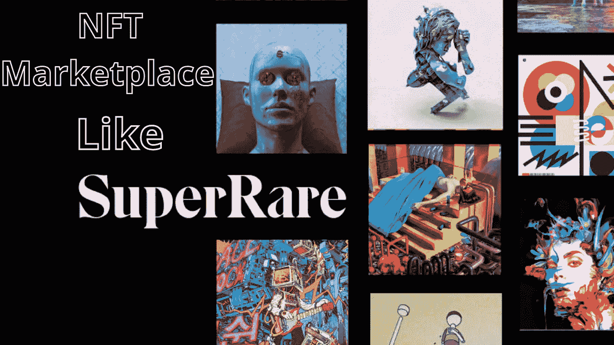
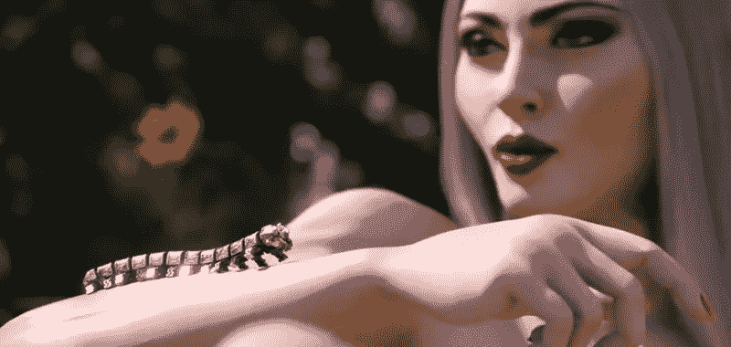

# 像超级稀有这样的 NFT 市场——将你的注意力转移到超级稀有的艺术收藏品上

> 原文：<https://medium.com/geekculture/nft-marketplace-like-superrare-shifting-your-focus-towards-super-rare-collections-of-art-812451454942?source=collection_archive---------20----------------------->

NFT Marketplace Like SuperRare

NFT 市场已经遍布全球有一段时间了。NFT 就是一切，拥有许多企业，导致了一场革命。作为投资者投资数码收藏品的地方，NFT 市场正获得越来越大的吸引力。NFT 市场允许创作者和艺术家以不可替代的代币形式发布和销售他们的数字作品。 [**SuperRare**](https://superrare.com/) 是一个知名的 NFT 平台，在数字收藏家中迅速获得关注。在**周围，价值 9000 万美元的数字艺术已经在平台**上被收集。它是优秀艺术家、设计师和游戏开发者的展示平台。

在这里，我们来看看什么是像 NFT 市场 这样的超级稀有商品，以及它是如何制造的。

## **超级罕见的 NFT 市场到底是什么？**

**ᐅ****超级罕见的 NFT 市场**的主要焦点之一是独一无二的限量版艺术品。它使艺术家能够创作和标记他们的作品，同时也为客户提供服务。

**ᐅ** 该平台基于 **ERC-721** 令牌标准，这是目前以太坊使用最广泛的 NFT 令牌。艺术品包含 10%的版税，确保创作者在二次销售时得到补偿。

**ᐅ** 超级稀有平台，该公司称之为**“insta gram meets christies”，**是考虑到艺术收藏的社交面而创建的。另一方面，用户可以关注自己喜欢的创作者，浏览一系列推荐内容，就像在社交媒体上一样。一个“活动”流和一个致力于热门音乐人的部分让用户能够跟上正在发生的事情。

**ᐅ** SuperRare 接受**乙醚(ETH)** 的所有交易，所有购买都要收取 **3%** 的交易费。SuperRare 向创作者收取主销售额 15%的佣金。

> **在继续下一步开发流程之前，先了解像 SuperRare 这样的 NFT 市场的工作模式。**

## 像 NFT 市场这样的超级市场有多罕见？

☀用户首先应该在平台上创建一个账户。他们可以使用电子邮件地址和电话号码等凭据注册该平台。

☀为了存储、出售和购买 NFT，用户可以建立自己的加密货币钱包。

☀的 NFT 用户将能够铸造他们的 NFT，并为拍卖设置自己的参数。

☀一旦平台接受了符号化的艺术和资产，它们就可以在 **NFT 市场**上市拍卖和出售。

☀该网站允许任何有兴趣投标或购买 NFT 的人这样做。

☀的制作者和艺术家在接受或拒绝对他们艺术作品的出价方面有完全的选择权

☀:资金将从同一个账户中提取，国家粮食计划署也将转移到同一个账户。

## **麦当娜成为超级罕见的 NFT 市场的中心**

多亏了 SuperRare，NFT 地区有一种画廊般的氛围。这是一个独特的市场，它优先考虑艺术意图和可信度，而不是有利于模因的艺术品。一些名人已经开始在 SuperRare 上列出他们的 NFT，从而使它成为一个[**名人市场**](https://bit.ly/3PGOqIk) 。

Source:[https://nftplazas.com/](https://nftplazas.com/)

> [**美国歌手麦当娜**](https://en.wikipedia.org/wiki/Madonna) 与 **Beeple** 合作，在 SuperRare 上诞生了一个名为**“创造之母”**的充满异国情调的 NFT 专辑，将资助全世界的妇女和儿童。该系列是 NFT 的三联画。帮助受乌克兰战争影响的妇女和儿童的**儿童之声基金会**、为刚果民主共和国暴力受害者辩护的**欢乐之城基金会**以及为被监禁的看护者提供保释的黑人妈妈保释组织(Black Mama's Bail Out)将获得这三件数字化收藏品的全部收益。

SuperRare 将有一个高端的画廊氛围，因为艺术家可以铸造他们自己的作品。本质上，这意味着产品是稀有的。在 NFT 市场，超级稀有是严肃艺术家和艺术爱好者的首选。

## **超级稀有的独有特征，如 NFT 市场**

**✔**t30】测试阶段功能:

当我们的市场处于测试阶段时，会员可以获得被动收入。正如在测试阶段观察到的，该平台目前正在开发中。一级和二级市场参与者分享利润。

**✔**t34】美术馆佣金

市场包括在整个 NFT 交易过程中产生额外佣金的特征。根据贸易的准入，分为初级和次级类别。

**✔**t38】参展费用

超级罕见的 NFT 市场的参与者通过以市场费用的形式获得参与费来赚钱。市场收费以有竞争力的价格设定，增加了使用该平台进行非金融交易的人数。

**✔二级市场受益**

该市场以其二级市场优势而闻名。NFT 平台通常不得不通过一级市场提供收益，二级市场的资金为 NFT 企业家提供高级收益。

> 你可能已经有了一个类似 SuperRare 的 [**NFT 市场开发**](https://bit.ly/3MJWDtl) 的想法，现在正在了解开发过程。

## **开发流程:**

Chain 选择

这一阶段包括决定市场功能的最佳链，如投标、购买和出售数字资产，以及鼓励创建新的 NFT 的功能。

NFT minting

NFT 铸币是一个主要属性，需要展示在平台上列出的 NFT。批准代币和与将要构建的平台相关联的货币的过程被称为代币铸造。

I **钱包整合**

钱包整合是任何金融系统正常运行的必要条件。钱包集成过程包括向 NFT 平台添加可用的加密钱包。

CNFT 的反应

建立任何 NFT 市场的关键过程是产生非功能性交易。它完全依赖于设计者和开发者的创造力，并且 NFT 是基于概念定价的。

TT**降级**

这种交换是建立像超级稀有的 这样的 [**NFT 市场的最后一步。当市场成功创建时，数字资产的权衡就被发现了。它们基于定价和可用性，并作为现成的协议提供给 NFT 平台用户。**](https://bit.ly/3MJYKgB)

## **收尾完毕！**

像 NFT 市场这样的超级稀有市场都是关于稀有种类的东西，使它变得超级稀有。建造一个会让你成为一个非凡的创造者。您可以联系顶级的 NFT 市场开发公司来创建您的市场。做一个创造者，在一个了不起的收藏家的帮助下交易一件非凡的艺术品。