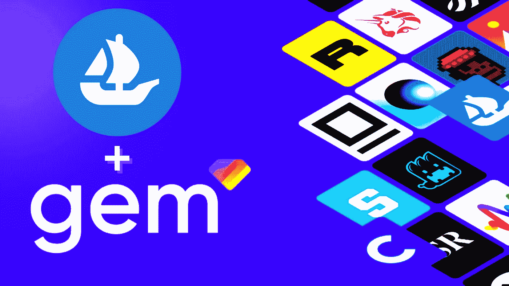

# NFT 市场| OpenSea 收购 NFT 聚合商 Gem - 2022

> 原文：<https://medium.com/geekculture/nft-marketplaces-opensea-acquires-nft-aggregator-gem-2022-2599eb81239f?source=collection_archive---------17----------------------->

在最近给 Gem 投资者的一封电子邮件中，NFT 市场聚合平台传来了一个巨大的惊喜:广受欢迎的 NFT 市场 OpenSea 已经收购了该公司。Gem 是一个 NFT 聚合平台，允许其用户在各种市场平台上购买 NFT。该平台上的买家可以通过在同一屋檐下的许多市场进行搜索来购买特定收藏的低端 NFT。

据 Gem 称，收购要约出乎意料，但这将有助于他们更多地了解 OpenSea NFT 市场平台的基础设施。OpenSea 网站上的一篇博客文章称，此举将有助于该平台从 Gem 聚合器那里学习关于高级 NFT 社区的专业知识和直觉。

如果你是一个小规模的加密业务爱好者，希望更深入地了解 NFT 世界，那么像 OpenSea 这样开发自己的 NFT 市场 会是你活动的一个巨大启动。

# 为什么 NFT 市场是一个有利可图的投资？

一个 NFT 市场业务可以在许多方面为你带来利润，因为新的创作者每天都在 NFT 潮流中跳跃，他们中的大多数人都在寻找 NFT 市场，让他们的 NFT 项目上市销售。因此，如果密码世界全心全意地采用你的产品，基于你的创新思想进行 NFT 市场开发可以改变游戏规则。即使你没有成为世界密码强国，你仍然可以赢得密码社区的心，因为它总是欢迎有良好前景的企业和产品。

像 OpenSea 这样发展起来的 NFT 市场的利润可以通过多种方式获得。例如， [**OpenSea**](https://opensea.io/) 在交易过程中向买家和卖家各收取 2.5%的统一费用，这是他们的创收点之一，因为 NFT 市场平台上的日交易量非常高。此外，其他市场通过对在平台上注册、铸造非功能性交易、列出非功能性交易、对非功能性交易竞价以及营销 NFT 项目征收费用来盈利。尽管通过二次销售的版税回馈社区已经成为 NFT 市场风险投资的常态，但所得大于所失。因此，企业成功地管理了自己，并为更大的 NFT 繁荣做好了准备。

# 发展 NFT 市场背后的过程

NFT 市场的发展可以有几种方式，这取决于你的选择。如果你想在短时间内有一个解决方案，白牌 NFT 市场平台可能是最好的选择。或者，如果你可以接受时间限制，但需要一个独特的平台来长期维持，没有什么比从头开始开发更好的了。根据您的选择，为您的新企业开发 NFT 市场平台所产生的成本会有所不同；白标解决方案的成本低于单独开发的解决方案。此外，集成到平台中的每个额外功能都会增加费用。不管你在开发 NFT 市场平台上花了多少钱，你都可以通过使用正确的策略来覆盖目标受众，从而快速获利。

## 总结想法

从今以后，我们可以说，如果你朝着正确的方向努力，像 OpenSea 一样开发自己的 NFT 市场将增加你的企业进入顶级加密企业的机会。此外，加密世界仍然是一个充满风险的世界，一些风险可能会带来更多的回报而不是损失。作为一个企业主，你应该能够承担一些风险，这样你的声誉就可以飞上天，并利用新获得的认可进入高层。如果你已经决定像 OpenSea 一样发展你的 NFT 市场，那么有一些公司可以通过满足你的所有要求来帮助你自下而上地建立你的新企业。