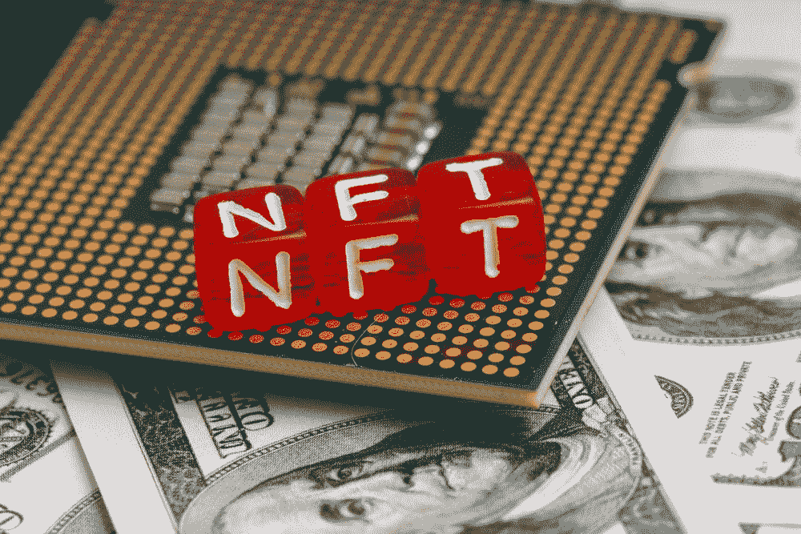

# NFT 项目推特研究

> 原文：<https://medium.com/geekculture/nft-project-twitter-research-23db0929e774?source=collection_archive---------7----------------------->

## NFT 研究

## 如何在购买 NFT 之前去 DYOR

Photo by [Andrey Metelev](https://unsplash.com/@metelevan?utm_source=unsplash&utm_medium=referral&utm_content=creditCopyText) on [Unsplash](http://localhost:3000/s/photos/nft?utm_source=unsplash&utm_medium=referral&utm_content=creditCopyText)

在这篇文章中，我想分享一些在进入项目之前研究 NFT 项目 Twitter 账户的技巧。

作为一名 NFT 买家，在开始深入一个项目之前，我经常会检查一些东西，包括: