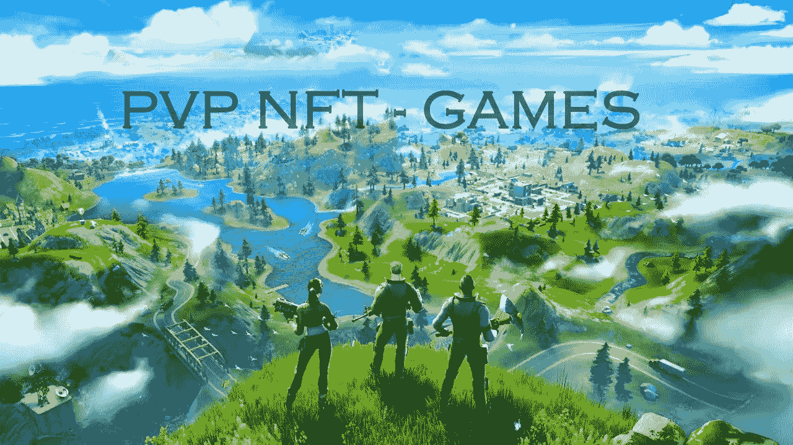
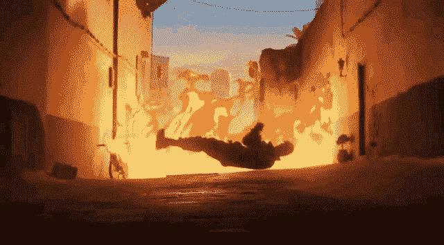
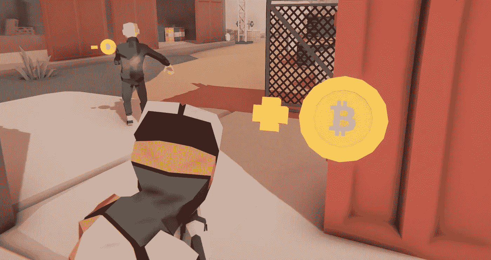
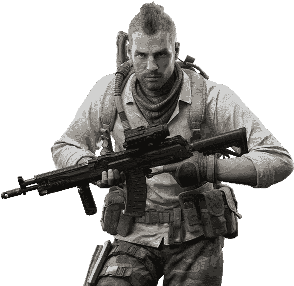

# NFT PVP 游戏，统治数十亿美元产业的阵容

> 原文：<https://medium.com/geekculture/nft-pvp-games-line-ups-to-dominate-the-many-billion-dollar-industries-984bdc293525?source=collection_archive---------12----------------------->

## **游戏——人类创造力的复制品**

世界一直在进化循环中运行，这些影响正以不同的方式改变着人类的生活。每当一项新技术出现时，行业都会进行严肃的讨论，在炒作过后，这项技术也会逐渐消失。但是很少有技术把自己建设成一个不可避免的、坚不可摧的行业，永远不会在新的技术潮流中消失。数字游戏技术就是其中之一。更像艺术、电影和体育，游戏产业有着难以想象的观众来源和粉丝基础。从二维图形到三维图形，游戏行业已经开发了许多扣人心弦的游戏。他们开发了自己的生态系统，在这个数字时代，仅仅一款游戏就几乎创造了 2.38 亿的销售额。它随时准备融入所有的技术进步，从[区块链到 NFT](https://www.blockchainappfactory.com/nft-development-services?utm_source=Medium&utm_medium=Publication-+30%2F11%2F2021&utm_campaign=vignesh) ，他们从来没有倒退或努力表现良好。

> “游戏以独特性和不可摧毁性重新定义”

## **博彩业——科技时代的预兆**

这些数字只是冰山一角，博彩业的遗产最终以数十亿计增长，不仅是因为金钱，也是因为社区人口。游戏平台是最有影响力的平台之一，他们的电影动画为他们的角色创造了巨大的粉丝基础。续集创造了破纪录的市场，所有类型的游戏都创造了游戏市场的销售记录。游戏行业有更多有影响力的续集，PVP 概念是整个游戏行业中最熟悉的类别之一。很少有 PVP 游戏在智能手机、PC 和游戏机等所有生态系统上注册了商标。其中最重要、最引人注目的游戏是****使命召唤******堡垒之夜*** 。*

*您可能听说过或探索过这些类型的游戏，这些游戏的趋势增加了社区中游戏玩家的数量。不仅仅是关于社区和财富，他们甚至为元概念奠定了基础。这就是将游戏产业视为数字进步的预言者的原因。*

## ***NFT 游戏——边玩边赚***

**

***Earn while engaging***

*不可替代的代币改变了他们倾向于停留的地方的性质。游戏行业中的 [NFTs 整合](https://www.blockchainappfactory.com/nft-gaming-platform-development?utm_source=Medium&utm_medium=Publication-+30%2F11%2F2021&utm_campaign=vignesh)是一个游戏规则改变者，它只能带来有效的利益。NFT 游戏公司正在敲开游戏社区的大门，带来了大量的好处和优势。虽然博彩业有更大的遗产，但他们总是倾向于集中摊位。市场上的每一款游戏对老百姓来说都是相当多的钱。但是 NFT 的加入改变了这个游戏平台的未来走向了一条不同的道路。启用 [NFT 游戏](https://www.blockchainappfactory.com/nft-gaming-platform-development?utm_source=Medium&utm_medium=Publication-+30%2F11%2F2021&utm_campaign=vignesh)的用户友好生态系统将是十年来最有趣的收购。*

* [## NFT 游戏平台——为什么市场占有率非常高？

### 游戏产业的发展太快了，发生的变化是乏味的，它们影响了…

medium.com](/security-token-offering/nft-gaming-platform-why-are-the-market-dominations-very-high-1aface48af6f) 

## **NFT 博彩集锦**

📌玩赚，NFT 游戏平台允许用户通过玩游戏来赚取密码。

📌利用收购的资产并将其转换成 NFT，在 NFT 市场上市

📌使用获得的积分在 NFT 游戏平台自己的 NFT 市场上拥有 NFT。

## **PVP 游戏——游戏 NFT 平台的神经**

**PVP games**

玩家对玩家游戏是游戏社区的当前趋势，竞争性的游戏玩法和为了赢得游戏而生存的冲动使得游戏玩家有“这就是它”的时刻。游戏社区是互动性和交流性最强的媒体之一。虽然 PVP 类型的游戏在玩家的空间里已经存在很长时间了，但是智能手机为每个人打开了访问它的机会。这样 PVP 就变成了一个更有生命力的游戏类型。

PVP 游戏上的 [**NFT 游戏平台**](https://www.blockchainappfactory.com/nft-gaming-platform-development?utm_source=Medium&utm_medium=Publication-+30%2F11%2F2021&utm_campaign=vignesh) 对于许多游戏玩家来说就像是梦想成真，想象一下，游戏玩家可以快乐地做他们在这个世界上唯一想做的事情。更重要的是，密码是作为支付游戏的费用支付的，这为 NFT 游戏中的游戏赚取平台奠定了基础。许多游戏玩家被这个概念所吸引，现在这个概念定义了加密的游戏平台。

🛡️ **F/TPS PVP**

明白了吗，你生来就是游戏玩家，对于那些觉得难以理解的人来说，这是第一个？第三人称射击游戏玩家 Vs 玩家游戏玩家。NFT PVP 游戏在加密领域有各种好处。游戏的概念与典型的皇家战役游戏非常相似。

🛡️ **大堂**

一群玩家将被连接在一个大厅里互相竞争，如果玩家愿意，他们可以选择组队或者单飞。大厅是为了召集玩家在战斗中部署他们。

🛡️ **皇家战役**

从大厅聚集的玩家将被部署到地图上的这里，在这里他们必须找到资源、武器和弹药来相互竞争。并最终在游戏中生存下来。

只能有一个赢家，所有其他人都应该被埋葬，这里 NFT PVP 游戏介绍了许多选择来收集资源和赚钱。用户可以收集头像，解锁特殊的皮肤，皮肤越稀有，在 NFT 市场拍卖或出售的价格就越高。这些 NFT PVP 游戏就像生存之战，赚取可以在现实世界中使用的[加密货币](https://www.blockchainappfactory.com/cryptocurrency-development?utm_source=Medium&utm_medium=Publication-+30%2F11%2F2021&utm_campaign=vignesh)。

 [## 建立基于游戏产业的 NFT 市场，如 NBA Topshot

### NBA Topshot 成为体育用例中最好的 NFT 市场。其超级成功背后的原因是它…

medium.com](/nft-non-fungible-token/building-game-industry-based-nft-marketplace-like-nba-topshot-9a7a5b364b1) 

## **NFT PVP 游戏市场**

NFT PVP 游戏平台有自己的市场来买卖基于 PVP 的资产。不仅仅是在密码中赚钱，玩家实际上可以使用这个 NFT PVP 游戏平台用 NFT 的资产进行交易。更独特和更可靠的资产将对市场产生巨大影响，并有可能超出预期的交易限额，

> “不再受限制的游戏体验”

## **Booyah！——博客幸存**

游戏平台将有重大的进步和互动功能，以在加密空间的浪潮中生存下来。正如我们所见，NFT 游戏平台将产生重大影响。NFT 空间不仅仅是一个游戏平台，更倾向于建立一个收入生态系统。在典型的中央游戏平台上占了上风。游戏玩家有广泛的机会，但拥有这些平台的人将决定社区的机会和命运。*