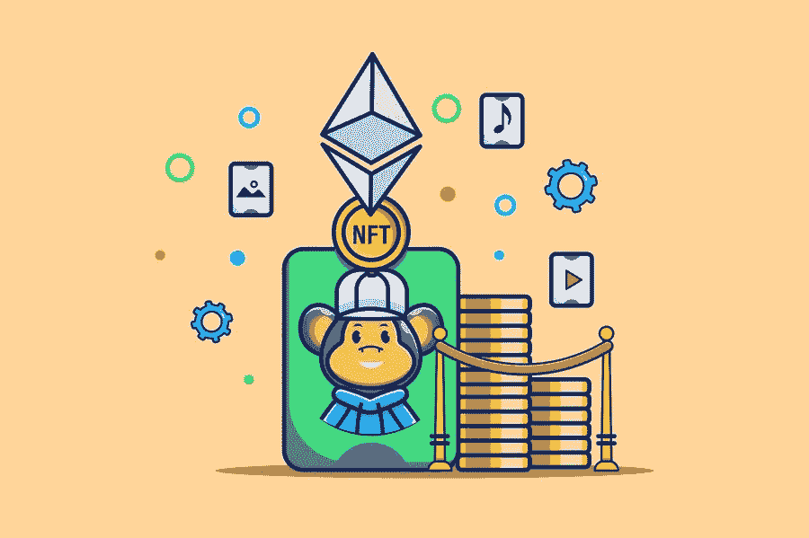

# NFT 版税解释:NFT 版税如何工作？

> 原文：<https://medium.com/geekculture/nft-royalties-explained-how-do-nft-royalties-work-54f56e15cb07?source=collection_archive---------16----------------------->

艺术是人性的基石。如果没有艺术和它所带来的表达方式，我们中的任何一个人会在哪里？当我们有悲伤的一天，大多数人，如果不是所有人，都会从音乐中寻求安慰。即使在最绝望的时候，一幅简单的画也能唤起希望。因此，当文字显得太多的时候，艺术是我们使用的媒介。艺术无处不在，从让我们得以一窥历史的洞穴绘画到对未来的艺术演绎。

然而，尽管它的重要性，艺术和艺术家往往被忽视。我们听到了太多艺术家和音乐家由于各种各样的原因而没有成功的故事。像艺术画廊和代理机构这样的中间商经常介入并拿走大量的销售额，使得创作者很难得到他们的公平份额，更不用说利润了！

输入 NFTs。这些代币允许创作者将他们的作品货币化并收回他们的所有权。通过仅在艺术家和买家之间进行交易，第三方被完全排除在等式之外。此外，每当艺术家的作品在 [**NFT 交易平台**](https://www.jump.trade/) 售出，艺术家就可以获得版税。听起来很棒，是吗？继续阅读，了解更多信息！

# **什么是 NFT？**

这些天,“NFT”这个词被频繁使用。但是到底什么是 NFT，它是如何工作的？NFT 或不可替代令牌，顾名思义。它们是代表您对特定资产的所有权的数字令牌。它们是不可替代的，也就是说你不能像兑换一美元那样简单地将一种货币兑换成另一种货币。每一个 NFT 都是独一无二的，这使得拥有它更加令人垂涎。

此外，任何东西都可以成为 NFT。从简单的 jpeg 图像到整张音乐专辑，NFT 可以有多种形式。但是仅仅保存图像不是更容易吗？当然，但是 NFT 会给你所有权和所有随之而来的权利。对于艺术家来说，在 NFT 平台上展示他们的作品给他们带来的不仅仅是最初的销售额。来自 NFTs 的版税是艺术家最大的吸引力之一。

# **首先，什么是 NFT 版税？**

NFT 版税是艺术家将他们的作品货币化的一种方式，远远超出了最初的销售。版税是每次艺术品二次销售时支付的费用。也就是说，每次他们的艺术品被转售给第二个买家，NFT 版税确保艺术家得到总售价的规定百分比。当 NFT 被铸造时，版税的条款可以被编码到智能合同中。完成后，每次作品售出，版税都会存入艺术家的钱包。通常的提成率在 5%到 10%之间。随着一个艺术家越来越受欢迎，他们的作品越来越受欢迎，其价值也明显增加。在这种情况下，即使是 5%的版税也相当可观，确保艺术家总是有收入来源。

没有第三方参与，因为一切都由智能合同处理，极大地减少了人为错误。这个系统不仅仅适用于数字艺术！NFT 版税可以包括音乐、实物，甚至游戏配件。尤其是后者，正变得颇具吸引力。随着配饰成为元宇宙时尚界不可或缺的一部分，越来越多的艺术家开始设计可穿戴设备。

然而，只有精选的 NFT 市场为艺术家提供赚取版税的选择。这在最近引起了不小的轰动，这是理所应当的！

## 为什么它们很重要？

版税由来已久。每当一个音乐家的歌曲在电台播出时，如果他们与唱片公司有版税协议，他们可能会得到版税。当作家的书被卖出时，情况也是如此。然而，这个系统调用的第三方很少是可靠的。此外，在几个艺术家的情况下，他们可以出售它的价格，并得到钱。然而，当时间证明是正确的，买方可以以过高的价格出售，完全离开艺术家的循环。

这就是 NFT 的作用。区块链技术和智能合同的使用使特许权使用费。现在，有了 NFTs，艺术家可以通过完全自动化的方法从后续销售中获利。艺术家还可以密切关注他们作品的所有权——这在传统交易中是非常乏味的事情。区块链或数字账本技术也可以确保没有假货或复制品在流通。如果偶然有一个真的出现了，追踪假冒产品就容易多了。

NFTs 的另一个有趣之处是，即使作品被出售，版权仍然属于创作者。在某些情况下，创作者还可以将一部分版权出售给他人。显而易见，NFT 版税将权力交还给创作者和艺术家。

## **那么，大家都在忙什么呢？**

NFT 的版税现在已经引发了很多话题。为了吸引更多的买家，几个 NFT 市场已经取消了 NFT 的版税。这一举措在 Twitter 上引起了激烈的争论，随后一些平台态度有所软化。创作者认为，NFTs 的整体理念是为创作者和艺术家提供一个繁荣的平台，让他们的作品货币化。拒绝创作者从二次销售中获得版税是与 Web3 的前提背道而驰的。

## **结束语**

不可否认的是，NFTs 彻底改变了艺术界。他们允许创作者以前所未有的方式将他们的作品货币化。在这项技术的帮助下，人们通常对苦苦挣扎的艺术家的刻板印象被彻底打破了。通过确保公平的市场，NFT 给了创造者控制权。然而，狡猾的人有时甚至可以绕过聪明的合同，逃避支付版税，[**【NFT 市场】**](https://www.jump.trade/) ，因此，必须采取严格的措施，确保艺术家为世界付出的所有欢乐和美丽得到慷慨的回报。