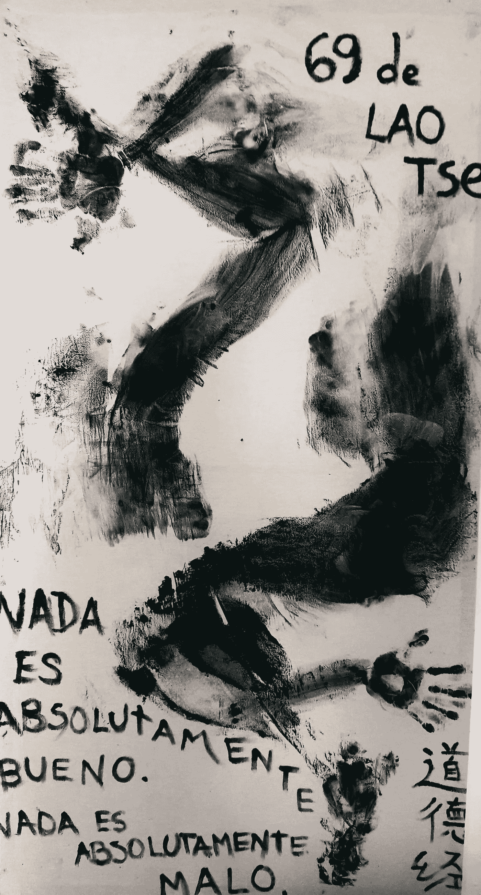

# NFT 聚焦:为共产主义古巴的自由和财产而战

> 原文：<https://medium.com/geekculture/nft-spotlight-fighting-for-liberty-and-property-in-communist-cuba-290d4384c108?source=collection_archive---------12----------------------->

# 第 1 部分—中国马塔哈里

“在这种演变之前，我看到的最大风险是，在统治世界的经济大国面前，权力下放所代表的威胁，以及他们将允许‘泡沫’增长多久。”——基纳马塔哈里

# 什么是 NFT？