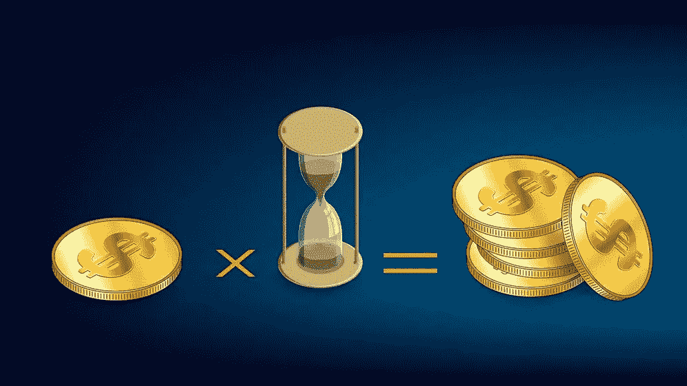

# NFT 赌注指南——你被动收入的一扇门

> 原文：<https://medium.com/geekculture/nft-staking-guide-a-door-to-your-passive-income-3de0cee9e066?source=collection_archive---------10----------------------->

加密货币赌注在市场上并不新鲜。用户下注他们的加密货币，给他们的钱包增加奖励。简单来说，赌博遵循储蓄的相同路线图。然而，在这种情况下，您将改为存放您的加密货币。

当谈到 NFTs 时，staking 是一个相当新的发展，需要更多的探索。尽管还处于起步阶段，但这一发展正帮助用户获得源源不断的被动收入。NFTs 的赌注依赖于 PoF 机制来奖励用户。这意味着参与者在更长的时间内下注的 NFT 越多，回报就越多。

比如，想象一下这个。你买了一个 NFT，现在它闲置在你的电子钱包里，给不了你任何好处。通过在 NFT 赌注平台上下注这个 NFT，你可以获得投资回报。

让我们更深入地讨论一下非功能性测试。

# 什么是 NFT 赌注？

NFT 赌注类似于储蓄存款。与传统储蓄不同的是，在这里，你可以存入你的非存款账户并获得收益。顾名思义，下注 NFT 意味着将你的 NFT 锁定在 NFT 下注平台，产生被动收入。你可能会想，我们会失去所有权吗？放心！即使你在赌你的 NFT，你也不会失去对它们的所有权。获得的奖励将基于年利率、下注的 NFT 数量以及最后的下注持续时间。

NFT 是独一无二的。因此，投资者和收藏者倾向于小心交易。这种新方式打开了 NFT 市场的大门，使用户能够将他们的资产货币化。因此，吸引了大量的注意力，NFT 赌注。

押注 NFT 的工作方式与在市场中押注加密货币完全一样。然而，我们需要记住的是，并非所有的非功能性交易都有赌注。非功能性测试的标桩可能因项目而异。

# **赌注是如何运作的？**

如前所述，不可替代令牌(NFT)是独特的资产。因此，所有者通常不愿意在市场上出售它。另一件事是，NFT 取决于市场需求率，这使得它容易受到价格波动的影响。在这种情况下，NFT 桩的引入可能会给用户带来方便。

他们现在可以选择押上他们的 NFT，被动地赚钱。要下注您的 NFT，您需要一个存储您的 NFT 和令牌的加密钱包。下一步将是确保你的钱包适合你的 NFT 投资平台所基于的区块链。每个平台使用不同的区块链；因此，确保钱包和区块链的兼容性是必须的。最后，你必须将你的钱包连接到 NFT 赌注平台。

## **什么是 NFT 赌注奖励？**

NFT 奖励可能会因我们所投资的平台和 NFT 类型而异。大多数平台都支持定期下注奖励，从每天到每周不等。获得的奖励通常是在平台上默认的代币形式。玩家可以交易赌注奖励，并有可能将它们转换成现实生活中的货币。

# **NFT 流行的跑马圈地平台**

在 NFTs 中，赌注是一个相对较新的概念，主要用于 [**NFT 游戏平台**](https://www.jump.trade/) 。“玩即赚”游戏提供了在游戏中下注的机会，回报更令人满意的奖励。

## **MOBOX**

建立在 BNB 智能链上，这是一个涉及元宇宙的玩赢游戏。玩家在这个平台上下注 NFT，可以获得本地令牌 MBOX 的奖励。MOBOX 元宇宙，MOMOverse，有称为 MOMOs 的 NFT，可以在 NFT 平台上铸造、购买、出售或交易。

每个陌陌都有独特的品质和不同的散列值。硬件使用哈希功能来运行和解决不同的哈希算法。哈希算法有助于生成新的加密货币，并允许它们之间的交易。这个过程也被称为采矿。下注 MOMOs 可以帮助您收集游戏中的货币 MBOX。您下注越多，您赢得的 MBOX 就越多。然后，您可以将这些 MBOX 转换成现实生活中的货币。

## **动物园管理员**

动物园管理员是一个游戏化的 DApp 高产农场。收益农业是一个倍增奖励的过程，其中涉及加密货币的赌注。Zookeeper 为用户提供了在流动性池中下注的机会，这反过来又允许双重养殖。这意味着您可以获得效用令牌 ZOO 以及 wan WAP Liquidity Provider(WASP)令牌作为奖励。

您也可以选择将代币锁定一段时间来增加奖励。赌注 NFT 卡称为动物园助推器，可以通过赌注动物园代币获得，也可以增加奖励。

## **进入最佳 NFTs 赌注**

也就是说，决定下注 NFT 需要了解预期的结果。因此，彻底的研究是必须的。非上市公司有不同的类型，你不能把它们都押在 NFT 市场上。

比如游戏 NFTs，有投资的冲动？Splinterlands 是一个受欢迎的 NFT 投资平台。游戏建立在以太坊区块链上，允许玩家通过赌注被动赚取。

## **总结**

NFT 赌注是 [**即玩即赢游戏**](https://www.jump.trade/mcl-game) 中引入的一个全新概念，需要深入探索。尽管如此，这种进步仍然吸引了新的玩家。你不想玩或参与交易？NFT 赌注是一个伟大的方法来产生被动收入。NFT 赌博业正在广泛发展。为什么不呢？它让玩家有机会在不失去所有权的情况下对他们的 NFT 下注。NFT 市场即将到来，如果你想投资，这可能是正确的时间。