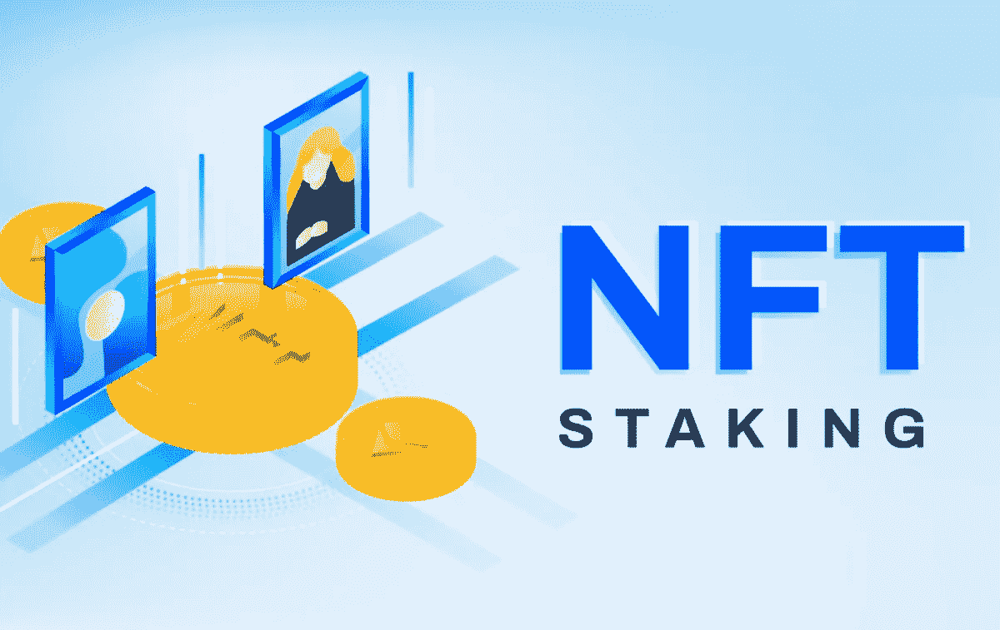

# NFT 赌注平台开发:如何推出一个 NFT 赌注平台？

> 原文：<https://medium.com/geekculture/nft-staking-platform-development-how-to-launch-an-nft-staking-platform-774c58f1cf1d?source=collection_archive---------12----------------------->

不可替代的代币在市场上创造了悠久的历史。以前，人们认为非功能性文件仅用于声明对数字资产的所有权。但是这种理解在市场上不再流行，因为人们已经开始探索 NFT 的细微差别。现在，人们已经开始使用 NFT 进行赌注和奖励。NFT 赌注已经铺平了一条在加密领域赚取被动收入的新途径。此外，NFT 跑马圈地是将 NFT 资产和 DeFi 整合在一起的过程。

在不断增长的 NFTs 领域，它为企业家在市场上启动他们的加密企业打开了大门。本博客将简要介绍关于 [**NFT 跑马圈地平台开发**](https://www.appdupe.com/nft-marketplace-development) 的每一个细微之处。

# **什么是 NFT 赌注？对个人来说值得吗？**

区块链网络在很大程度上依赖于交易验证者的全球网络，这些验证者在数据被存储在区块链之前对交易进行认证。验证器是基于他们已经向区块链的操作承诺的加密货币来决定的。NFT 赌注就是承诺或锁定平台或协议上的不可替代令牌，以换取赌注奖励和其他好处。在这里，NFT 的所有者不会失去他们自己的，但他们可以通过它赚钱。

NFT 跑马圈地背后的理念是让个人能够利用手中的非金融资产放贷。如果有人手里没有几百万美元，却有一个价值几十亿美元的 NFT，该怎么办？为什么个人不利用 NFT，得到他想要的钱呢？这就是 NFT 桩向工具包中有非功能性测试的个人传达的信息。赌注的主要作用是提供一条激励区块链股份证明的途径，这意味着它们将作为对那些以更准确的方式验证区块链交易的人的奖励。

# **NFT 赌马有多受欢迎？**

在讨论 NFT 跑马圈地的潜力时，他们并没有像 NFT 那样大量地付诸实践。当 NFT 被锁定在一个平台上时，个人可以根据年百分比收益率(APY)、下注的持续时间和下注的 NFT 数量获得奖励。投资者和 NFT 爱好者将涌向 NFT 平台购买他们想要的 NFT 收藏品。不仅仅是花哨，现在 NFT 的赌注为他们提供了一个机会，将他们的数字资产货币化，这些资产具有吸引人们参与 NFT 市场的巨大潜力。

说到 [**NFT 赌注**](https://academy.binance.com/en/articles/what-is-nft-staking-and-how-does-it-work) ，流程与加密货币赌注相同。为此，所有个人需要的是有一个用于存储 NFTs 的加密钱包。因为用户注册了 NFT 赌注平台，他们应该明白不是所有的非专利交易都是为了钱。NFT 打桩的要求因平台而异。然而，人们仍然认为，除了非金融交易，还有许多其他方式可以进行投资，但最重要的是流动性。每一个 NFT 都有其独特性和稀有性，这是无法比较的。每次个人只能选择购买和出售 NFT。这就是为什么 NFT 赌注是最好的替代方式来赚钱。

## **NFT 赌注是如何运作的？**

NFT 赌注以两种方式工作。它们被应用于两个不同的场景，称为元宇宙游戏平台和 NFT 赌注平台。NFT 赌注将让你赚取更多的收入与他们的资产以及保留他们的所有权。这个概念类似于流动性收入计划，个人可以获得奖励，但它只能用于加密货币，而不是 NFT。NFTs 是在智能合同 ERC 721 的支持下开发的。这些契约内部有自我机制，可以与其他令牌以及区块链进行交互。同样的技术将被用于所有的非功能性交易，这样当你对 NFT 下赌注时，就是合同在下赌注。

然而，NFT 的立桩要经历一个巨大的过程。以下是标桩 NFT 的步骤。

*   用户应该注册 NFT 赌注平台。
*   在向平台注册后，用户可以上传他们存储 NFTs 的加密钱包。
*   该平台将验证 NFTs 并告知用户年百分比产量(AYL)。它还将评估在这方面是否支持 NFTs。
*   用户可以开始在平台上下注，并从中赚取被动收入。

截至目前，只有某些加密货币支持 NFT 赌注。他们是，

*   以太坊
*   卡尔达诺
*   索拉纳
*   波尔卡多特

## **NFT 在 NFT 博彩平台跑马圈地**

在你开始开发 NFT 打桩平台之前，你必须了解 NFT 打桩的应用。尽管我们有一个单独的 NFT 赌注平台，NFT 赌注也适用于 NFT 游戏平台。有许多 NFT 游戏平台支持 NFT 赌注。看看 NFT 进行 NFT 赌博的游戏平台。

**Axie Infinity** —这是一个受欢迎的 NFT 游戏平台，引入了赌注的概念。用户可以下注他们的 AXS 代币，赚取惊人的奖励。它还提供了双倍的 APY，玩家可以获得双倍的收入。

**MOBOX** —这是另一款重要的 NFT 游戏，提供 NFT 赌注功能。这个玩到赚的游戏平台建立在币安智能链上，每个陌陌都有不同的角色和功能。当玩家下注陌陌时，他们将能够赢得他们的 MBOX 代币。

**分裂之地**——冒险的 NFT 游戏平台将允许用户下注他们的 SPS 代币。通过跟踪代币，玩家将获得平台的特别优惠、促销和其他额外津贴。

## **为什么选择开发 NFT 赌注平台？**

不可替代的代币有助于建立数字收藏品的所有权和安全性。现在够了吗？必须分析范围广泛的 NFT，DeFi 是最好的方法之一。

随着 NFTs 市场的蓬勃发展，这将是您开始使用 [**NFT 赌注平台开发**](https://www.appdupe.com/nft-marketplace-development) 的最佳时机。众所周知，投资数字资产会给用户带来很多好处。用户将通过标桩 NFTs 获得许多好处。这些押记资产将用于在 NFT 空间内建立一个流动性池。

虽然列出了 NFT 赌注的好处，还有很多要添加到列表中。空投和奖励是两个最重要的好处，个人将从 NFT 赌注。NFT 赌注也将为个人提供大量的商业机会。想象一下，NFT 赌注赢得了人们的心。NFT 跑马圈地平台也会有同样的需求。NFT 赌注平台有如此大的潜力，他们会耙你数百万美元。有了这种需求，你可以迅速推出 NFT 爱好者的 NFT 赌注平台。

## **推出 NFT 赌博平台的额外津贴**

*   无论用户何时在论坛中下注，NFT 赌注平台都会为他们提供大量的奖励
*   获得随机空投可以通过 NFT 赌注论坛
*   透明度是保持平台活动的关键术语。

## **总结**

对于极有兴趣在 NFT 市场立足的企业家来说，这将是一个绝佳的机会。你可以开始接触顶尖的 [**NFT 市场开发公司**](https://www.appdupe.com/nft-marketplace-development) ，在他们的健康支持下，你可以在市场上推出 NFT 跑马圈地平台。