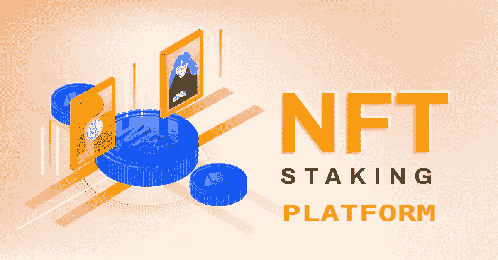
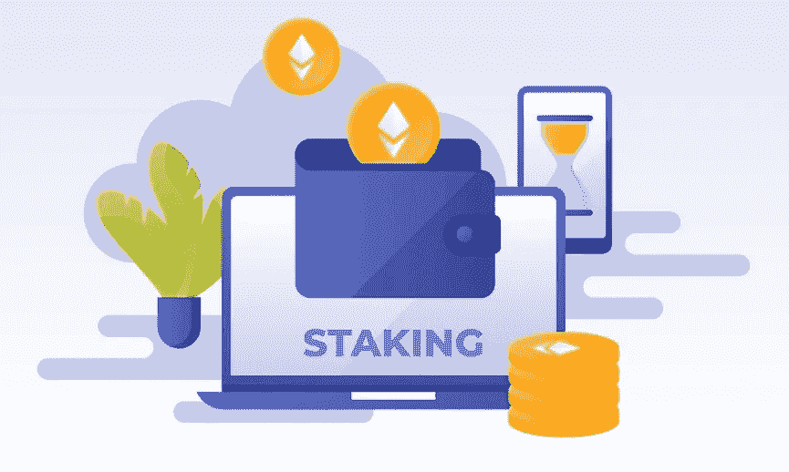

# NFT 赌注平台开发:如何推出 NFT 贷款市场？

> 原文：<https://medium.com/geekculture/nft-staking-platform-development-how-to-launch-nft-loan-marketplace-396c00f9b039?source=collection_archive---------9----------------------->

如今，FTs 是令世界震惊的引人注目的标志性收藏品。不可替代代币是用于交易和竞价的数字改革。区块链行业专家因为这项技术获得巨额收入。NFTs 保留并保护特定资产的所有权。NFT 正在征服所有领域，如艺术品、音乐、模因、视频、游戏和体育。就连 Twitter 的首席执行官杰克·多西也因扮演 NFT 而获得了 120 万美元的收入。

以同样的方式，NFT 赌注将像一个奖金令牌持有者，他们获得奖励。作为一个商务爱好者，你可以幸运地买到顶级的 [**NFT 跑马圈地平台开发公司**](https://www.appdupe.com/nft-marketplace-development) 。

> 在这篇博客中，你将获得开发你自己的 NFT 赌注平台的建设性方法。对你在 NFT 的职业充满热情，把自己和专业联系起来。

# **NFT 赌注——要诀**

您应该将 NFT 收藏品附加到 staking 协议，这样就可以实现对这些收藏品的加密。锁定 NFT 收藏品的期限是暂时的。人们可以加密区块链的 NFT 资产。利用这些 NFT 进行交易或投标是绝对不可能的。这段不活跃的时间是非流动性的。代币持有者通常会选择 NFT 下注，因为他们可以从下注的货币中获得佣金。

并非所有的 NFT 都可以像其他加密货币一样用于赌注。使用属于区块链的智能合同，可以将它们部署在 NFT 打桩平台上。

# **如何入股 NFTs？**

NFT 的持有者将会欣赏这些惊人的数字收藏，因此不会费心去快速出售它们。考虑到它们的独特性和不可分割性，它们对交易不感兴趣。因此，他们利用这个 [NFT 赌注](https://cointelegraph.com/news/what-is-nft-staking-and-how-to-earn-income-from-nfts)来保护他们的收藏安全，同时赚取利润。另一方面，对于加密货币来说，只有卖出和买入的选项。

> 首先，在下注时，您必须有一个用于特定 NFTs 的加密钱包。此外，钱包应与区块链兼容。然后，将钱包连接到赌注平台，存入感兴趣的 NFTs。

## **下注 NFT 有什么奖励？**

这取决于平台的类型和 NFT，以预测 NFT 持有者将获得何种回报。这些奖励每天或每周定期发放。代币持有者可以将这些奖励转换成加密货币或法定货币。此外，在跑马圈地平台中还有分散的自治组织(DAO)。

因此，这允许 NFT 持有者参与治理任务，因为他们将其资产锁定在 DAO 池或 NFT 赌注池中。这给了他们提出建议或自己提出建议的投票权。

## NFT 打桩平台的特点

1.  **API 集成**:有许多支付网关集成以及数字钱包来连接赌注平台。因此，它提高了过程的速度和可用性。
2.  **支持贵重物品保护**:使用防火墙和协议保护信息。因为在下注大量 NFT 时，安全性是主要考虑因素。
3.  **其他附加功能**:UI/UX 设计和缩略图，用于自动化平台和吸引观众。
4.  **奖励的计算**:使用三个方面 1。硬币 2 的通货膨胀率。NFT 资产的投资期限。类型的 NFT 收藏品的赌注。
5.  支付:它将描述他们将如何准确地将股份分配给持有人。它还包括过去的交易历史，以跟踪他们的活动。

## **打造稳定的 NFT 跑马圈地平台**

抓住以下步骤作为蓝图 [**准确开发自己的 NFT 赌注平台**](https://www.appdupe.com/nft-marketplace-development) 。此外，确保您与专家团队一起实现这一目标。

1.  首先，你必须通过进行一手和二手调查来收集信息。然后把他们整理出来，准确的知道谁是你真正的受众。这一阶段是探索 NFT 空间并设定市场趋势业务。
2.  其次，为了获得有时甚至更好的结果，选择最好的懂技术的团队。利用开发人员和主题专家将是有用的，并使工作更简单。
3.  第三，有最好的想法，关于哪个区块链雇用你的 NFT 跑马圈地平台。
4.  决定要标记哪个垂直的 NFT。
5.  此外，提及授权和用户在平台上的角色。
6.  规划平台技术部分如何工作的蓝图。
7.  设计最好的用户界面/UX 界面或登陆页面，让用户赞叹并让他们探索。
8.  根据打桩平台的工作和功能，设计和制定智能合同。
9.  最后，测试应用程序几次，以避免错误。使用测试版软件可能有助于检查其可用性。
10.  部署应用程序和发布产品。

## **不同的区块链如何使用 NFT 赌注平台？**

## 以太坊

在以太坊上推出 NFT 赌注平台是一个明智的决定。因为以太坊是最熟悉的区块链，因为它提供智能合同解决方案并创建分散的应用程序。另一个优势是，由于它的高特性，你可以获得很高的年收益率。

## 币安智能连锁

与其他区块链相比，币安智能链不会产生高额的汽油费或交易成本。它由许多采用方法、产量耕作和分散交换组成。

## 多边形

多边形也招致最低的天然气费和交易成本。加密空间中的几个加密项目可在多边形区块链网络中操作。它也是有史以来最重要的基于 POS 协议的网络。

# **结论**

所以我总结，NFT 跑马圈地平台是代币持有者获取收入的门户。在区块链存储和加密 NFT 收藏不仅保护了它，还增加了金钱。NFT 赌注平台的开发确保您的业务达到更高的水平。此外，它保持流动性始终稳定。有数不清的好处提到 NFT 赌注平台。

如果你真的努力提升你的业务，那么 [**启动 NFT 赌博市场**](https://www.appdupe.com/nft-marketplace-development) 装备最好的功能。你可以联系一家 NFT 的 staking 平台开发公司，让专家为你提供支持。因此，开发这样一个平台来超越你的创业精神并增加你的收入是值得的。